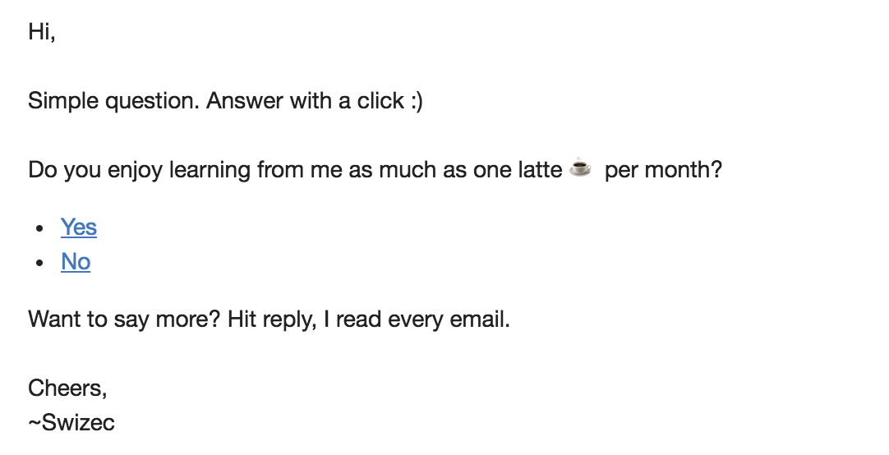
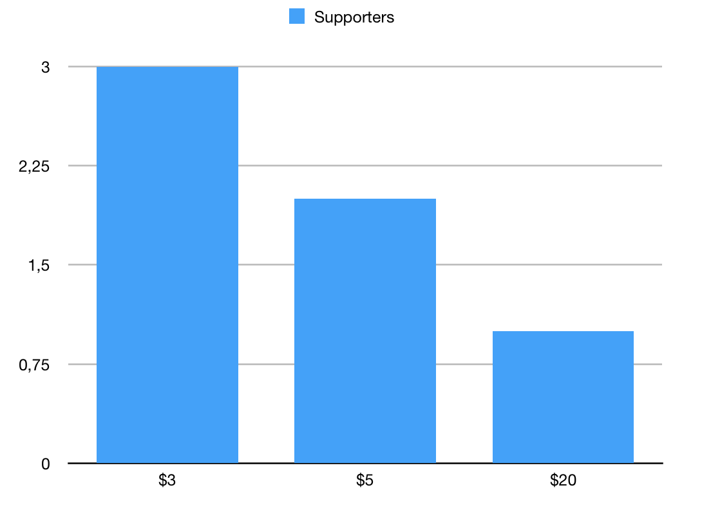
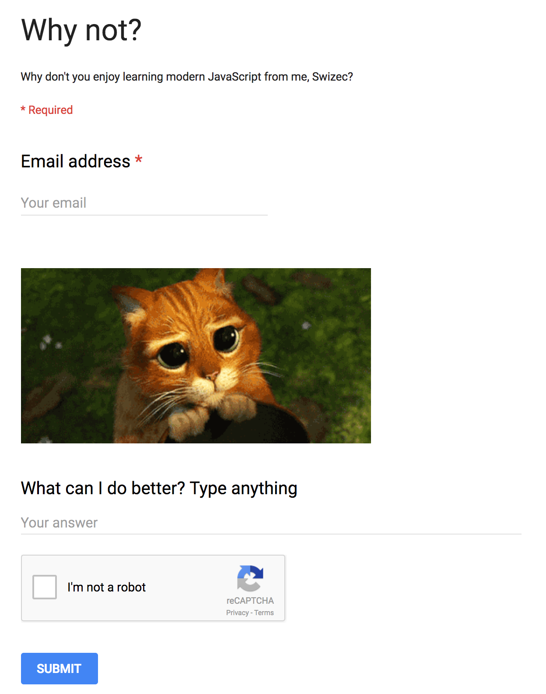

Just over a week ago, I sent this email to 7,517 people.

_Do you enjoy learning from me?_

2,461 people opened that email. 60 unsubscribed, and 7 wrote a reply. 3 of those were vacation autoresponders.

Clicking `Yes` opened a [Patreon page](https://www.patreon.com/swizec) with monthly patronages ranging from $3 upwards. 226 people clicked that.

But only 6 people converted on Patreon itself, and one of them was my girlfriend 🤔

That's a conversion rate of 2% on Patreon itself and a rate of 0.6% overall. It sounds terrible, but it’s similar to numbers I've seen elsewhere. Honestly, I thought it was worse.

Convincing people to swipe their card is hard. Especially if it's for a monthly subscription.

Of those 7,517 people, only 51 clicked `No`. They were taken to a Google Form with a single input box. _Why not?_

Of those 51, 10 people wrote great feedback (for the most part).

One meanie said _"No”_, and another meanie said _"stop writing"_. Those were… uncalled for.

But I also got great feedback like this:

> I like your business insights and your honesty, but I'm not a React guy (which you talk about) (I'm the bright side - called VueJS :). Also, I wish you would cover more ground in your emails, more links thoughts and resources. Keep up your good work though - I'm sure you'll find the perfect product-market-fit!

And stuff like this:

> Sometimes entertaining/informative, way too random and inconsistent to pay for.

Or this:

> I like the tone of your emails, they are always fun to read, and I almost always will open them. But a lot of the content I cannot use in my daily work. I guess I feel like the scope is very large. I tend to like content that helps me solve an isolated and specific problem.

Overall, people seem to enjoy my emails, but not enough to pay for. Which makes sense. Why would you pay for something that doesn't feel like a coherent product?

My weekly emails just aren't a coherent product (yet?). Maybe one day they will be, maybe they won't. It's hard to decide which direction to take it all because I think a large part of what makes a great engineer is his or her breadth of knowledge. And it's that breadth that I want to offer.

But breadth is difficult to productize. That's why my flagship product is a book that talks about putting just two libraries together :D

Overall, I can't decide if the Patreon experiment is a great success or a total bust.

$37 monthly recurring revenue is pretty cool, but it’s nothing to write home about. Can it grow from here? Could I get to a point where I don't have to sell products anymore and could rely just on monthly subscriptions in a few months to a year?

¯\\\_(ツ)\_/¯

Would be nice, tho. Launches are stressful and putting books and courses together is always harder than it looks.

Most of all, 226 people who said _"Yes, I enjoy this as much as caffeine"_ versus 51 who said _"Nah"_, **that's** a win. I'm doing something right; now I just have to figure out what it is. 😅