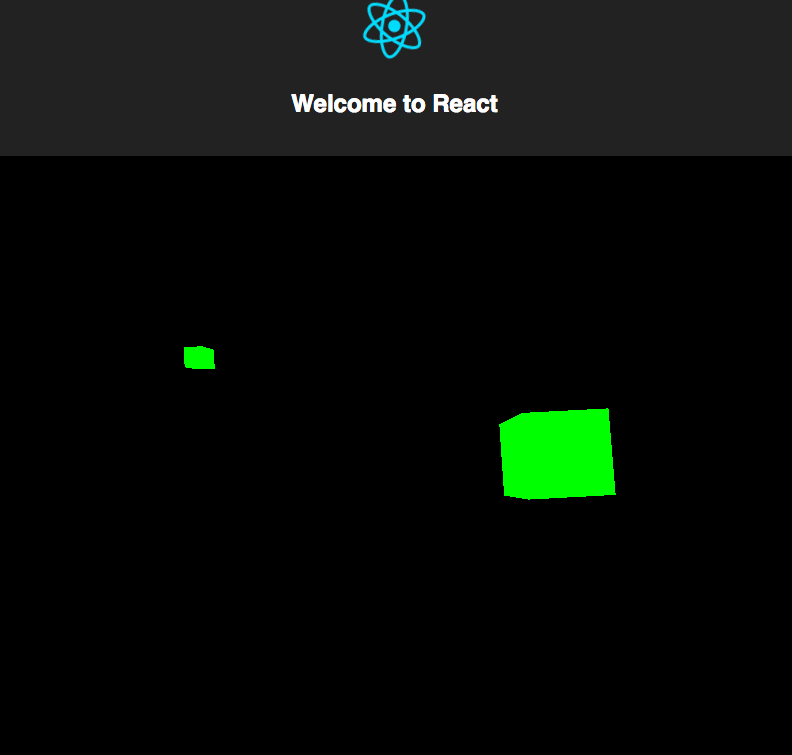
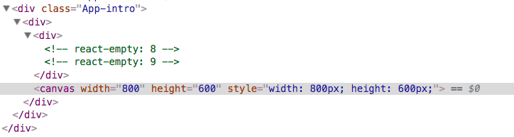

_This is a Livecoding Recap – an almost-weekly post about interesting things discovered while livecoding. Usually shorter than 500 words. Often with pictures. Livecoding happens almost **every Sunday at 2pm PDT** on multiple channels. You should follow [My Youtube](https://www.youtube.com/channel/UCoyHgaeLLI7Knp7LDHOwZMw) channel to catch me live._


17 years ago, in 6th grade, I set out to build a 3D spinning cube and failed miserably. You can't do 3D without sine and cosine.


Today, I made it happen! _Two_ 3D spinning cubes. 🤘🏼


\[caption id="attachment_7671" align="alignnone" width="792"] Two spinning cubes\[/caption]


As promised [poolside on Sunday](https://twitter.com/Swizec/status/876537115760222208), this week's livecoding session happened on Monday. Together, we admired the speed of [my new laptop](https://swizec.com/blog/first-day-new-2017-macbook-pro/swizec/7643), wondered why YouTube still garbles my voice, and built two green spinning 3D cubes. Declaratively 😏


The main render code looks like this:


```
                

                    
                        

                            
                            

                        
                    
                
```


A `ThreeScene`, which is a scene done with [Three.js](https://threejs.org/), contains a `PerspectiveCamera`, which contains 2 `Cube` elements. Cube positions come from state, get changed on `requestAnimationFrame` in an infinite loop, and voilà: Two Spinning Cubes.


The goal was to come up with a declarative approach to creating 3D scenes. Write React components, use all the normal React idioms, and have stuff come out in 3D.


I'm sure someone's already built a React-to-Three library, but I wanted to give it a shot myself. You can think of this as a proof of concept.


This is also the first time I've played with Three.js, and I have to say, it's easier than I thought it would be. At least to render two cubes. Other stuff I'm sure is super hard.


Here's how it works. 👇


PS: Full [code is on GitHub](https://github.com/Swizec/something-3d)


## Step 1: A `<ThreeScene>`


```
class ThreeScene extends Component {
    scene = new THREE.Scene();
    renderer = new THREE.WebGLRenderer();

    componentDidMount() {
        this.updateThree(this.props);

        this.refs.anchor.appendChild(this.renderer.domElement);
    }
    componentDidUpdate() {
        this.updateThree(this.props);
    }

    updateThree(props) {
        const { width, height } = props;

        this.renderer.setSize(width, height);
    }

    getChildContext() {
        return {
            scene: this.scene,
            renderer: this.renderer
        }
    }

    render() {
        const { width, height, style } = this.props;

        return (
            

                 {this.props.children}
            

        )
    }
}

ThreeScene.childContextTypes = {
    scene: PropTypes.object,
    renderer: PropTypes.object
}
```


A `ThreeScene` component defines a new Three.js `Scene` and a `WebGLRenderer`. Both are added into React Context via `getChildContext`.


Context is messy but it gives every child access to the scene and renderer. They'll need the scene for rendering themselves, and the camera component will need access to the renderer.


In `componentDidMount`, we manually update the DOM and `appendChild` to the rendered anchor element. This mounts our Three.js canvas to the DOM.





## Step 2: A `<PerspectiveCamera>`


Three.js comes with a bunch of different camera configurations, and I don't know what they all mean. I think one of them, the StereoCamera, is meant for VR.


The base example uses `PerspectiveCamera`, so that's what I used, too. This component sets up our camera and renders our scene.


```
class PerspectiveCamera extends Component {
    constructor(props) {
        super(props);

        this.updateThree(props);
    }
    componentDidUpdate() {
        this.updateThree(this.props);
        this._render();
    }

    updateThree(props) {
        const { fov, aspect, near, far, position } = this.props;

        this.camera = new THREE.PerspectiveCamera(fov, aspect, near, far);
        this.camera.position.x = position.x;
        this.camera.position.y = position.y;
        this.camera.position.z = position.z;
    }

    componentDidMount() {
        this._render();
    }

    _render() {
        this.context.renderer.render(this.context.scene, this.camera);
    }

    render() {
        return 
{this.props.children}
;
    }
}

PerspectiveCamera.contextTypes = {
    scene: PropTypes.object,
    renderer: PropTypes.object
}
```


We call `updateThree` when `<PerspectiveCamera>` is first initialized and whenever props or children update. This creates a new camera instance with updated properties.


I'm sure Three.js supports changing field of view, aspect ratio, and other properties of an already instantiated camera, but there was no clear way of doing so. It looks like creating a new camera on every `requestAnimationFrame` doesn't cause issues.


Every time React updates our component, we call `_render`. It performs the actual Three.js rendering of our scene.


## Step 3: Two `<Cube>`s


Finally, our `<Cube>` components know how to render a 3D cube from props, and add themselves to the scene when mounted. They should remove themselves when unmounted, but I didn't implement that part due to _"Eh, it's just an example.”_


```
class Cube extends Component {
    componentWillMount() {
        this.geometry = new THREE.BoxGeometry(1, 1, 1);
        this.material = new THREE.MeshBasicMaterial({ color: 0x00ff00 });
        this.cube = new THREE.Mesh(this.geometry, this.material);

        this.context.scene.add(this.cube);
    }

    componentDidUpdate() {
        const { rotation, position } = this.props;

        this.cube.rotation.x = rotation.x;
        this.cube.rotation.y = rotation.y;

        this.cube.position.x = position.x;
        this.cube.position.y = position.y;
        this.cube.position.z = position.z;
    }

    render() {
        return null;
    }
}

Cube.contextTypes = {
    scene: PropTypes.object
}
```


Officially, a `<Cube>` component renders `null`. Unofficially, it adds itself to the scene with `scene.add` in `componentWillMount`.


When it's being mounted, it also sets up the object itself with `Geometry`, adds a green `Mesh`, and updates its own `rotation` and `position` on every `componentDidUpdate`. This creates smooth animation if we change props often enough.


Every `requestAnimationFrame` is best.


## Fin


And that's how we can render declarative 3D scenes in React. This has been a 2-hour experiment. With some more work, it could become a proper way to use Three.js with a React approach.


Surely someone's already built that…