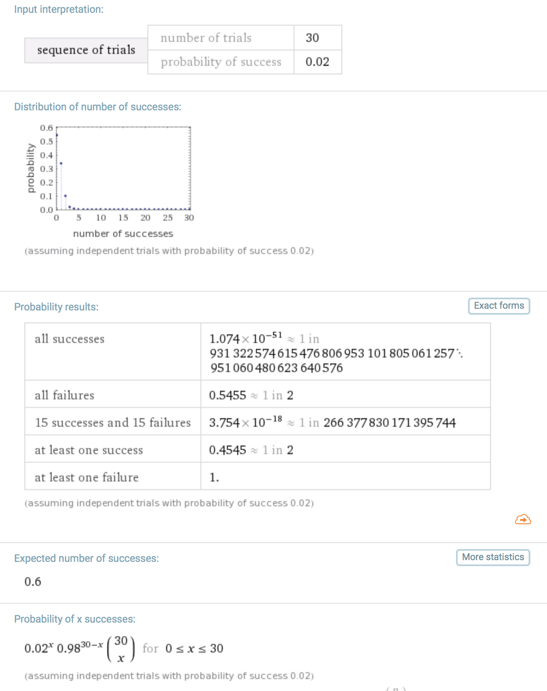

A reader wrote to me bemoaning the difficulty of getting a job these days. She had read [my old article about interviewing at Shopify](https://swizec.com/blog/the-most-pleasant-job-interview-i-have-ever-had/swizec/6121) and thought something like _"Damn that sounds so easy! Why is it so hard now?"_

> I miss the days when getting a job didn’t mean jumping through rings of fire, not that I actually remember them, but I’ve heard stories! ~ Miss Anastacia

I don't think it's gotten any harder or easier than it used to be. Think of it as a game of probabilities.

Let's assume that a successful job application is a conversion funnel. Just like a funnel in sales, or marketing, or product signups. They're all similar in that you have a series of steps that produce one of two outcomes: Yes or No.

In job applications you get an offer, or you don't. In sales, you make the sale, or not. In marketing, someone tries your app, or they don't. In product signups, they become a user, or not. When applying for conference talks, you get in, or you don't.

This observation of a Yes or No result is \\important. It means we can model the probability of success after repeat attempts using [Bernoulli's trials](https://en.wikipedia.org/wiki/Bernoulli_trial).

> In the theory of probability and statistics, a Bernoulli trial (or binomial trial) is a random experiment with exactly two possible outcomes, "success" and "failure", in which the probability of success is the same every time the experiment is conducted. It is named after Jacob Bernoulli, a 17th century Swiss mathematician.

Those assumptions are not strictly true for us. You don't have the same probability of landing every job you apply for, some people are easier to sell to, some marketing campaigns are just better, and not all conferences have the same rejection rates.

All of that is true. Life is fuzzy.

We can rely on the law of [regression toward the mean](https://en.wikipedia.org/wiki/Regression_toward_the_mean) to gloss over that imperfection. After enough attempts we should have a clear conversion rate.

Many people famous for speaking at tech conferences, for example, say that about 1 in 3 applications lands. That gives them a conversion rate of 30%.

A job applicant with a smashing CV and amazing talent for applying only to jobs they're a great match for might have a conversion rate of, say, 50%.

A fresh graduate using a spray and pray strategy might be closer to a 5% overall conversion rate. First contact to job offer.

Job applications are often a long funnel and each step on the way has a Yes or No component. Each can be modeled as its own Bernoulli trial.

1. First contact. You ping them or their recruiter pings you
2. Initial phone call with recruiter person
3. First real phone interview
4. On-site interview lasting a few hours
5. Chatting with offer giver so they can feel you out
6. Job offer

Many people don't realize this, but step 5 is where they decide what the offer is going to be. The best negotiator in the company feels you out and decides what to offer so it's juuuuust enough for you to say yes, but no more. That would be expensive.

You often already have a job at this point. A red flag can still mess it up.

Now let's say the probabilities of a Yes in each of those steps go something like this:

1. Initial contact: 10%
2. Soft phone interview: 80% (recruiters are optimistic, that's what pays them)
3. Phone interview: 50% (you're a good engineer, but companies like to think they're tough)
4. On-site interviews: 60% (you're already here, that's good)
5. Chat with offer giver: 80% (only red flags will mess it up)
6. Job offer

That gives you an overall conversion rate of `0.1*0.8*0.5*0.6*0.8 = 0.02 == 2%` which sounds really tough. I see now what Anastacia meant.

Now if we plug that into the formula for [Bernoulli trials on WolframAlpha](https://www.wolframalpha.com/input/?i=30+trials+p%3D0.02) we see that if you apply for 30 jobs, that gives you a 45% chance of landing at least one job. 100 applications increases that chance to 86%.

That sounds discouraging I know, but there are things you can do to improve your chances. You can improve your targeting to increase that first 10% chance. You can blog and go to meetups and build your network and skip that first step.

When recruiters make the first contant, you have a higher chance. I promise. Conversion rate goes from the above, to something closer to `0.8*0.5*0.6*0.8 = 0.19 == 19%`.

That means you have an 87% chance of landing a job after just [10 Bernoulli trials](https://www.wolframalpha.com/input/?i=10+trials+p%3D0.19). Pretty good, no?

Now of course all these probabilities are made up. They're different for every individual. They depend on experience, the companies you apply for, how much money you want.

I promise that if you're a decent engineer and you're willing to work for $50k in Silicon Valley, you will have to fight off startup founders with a stick.

Oh and what about our _"Famous tech conference speaker with 30% conversion rate"_ example? [7 CFP applications gives them a 91%](https://www.wolframalpha.com/input/?i=7+trials+p%3D0.3) chance of giving a talk.

And really that just means I'm a huge baby for having a single CFP rejected and thinking to myself screw conferences this is stupid I'm never CFPing ever again.