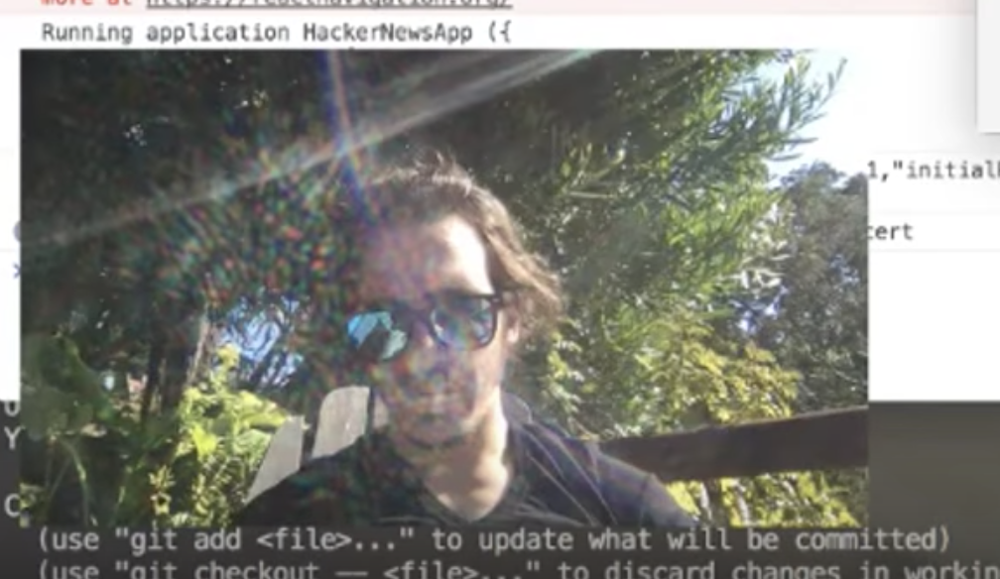

_This is a Livecoding Recap – an almost-weekly post about interesting things discovered while livecoding. Usually shorter than 500 words. Often with pictures. Livecoding happens almost **every Sunday at 2pm PDT** on multiple channels. You should follow [My Youtube](https://www.youtube.com/TheSwizec) channel to catch me live._

This weekend, I tried something new: Coding from a pleasant sunny location. It didn't go so well.

First, the internet was atrocious. My stream kept lagging and cutting off and being blurry. In the end, I had to crank the bitrate and resolution way down. That helped, sort of.

Second, YouTube blocked my video based on copyright. Listening to music through your monitor and recording it as a background murmur through your mic is okay. Listening through laptop and using the built-in mic is not okay.

_shrug_

Third, I got sunburnt on half of my face. **BUT** new MacBook Pro screens work in sunlight! You can actually see the screen now 😁

Fourth, my girlfriend decided it would be funny to water me like a plant. It was not. 😒

The good news is YouTube offers a "remove song" feature, so I might be able to salvage this video. We'll see.

Yes, two livecoding sessions last week. :)

I didn't finish the app while streaming. There's going to be a full tutorial and proper edited video on [React Native School](http://school.shoutem.com/) later this week.

So what was I even building?

One of those HackerNews App projects. You know the type; it's not quite a TODO app, but it's similarly generic and a common example to show people how things are done.

Mine's going to have a twist though: It’s gonna hide comments and stories where [semantic analysis](https://cloud.google.com/natural-language/) says people aren't being nice.

https&#x3A;//twitter.com/dan_abramov/status/882757021124235264

I think it's going to work.

I ran some positive and negative comments through Google Cloud's Natural Language API, and it looks promising. Bad comments get a negative score, good comments are positive, most are neutral.

It's not as good as their [Perspective API](https://www.perspectiveapi.com/#/) promises to be. Unlike Perspective, it's already here and should work as a proof of concept.

Plan is to have the app finished tonight and a full tutorial out by Wednesday.

The trickiest part is convincing React Native to render HackerNews comments because they're in HTML. Guess what doesn't automatically render in a native app? That's right… HTML.

There's Webviews, but I'm not sure how I feel about those. Feels hamfisted for text that only does italics, quotes, and links.

Some htmltext components do exist, but they're old. Might have to roll my own.

We'll see.