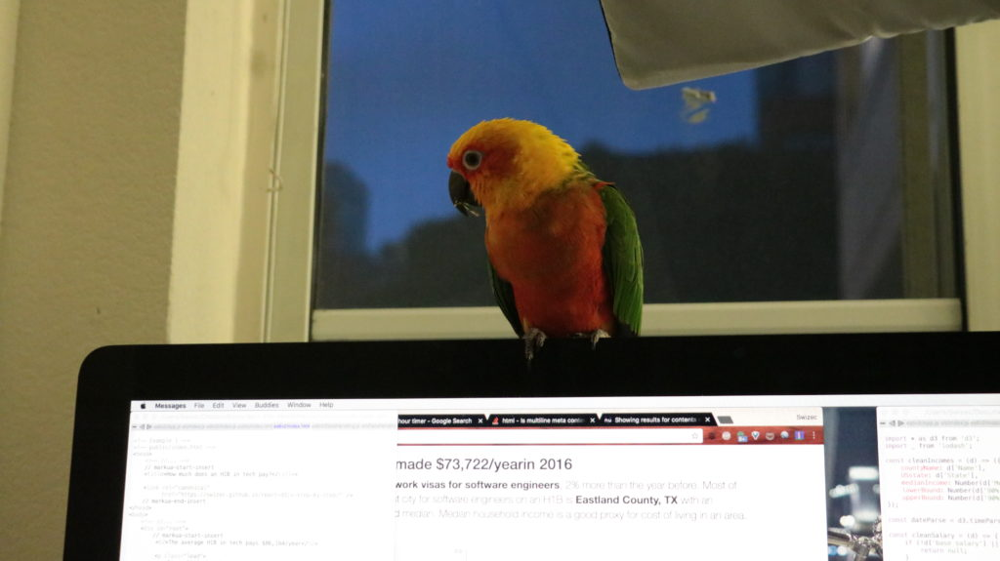

 Make a thing. Add Buy button. Tell people. If you [have the entrepreneurial itch](https://blog.ycombinator.com/why-should-i-start-a-startup/) but don't have the financial security to back up the risk, becoming a bootstrapped micropreneur is a great first choice. Start your business on the side, and once its revenue is high enough to live on, make the jump. It's slower than a funded startup, but it’s a lot less risky. Sure, it comes with a social opportunity cost (long nights and weekends), but so does a startup. People say startups are [a way to compress your whole working life into a few years](http://www.paulgraham.com/wealth.html). If your sidehustle does well, you can later leverage it to fund your big startup idea. Or, hell, live a good life on a lifestyle business making a few hundred thousand per year. $150k/year revenue won't get you any headlines, but it's plenty to live on and run a solo business. Get to $500k/year, and you have a higher expected ROI over N years than any startup founder. Think about it. A digital business can have almost infinite margins. Once you build the thing, your only expenses are marketing, support, a few SaaS services, and a helping hand or two. What if you made $500k/year in revenue, and $400k of it was pure margin? $400k of cold hard cash, just for you, every year. How happy would you be? What about if you made $1,000,000,000/year in revenue, had 10,000 employees, 20 board members, a $200k salary, and $500,000,000 of imaginary money you can't turn into cash (stock). Would _that_ make you happy? My sidehustle is a combination of books and teaching. I'm experimenting with coaching, and a company is sponsoring my React Native writing on a [cobranded blog/YT channel](https://school.shoutem.com/). I publish [monthly breakdowns](https://swizec.com/blog/4093-june-sidehustle-report/swizec/7681), and that lists all revenue streams and expenses. https&#x3A;//twitter.com/Swizec/status/886790354493517824 Expenses come down to about $2000/month, and I'm well on track to make around $50k this year. That's with about _60 hours per month_ of active work. If I didn't insist on living in SF, I could have a very cushy life back in Slovenia. $24k expenses, $24k personal salary. Average salary in Ljubljana – my hometown – is $25k. For people who work 160 hours per month 😉

* * *

I never had an official mentor, but plenty of people helped and nudged me in the right direction and answered my questions. You can find most of them on the internets. It all boils down to this: Make things. Add "Pay For Thing" button. Tell people. I started with following [Ramit Sethi's](https://www.iwillteachyoutoberich.com/) emails for a few years (he's great to drive home the point that yes you do deserve to get paid), then [Brennan Dunn's](https://doubleyourfreelancing.com/) emails and content (he's great for "you totes can make shitloads"), then [Nathan Barry's](http://nathanbarry.com/) book Authority which is great for "Here are concrete steps to start making bank", and I went to Dunn's [DYFConf](http://doubleyourfreelancing.com/conf/) which is like a baby [MicroConf](http://www.microconf.com/) (to which I want to go, but still haven't), oh and of course I listened to all mp3s of all past talks from MicroConf. [Patio11's](https://twitter.com/patio11) writings helped a lot as well. I used [Bryan Harris](http://videofruit.com/blog/) stuff for ideas on growing an audience, and [Kai Davis](https://kaidavis.com/) is great for being a cheerleader and giving good ideas on positioning and writing. Somehow I got invited to the Slack group where many of these micropreneur/microconf celebrities hang out and that's been superb as well. Much inspiration, many great ideas. Oh and I used Ken Wallace's [MastermindJam](https://mastermindjam.com/) to join a mastermind of likeminded peers. That helps with keeping you accountable and shipping stuff. I also used Amy Hoy's [30x500](https://30x500.com/academy/), but I bought that too late (or too early, hard to say) and it didn't help super much. I should revisit. [Pieter Levels'](https://twitter.com/levelsio) twitter stream is also a huge bundle of inspiration. But really Patio11's tweetstorm says it best: https&#x3A;//twitter.com/patio11/status/887793614780235777 Make something. Charge for it. Congratz, you're a business. _This post first appeared as a [thread on HackerNews](https://news.ycombinator.com/item?id=14807198)_
