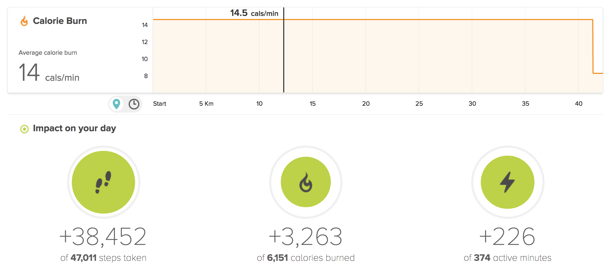
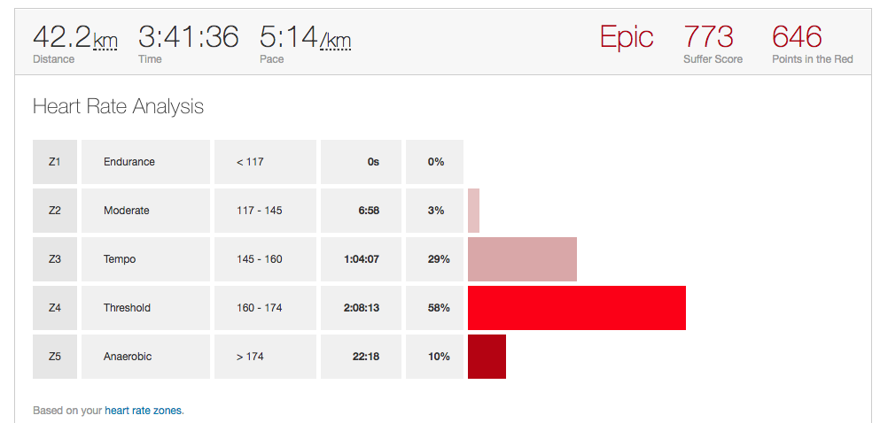

Three years ago, I had a stupid idea: I'm gonna run a marathon in under 4 hours. It was October 2014, and I was taking advantage of Ljubljana Marathon discounts to buy my first pair of running shoes. Slovenia was getting chilly, and my barefoot running was becoming unbearable. 10k was the longest distance I had run, and my time was around 1 hour. When I started a few months prior, even 4km seemed super far. Two loops around a track were plenty. A marathon is 42km, 26.2 miles. That's just like running 10k four times back-to-back and adding two more. I figured if I can run a 10k in just under an hour, then I should be able to run a full marathon in just under 4 hours.  But this stuff doesn't scale linearly at all. The farther you go, the slower you get, and the more your body suffers. The hard part of running a marathon is keeping your knees from blowing up, your ankles from giving in, and your feet from giving up. Blisters and dead black toenails are a real concern. On top of that, you're battling your metabolism. The human body can store about 45 minutes worth of glycogen, you're sweating electrolytes, and generally depleting all your resources. In a 4 hour race, you're gonna have to eat stuff, replenish your electrolytes to avoid cramping, and hope that you finish before your body says, _"You know what, screw this. I stop now.”_ According to my FitBit, I burned 3263 calories. On a chill day with no exercise I burn 1800. That's two days worth of calories gone in 4 hours. 😬  My heart suffered, too. Average heart rate through the run was over 160, with peaks reaching up to 185. You thought marathons were about endurance? Ha! I spent 0% in the endurance heart rate.  I didn't know all of this 3 years ago, but I did know that joints would be the problem. You can train cardio, but how do you teach your skeleton to withstand that sort of abuse? So I devised a plan that I've been following ever since: at least 2 "short" runs during the week, 1 long run on the weekend. At firs,t this meant two 5k runs during the week, then a 10k on the weekend. With time, this grew to two 8ks and a 15k on the weekend. That got me to a sub-2 hour marathon at the 2015 San Francisco Marathon, somewhere around 1:59:xx. Great job, Swiz! Then I started training for a marathon. I was going to run in Ljubljana that October, but was unable to leave the United States due to visa issues. There was a real chance I wouldn't be able to come back. So I kept adding 2km to my Sunday runs, eventually making it all the way to 42km. Without race support and with far too many hills, I did it in 4:25:xx. A far cry from sub 4 hours, but a good lesson. I learned that a marathon is just a logistics race. You keep moving and you eat your gels and drink your water and tend to your electrolytes. Sometimes you poop. Best to poop before a run. Public restrooms are icky. With the October marathon in Ljubljana falling through, I slumped back into a loose routine of running twice a week for 8km to 10km, and a half marathon most Sundays. I knew what it took to ramp up and kept my baseline high. I ramped back up for the 2016 San Francisco Marathon. By now, I knew that having race support cuts up to 30 minutes from my time. I knew how to handle gels, and I had trained my metabolism to go through enormous piles of food to aid recovery. My routine was still two 10ks during the week, 1 half marathon or more during the weekend. But I started adding sprints to those 10ks and, ramping up to the marathon, I added 2 more weekday runs. The last two weeks before the race, I was running 5 10ks per week and 1 long run on Sunday. I was exhausted, and my practice marathon (two weeks out) was around 4:20. That seemed sufficient, so I rested my body, and on race day, I got a time of 4:02:xx. Two minutes too slow! UGH! So I had to do it again. Still not under 4 hours. My approach from then on was more lackadaisical. Two 10ks per week, 1 half marathon or more on Sunday. Some Sundays, I ran 16km; some Sundays, I ran 28km. Often it fell somewhere between 23 and 26 kilometers. Just enough to get to the Golden Gate Bridge and back. Nice views over there and watching surfers under the bridge is always fun. My runs weren't taken super seriously. I would stop and I would smell the roses. Listen to podcasts, casually take interesting pictures. Stuff like that. I started ramping up about 2 months before the marathon. The longest I made it was 37km of a trail run. Casually took me 4 hours because trails are hard. But right before the marathon, the last three weeks, I was running 7 days a week, 12km with sprints. My pace was looking good, and my recovery times were great. Question was, can I keep it up on race day? I rested my body, no exercise, for 4 days before the race. And that seems to have done it. I ran the first half in 1:45:xx which gave me 30 minutes to faff around should anything happen. Stuff did happen. I broke down going up hills. I had to stop to take a shit. The last 2 kilometers, I was cramping up so hard I couldn't run for more than 500 meters at a time. Finishing time? 3:47:35
