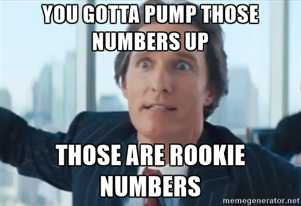

Here's a fun milestone for ya: My sidehustle makes about as much per hour as my day job. Around $55.

But the margins are different.

At the day job, I keep about $55 of my $55. Some of it goes to taxes, but it's still _my_ salary. From the sidehustle this July, I kept $11 of every $55. Some of which will go for taxes…

That must be why most people like to have jobs instead of businesses 🤔

Sometimes I wonder why I even bother… but then I'm like, _"Oh yeah, the 100% year over year growth.”_ There aren't many jobs out there that give you a 100% raise every year I think.

https&#x3A;//twitter.com/Swizec/status/886790354493517824

Anyway, July has been great. I'm experimenting with a new thing: React/JavaScript coaching. A fan reached out to me asking for help. He's been learning how to code on his own for about a year and was getting stuck. Bootcamps went too fast or too slow, random online articles were difficult to piece together, and online courses were great but didn't generalize.

So he asked me for help, and I said sure. The idea was to get him from _"I might be able to code on my own"_ to _"Employable engineer"_. Then he got a job at a startup that same week, so I've been helping him with that instead.

He's a great coder, probably knows more about JavaScript syntax than I do. But he struggles to take a big hairy problem and break it down into workable pieces. How do you turn a set of fuzzy requirements into specific solutions a computer can run? _That's_ the hard part.

Just as I suspected, most bootcamps and online courses aren't great at teaching that. They produce great coders, but not that many engineers.

Seems like a market opportunity 🤔

Oh, and I finished [React+D3v4](https://gum.co/mTWg). Editor fixed it up, I tested it all, ready to lock and load.

The next few weeks are going to be all about launching React+D3v4, then setting up some marketing ideas I've been having. Goal is to have a steady two sales per day average by the end of the year.

So far it's been at 0.6 sales per day average.

* * *

Here's July in numbers 👇

**Total revenue:** $3426

**Gumroad sales:** $970

- React+D3v4: $690
- React+ES6: $277
- ES6 cheatsheet: $3

**Leanpub sales:** $221

- Why programmers work at night: $21
- React+d3: $23
- React+D3 ES6: $177

**React native School:** $1464

**React/JavaScript coaching:** $750

**LiveEdu premium:** $5

**Amazon associates:** $16

**Time investment:** 62 hours

**Expenses:** $2707

- Editor: $800
- VA: $468
- Facebook Ads: $244
- Hosting: $10
- Drip: $184
- SumoMe: $99
- Flaticon: $9
- Domains: $33
- Laptop AppleCare: $375
- New Headphones: $375
- CodePen: $75
- SmartBribe: $35

**Hourly rate after expenses:** $11

That's $3 below minimum wage 😅