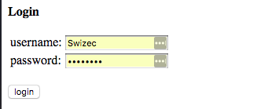
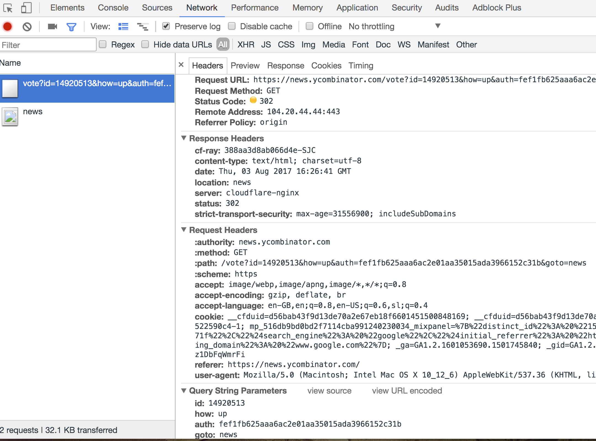
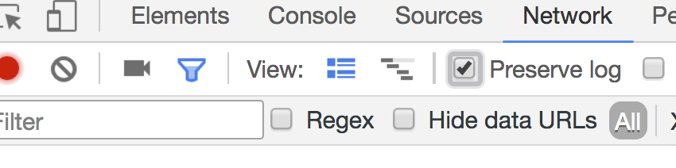
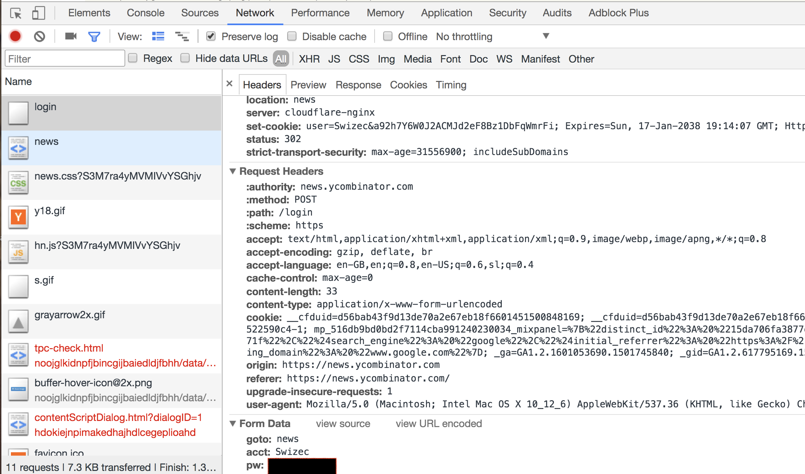
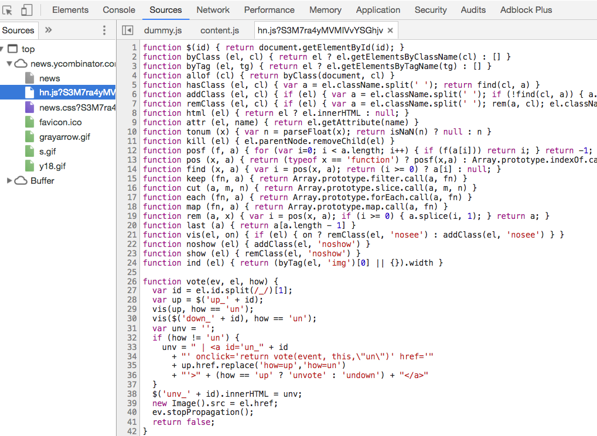

[Hacker News has a public API](https://github.com/HackerNews/API), and it's great. Live frontpage updates, live upvote counts, live comments. Everything you want or need at the tip of your fingers in real-time. But there's no write. You can't login, you can't upvote, and you can't post. You can't do anything but read. And you need writes to make a [Hacker News App](https://school.shoutem.com/lectures/hacker-news-app-part-2-upvoting-commenting/).  Without a public write API, the only thing left to do was to reverse engineer HackerNews forms and fake them with `fetch()` requests. Technically, this falls under [cross site request forgery](https://en.wikipedia.org/wiki/Cross-site_request_forgery), but it isn't malicious. Sure, we're pretending that we're a browser that's submitting forms, but we do what the user expects. That makes it okay, I think. HackerNews allows it at least. [1](#fn1) _shrug_ So how do you approach this sort of problem? It happens in 3 steps:

1.  Do the action
2.  Inspect the request
3.  Fake the request

The [Unofficial HN write API wrapper](https://gist.github.com/Swizec/de31ad9f995b0ad6bfe84dafd92e1e53) lives as a Gist. I'm tempted to release it as an NPM module. Should I? I'm going to show you how this works on two examples: A Login form and an Upvote button. The first is a normal POST request; the second is a GET request with some fakery protection.

## Do the action

HackerNews's login form looks like this:  Which in HTML looks like this:

```

    
    
    
    
        username:	
        
            
        
    

    
        password:	
        
            
        
    
    
    

    
```

Looking at this HTML tells us HackerNews uses a POST request to to the `/login` URL to log you in, then it sends a `goto` field[2](#fn2), and two text fields; `acct` and `pw`. Whoever wrote this code doesn't believe in typing things out.

* * *

The Upvote action isn't a form; it's a link that looks like this:

```

```

This tells us that voting happens through JavaScript. We can look for the `vote()` function in [HackerNews's javascript code](https://news.ycombinator.com/hn.js?S3M7ra4yMVMIVvYSGhjv). Lucky for us, it is neither obfuscated nor minified. This makes it easy to read right in Chrome DevTools.  The `vote()` function looks like this:

    function vote(ev, el, how) {
      var id = el.id.split(/_/)[1];
      var up = $('up_' + id);
      vis(up, how == 'un');
      vis($('down_' + id), how == 'un');
      var unv = '';
      if (how != 'un') {
        unv = " | " + (how == 'up' ? 'unvote' : 'undown') + ""
      }
      $('unv_' + id).innerHTML = unv;
      new Image().src = el.href;
      ev.stopPropagation();
      return false;
    }

Most of this code deals with updating the UI. The interesting line is `new Image().src = el.href`. It tells us that HackerNews upvotes use a GET request to the URL set in the link. In this case, that link is `/vote?id=14918911&how=up&auth=0855997b736abc0c65600fee44fbf9bbf3bca65c&goto=news`. The `auth` argument looks tricky. It's some sort of authentication token making sure these requests don't get forged. Look at other examples on the page, and you'll see the `auth` token is different on every upvote button. That means it isn't a per-user token, it's a per-user-per-story token. Which means we're going to have to find the URL every time we want to upvote anything.

## Inspect the request

We can confirm our findings by making the actions and inspecting their requests in Chrome DevTools. Due to redirects, you have to enable `Preserve Log`. Somehow I had never noticed that feature existed before doing this.  As we assumed, the login request sends `goto`, `acct`, and `pw`, and sets a cookie. 

* * *

Inspecting the upvote request follows a similar process. This is what we find:  No surprises here. We have to send a GET request to the upvote URL that's unique for every upvote button. We also send our login cookie so we can assume the server is doing some sort of validation between who's logged in and what the auth token says.

## Fake the request

To fake these requests, we use `fetch()`. Login is simple; it looks like this:

    class HN {
        BaseURL = 'https://news.ycombinator.com';

        login(username, password) {
            let headers = new Headers({
                "Content-Type": "application/x-www-form-urlencoded",
                "Access-Control-Allow-Origin": "*"
            });

            return fetch(`${this.BaseURL}/login`,
                         {
                             method: "POST",
                             headers: headers,
                             body: convertRequestBodyToFormUrlEncoded({
                                 acct: username,
                                 pw: password,
                                 goto: 'news'
                             }),
                             mode: 'no-cors',
                             credentials: 'include'
                         }).then(res => res.text())
                           .then(body => {
                               if (body.match(/Bad Login/i)) {
                                   return false;
                               }else{
                                   return true;
                               }
                           });
        }
    }

We set a `Content-Type` header to `application/x-www-form-urlencoded`. Many servers can handle params in any shape they come, but HackerNews is not one of those. This is the only type that works. Our `fetch()` request uses the `POST` method and our `headers`, converts our `{acct, pw, goto}` data object into a URL encoded string, asks the server (or is it the browser?) to please ignore [CORS](https://en.wikipedia.org/wiki/Cross-origin_resource_sharing), and we set `credentials: 'include'` to automagically handle cookies. That's how you expect client-side requests to behave, but you have to explicitly ask for it with `fetch()`. HackerNews responds with either the login page or the news page. If login was successful, we get the news page. Unsuccessful, and we get the login page with a `Bad Login` text. We look for said `Bad Login` text to decide if we are now logged in. Hopefully there are no frontpage stories with `Bad Login` in their title :D

* * *

Faking an upvote request is more tricky. We have to first fetch the URL. To do that we use [CheerioJs](https://github.com/cheeriojs/cheerio), an HTML parser that works in JavaScript and gives us a jQuery-like interface to the document. It's designed to work in node, but you can use the [cheerio-without-node](https://github.com/oyyd/cheerio-without-node-native) in the browser or React Native. Each HackerNews story can have its own page. This makes our job easier. We can request that page, parse it, and find the upvote button. That looks like this:

    class HN {
        // ..
        getUpvoteURL(id) {
            return fetch(`${this.BaseURL}/item?id=${id}`,
                         {
                             mode: 'no-cors',
                             credentials: 'include'
                         }).then(res => res.text())
                           .then(body => {
                               const doc = cheerio.load(body);

                               return doc(`#up_${id}`).attr('href');
                           });
        }
    }

We're making a basic GET request, asking to avoid CORS, and including our credentials. That way HackerNews thinks we're a browser with a logged in user and gives us exactly what it would give to a normal user. We use `cheerio.load` to parse the HTML and look for the upvote URL with `doc(#up_${id})`. Just like we would with jQuery. You can find the correct ID in the upvote button's HTML. Here it is again:

```

```

This part: `<a id="up_..."`. It's unique for every upvote link and helps us find the right one. To use this link, we issue a `fetch()` request similar to the one we used to find it.

    class HN {
        // ...
        upvote(id) {
            return this.getUpvoteURL(id)
                       .then(url => fetch(`${this.BaseURL}/${url}`, {
                           mode: 'no-cors',
                           credentials: 'include'
                       }))
                       .then(res => res.text())
                       .then(body => {
                           return true;
                       })
                       .catch(error => {
                           console.log(error);
                           return false;
                       });
        }
    }

Get the URL, make a fetch, include credentials, assume it worked. HackerNews doesn't give us any real indication that it worked or not. We have to assume. I guess we could re-fetch the item's page and see if that upvote button is still there. 🤔 Sending 2 requests for every upvote feels bad enough, though. No need to make it 3.

## Your new superpower

You can use this approach to reverse engineer any website. If it works on HackerNews, it's going to work everywhere. Apps and websites fundamentally cannot guard against something like this. If legitimate users can use the site, then you can pretend to be a real user and fake those requests. It's just how it is. HackerNews makes it easy. For others, it might be trickier. Use your new superpower responsibly. 

1.  There are ways to prevent cross-site requests with [CORS policies](https://en.wikipedia.org/wiki/Cross-origin_resource_sharing), domain filtering, and stuff like that. [↩](#ffn1)
2.  All HN actions have a `goto` field or argument, I assume it tells the server where to redirect after the request. [↩](#ffn2)
