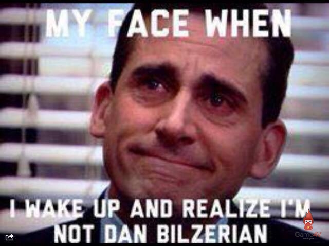

347 days ago, [I said something stupid](https://swizec.com/blog/work-on-reactd3js-es6-v2-begins-in-earnest/swizec/7010).

> Here’s my crazy plan: I want to launch React+D3js ES6 v2 in the first week of October. This time as a free upgrade for current users.

That did not happen. [React+D3v4](https://www.swizec.com/reactd3js) launched in August, some 10 months later than originally planned and a full 8 months after the preorder promised it would land. And it isn't a free upgrade either; it's a completely different book now.

But yes, it was September 2016, and I was being dumb. You can't rewrite a technical book in a month.

Sure, I did write [the first version](https://github.com/Swizec/react-d3js-ebook/tree/es5-version) in 2 weeks. Around a month to learn React, combine it with D3, make an app, launch.

That was fun. [Even made $4,000 in its first month](https://swizec.com/blog/how-a-book-i-wrote-in-two-weeks-made-4000-in-its-first-month/swizec/6675). Not bad for a 79-page book.

At the end of that post, I had this idea 👇

> But the biggest experiment to try is seeing if I can turn this into a system. Learn a tech, write about tech, launch book, once a month or every two months. Produce enough income to live off of.

> That’s the ultimate experiment right there.

That has not happened.

I can't live off my books, and I definitely can't launch a new one every month. But I _have_ been launching a new one every year, and I’ve made almost $80,000 in lifetime revenue on Gumroad. That's pretty cool, too.

A lot of that revenue has gone to other authors during the [React Indie Bundle](https://swizec.com/blog/react-indie-bundle-report-or-how-we-made-31k-in-a-week/swizec/6762) sale. Around $35,000, I'd say, which still leaves almost $50,000 for me and my freelancers and tech toys and advertising [and taxes](https://swizec.com/blog/how-i-got-boned-by-taxes-two-years-in-a-row/swizec/7582). So many taxes.

Fingers crossed I reach the $100k milestone this year 🤞

Anyway, first version: Spring 2015, 79 pages, single example, happily doing sales at $9 a pop or something like that. That pricing was dumb, but you live and you learn.

Second version came in Spring 2016. I think it landed around April or something. Improved code samples to use ES6, added a chapter on animation, rewrote most of the explanations. 117 pages, 2 project examples, always planned to make it better later.

That one made 743 sales for a total of about $20,000. I was super happy about that as it was happening, not so much looking back.

_Imagine how well it would've done, if I knew everything I know now!? If I made the book better, if pricing was more aggressive, IF EVERY LITTLE THING WAS AS GOOD AS IT IS TODAY._

Can you imagine? I would've been drowning in readers and fans and people suggesting improvements and making everything even betterer.

Maybe this time! 🤞

[React+D3v4](https://www.swizec.com/reactd3js) is the best thing I've ever written \[EDITOR’S NOTE: This is true]. 249 pages, 7 example projects, bonus chapter on React Native, learn basics in the browser, deep dive in the usual coding environment. Everything.

It's not just me. Even my editor is saying great things! And not just because I'm paying him. Hell, _test readers_ agree too. Everyone loves it.

> The examples in V4 are off the hook. No wonder it’s been so much work. You have really extended the learning process into fun, interactive projects. I was specifically trying to learn topojson and map visualizations! What a breeze!

See. See!? I extended the learning process into fun, interactive projects. Exactly what I was going for 😁

But here's the thing: I fear I'm too late. I fear everyone who's wanted to learn React already knows React. That everyone who wanted to build dataviz with React and D3 already knows how.

I know on an intellectual level that new people step into JavaScript every day. That old people get new jobs with new challenges. I know that many people simply pick up new projects or decide to learn something new every day.

A lot of people out there are learning JavaScript and figuring things out. More and more every day. _Those_ are the people I can try to reach and lend a helping hand to.

And maybe, just maybe, I can reach a stable level of making 2 or 3 sales per day by the end of this year. We'll see.

Until then, researching and writing [React+D3v4](https://www.swizec.com/reactd3js) has been fun. Now I gotta update my [interactive ES6 cheatsheet](https://es6cheatsheet.com).

Peace. ✌️