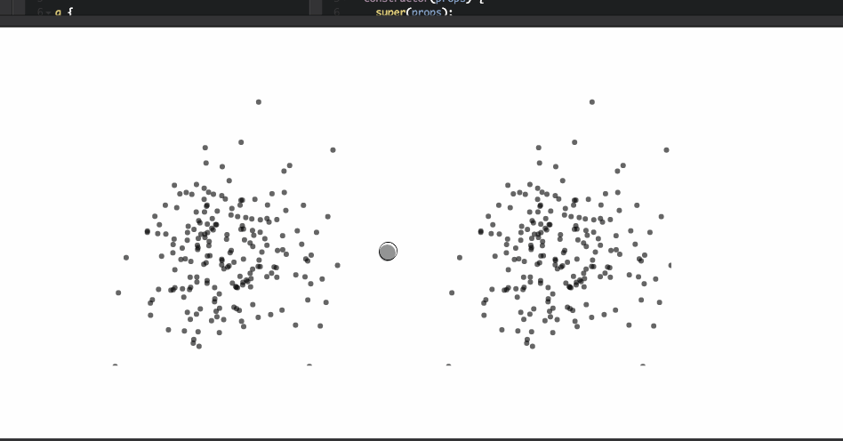

A question I often get is this: _"How do you build a zoomable dataviz component?"_ Well, you use [d3.zoom](https://github.com/d3/d3-zoom). That gives you `zoom` events for pinch-to-zoom and the mousewheel. Detects panning too. Just like your users expect from everything else that zooms. Then what? Then you have a choice to make. Do you want to zoom your whole component like it was an image, or do you want to zoom the space between your datapoints? The first looks pretty, the second gives users a chance to see more detail. In a side-by-side comparison, the two zoom effects look like this 👇  Both scatterplots use the same random data. Left side zooms like an image, right side zooms the space between datapoints. It even works on a phone, look.

> 

So how do you make that? You'll need: - 2 React components - 2 D3 scales - 1 D3 zoom - 1 D3 random number generator - 1 line of HTML - 5 lines of CSS - some event hooks - a sprinkle of state - a few props Here we go 🤘 \[codepen_embed height="426" theme_id="0" slug_hash="XaBrym" default_tab="js,result" user="swizec" editable="true" preview="true" data-preview="true" data-editable="true"]See the Pen [Two different zooms with D3 and React](https://codepen.io/swizec/pen/XaBrym/) by Swizec Teller ([@swizec](https://codepen.io/swizec)) on [CodePen](https://codepen.io).\[/codepen_embed]

## &lt;Chart /> component talks to d3.zoom

Our `<Chart />` component renders two scatterplots and talks to `d3.zoom` to zoom them. This way we can use a single zoom behavior for the entire SVG, which makes the scatterplots zoom in unison. I also found it more reliable than attaching `d3.zoom` to individual `<g>` elements, but couldn't figure out why. I think it assumes internally that it's working on a whole SVG element.

    const random = d3.randomNormal(5, 1);
    class Chart extends React.Component {
      constructor(props) {
        super(props);
        this.state = {
          data: d3.range(200).map(_ => [random(), random()]),
          zoomTransform: null
        }
        this.zoom = d3.zoom()
                      .scaleExtent([-5, 5])
                      .translateExtent([[-100, -100], [props.width+100, props.height+100]])
                      .extent([[-100, -100], [props.width+100, props.height+100]])
                      .on("zoom", this.zoomed.bind(this))
      }
      componentDidMount() {
        d3.select(this.refs.svg)
          .call(this.zoom)
      }
      componentDidUpdate() {
        d3.select(this.refs.svg)
          .call(this.zoom)
      }
      zoomed() {
        this.setState({ 
          zoomTransform: d3.event.transform
        });
      }
      render() {
        const { zoomTransform } = this.state,
              { width, height } = this.props;
        
        return (
          
            
            
          
        )
      }
    }

Our chart component breaks down into 4 parts:

1.  We use the `constructor` to generate random `[x, y]` coordinate pairs and a `d3.zoom` behavior. `scaleExtent` defines min and max scaling factor – from `-5` to `5` – and `translateExtent` and `extent` define movement boundaries. How much do we allow our chart to move around while zooming? We use `100px` in every direction.
2.  In `componentDidMount` and `componentDidUpdate`, we call our zoom behavior on the rendered SVG. This attaches touch, drag, and scroll events to the DOM. D3 normalizes them into a single `zoom` event for us.
3.  The `zoomed` function is our zoom event callback. We update component state with `d3.event.transform`, which is where D3 puts the information we need to zoom our chart.
4.  Our `render` method draws two `<Scatterplot />` components inside an `<svg>` element and gives them some props.

## &lt;Scatterplot /> component draws datapoints and zooms itself

The `<Scatterplot />` component follows the full integration approach I outline in [React+D3v4](https://www.swizec.com/reactd3js). We have D3 stuff in an `updateD3` function and we call it when props change to update the internal states of D3 objects. One complication we run into is that we use the same scatterplot component for two different types of zoom. That means some bloat, but it's manageable.

    class Scatterplot extends React.Component {
      constructor(props) {
        super(props);
        this.updateD3(props);
      }
      componentWillUpdate(nextProps) {
        this.updateD3(nextProps);
      }
      updateD3(props) {
        const { data, width, height, zoomTransform, zoomType } = props;
        
        this.xScale = d3.scaleLinear()
                        .domain([0, d3.max(data, ([x, y]) => x)])
                        .range([0, width]),
        this.yScale = d3.scaleLinear()
                        .domain([0, d3.max(data, ([x, y]) => y)])
                        .range([0, height]);
        
        if (zoomTransform && zoomType === "detail") {
          this.xScale.domain(zoomTransform.rescaleX(this.xScale).domain());
          this.yScale.domain(zoomTransform.rescaleY(this.yScale).domain());
        }
      }
      get transform() {
        const { x, y, zoomTransform, zoomType } = this.props;
        let transform = "";
        
        if (zoomTransform && zoomType === "scale") {
          transform = `translate(${x + zoomTransform.x}, ${y + zoomTransform.y}) scale(${zoomTransform.k})`;
        }else{
          transform = `translate(${x}, ${y})`;
        }
        
        return transform;
      }
      render() {
        const { data } = this.props;    
     
        return (
          
            {data.map(([x, y]) => )}
          
        )
      }
    }

Much like the `<Chart />` component, you can think of `<Scatterplot />` as having 4 parts:

1.  `constructor` and `componentWillUpdate` call `updateD3` with fresh props to update internal D3 state
2.  `updateD3` sets up two linear scales for us. `xScale` translates between data values and horizontal coordinates, `yScale` translates between data values and vertical coordinates
3.  The third part is split between the bottom of `updateD3` and `get transform`. It handles zooming.

Inside `updateD3` we zoom the space between datapoints by changing our scale's domains. `zoomTransform.rescaleX` takes a scale and returns a changed scale. We take its domain and update `xScale`. Same for `yScale`. This updates both the scatterplot's positioning and spacing between datapoints. This will never make intuitive sense to me, but it works. `get transform` also handles zooming. It creates an SVG `transform` attribute which we use to position and scale a scatterplot. We use `translate()` to move a chart into position and `scale()` to make it bigger or smaller depending on the factor `zoomTransform` gives us. Even if we're not zooming, we still `translate()` the chart so that we can move it around the page and show two scatterplots side by side.

1.  The fourth part is our `render` method. It creates a grouping element, walks through our data and renders circles.

You can play with this example on CodePen. \[codepen_embed height="426" theme_id="0" slug_hash="XaBrym" default_tab="js,result" user="swizec" editable="true" preview="true" data-preview="true" data-editable="true"]See the Pen [Two different zooms with D3 and React](https://codepen.io/swizec/pen/XaBrym/) by Swizec Teller ([@swizec](https://codepen.io/swizec)) on [CodePen](https://codepen.io).\[/codepen_embed] To learn more about putting React and D3v4 together, [check out my new book, React+D3v4](https://www.swizec.com/reactd3js)
