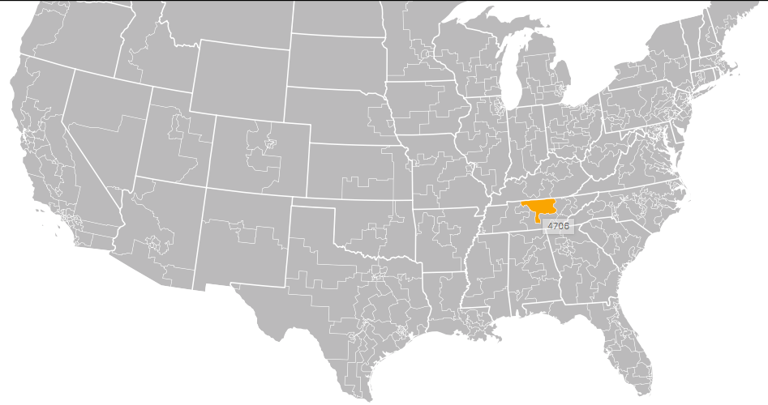

https&#x3A;//youtu.be/pzMTVChKvjo You and I both know that when it's time to code some D3, the easiest approach is to find an example that does something similar, copy its code, and tweak it a bit. But a lot of those examples are in old versions of D3, and what if you're using React or something and can't just plop code into your project like nobody's business? Here's what you do:

1.  Find the example
2.  Split it up into styling, data calc, and rendering
3.  Put those in the appropriate place for your environment

Let's do that for this example of [113th Congressional District](https://bl.ocks.org/mbostock/4657115) from March 2016.  The code starts with the usual HTML declarations, loading scripts, and a block of `<style>` stuff. Assuming we started our React app with `create-react-app`, we copy all the style info into `App.css`. That way we never have to worry about it again. We need styling because SVG elements are invisible by default.

## Setup a component

To make our lives easy, we're going to use the D3 blackbox approach to integration React and D3. By doing it this way, we can reuse all of the example code almost without change, and we lose most of React's benefits. Great for slapping code together quickly, but I'd suggest a more structured approach for anything serious. We need a component:

    // src/CongressionalDistricts.js

    import React, { Component } from 'react';
    import * as topojson from 'topojson';
    import * as d3 from 'd3';

    class CongressionalDistricts extends Component {
        state = {
            usData: null,
            usCongress: null
        }

        componentWillMount() {
            // load data
        }

        componentDidUpdate() {
            // render example D3
        }

        render() {
            const { usData, usCongress } = this.state;

            if (!usData || !usCongress) {
                return null;
            }

            return ;
        }
    }

    export default CongressionalDistricts;

Our `CongressionalDistricts` component has three parts. We're going to load data in `componentWillMount`, do all of our significant rendering in `componentDidUpdate`, and render an anchor element in `render`. This approach hands control of the DOM over to D3, which is why React can't help us. Once we're inside that anchor element, it's all D3 with this approach.

## Copypasta the code

Next in our example, we find the setup code.

    var width = 960,
        height = 600;

    var projection = d3.geo.albersUsa()
        .scale(1280)
        .translate([width / 2, height / 2]);

    var path = d3.geo.path()
        .projection(projection);

    var svg = d3.select("body").append("svg")
        .attr("width", width)
        .attr("height", height);

This code is great, but has some problems. It's still using `var` declarations, which are not encouraged in modern ES6. It also uses old D3 APIs which are going to fail when you run `npm install d3` because you'll get the new D3v4 version. On a practical level, it's setting up a new geographical projection, path generator, and creating an `svg` element. We can throw away the `svg` element creation because we're wrapping our component in svg anyway. So we copy the projection and path setup into `componentDidUpdate` like this:

    // src/CongressionalDistricts.js
        componentDidUpdate() {
            const svg = d3.select(this.refs.anchor),
                  { width, height } = this.props;

            const projection = d3.geoAlbers()
                                 .scale(1280)
                                 .translate([width / 2, height / 2]);

            const path = d3.geoPath(projection);

            const us = this.state.usData,
                  congress = this.state.usCongress;

We select our anchor element and name it `svg`. That way we won't have to change any of the other code. `d3.geo.albersUsa` becomes `d3.geoAlbers` and `d3.geo.path` becomes `d3.geoPath`. Same thing, simpler names. That's the general principle behind the D3v3 to D3v4 transition. The example code assumes data is global, so we take it out of state and put it in variables. Again, so we don't have to change any of the code. Next, the example loads its data.

    queue()
        .defer(d3.json, "/mbostock/raw/4090846/us.json")
        .defer(d3.json, "/mbostock/raw/4090846/us-congress-113.json")
        .await(ready);

This goes in our `componentWillMount` method. No sense fetching data before we know the component is getting mounted. And we definitely don't want to do it on every render :) Also, we change the URLs and download those files into our `/public` folder.

    // src/CongressionalDistricts.js
        componentWillMount() {
            d3.queue()
              .defer(d3.json, "us.json")
              .defer(d3.json, "us-congress-113.json")
              .await((error, usData, usCongress) => {
                  this.setState({
                      usData,
                      usCongress
                  });
              })
        }

This loads both datasets and updates component state, which triggers a re-render. Notice that with D3v4, `queue` is now an official part of D3. It helps us load multiple datasets sequentially. Now for the coup-de-grace: A massive copypasta that puts all the rendering code from our example into our React component. It's messy but it works.

    // src/CongressionalDistricts.js

        componentDidUpdate() {
            const svg = d3.select(this.refs.anchor),
                  { width, height } = this.props;

            const projection = d3.geoAlbers()
                                 .scale(1280)
                                 .translate([width / 2, height / 2]);

            const path = d3.geoPath(projection);

            const us = this.state.usData,
                  congress = this.state.usCongress;
                  
            // Pure copypasta starts here
            svg.append("defs").append("path")
               .attr("id", "land")
               .datum(topojson.feature(us, us.objects.land))
               .attr("d", path);

            svg.append("clipPath")
               .attr("id", "clip-land")
               .append("use")
               .attr("xlink:href", "#land");

            svg.append("g")
               .attr("class", "districts")
               .attr("clip-path", "url(#clip-land)")
               .selectAll("path")
               .data(topojson.feature(congress, congress.objects.districts).features)
               .enter().append("path")
               .attr("d", path)
               .append("title")
               .text(function(d) { return d.id; });

            svg.append("path")
               .attr("class", "district-boundaries")
               .datum(topojson.mesh(congress, congress.objects.districts, function(a, b) { return a !== b && (a.id / 1000 | 0) === (b.id / 1000 | 0); }))
               .attr("d", path);

            svg.append("path")
               .attr("class", "state-boundaries")
               .datum(topojson.mesh(us, us.objects.states, function(a, b) { return a !== b; }))
               .attr("d", path);
        }

Copy all the code over, and you should get a map. It's great.

## Make it better

Now here's what I'd do next. You see all those little `svg.append` calls? I'd change them to individual components. That way you could have a render method that looks more like this:

```

  
  
    
```

I think that sort of code is easier to understand. You can play with this example on Codepen 👇 \[codepen_embed height="265" theme_id="0" slug_hash="GvPexr" default_tab="js,result" user="swizec" editable="true" data-editable="true"]See the Pen [113th congressional districts D3 example moved into React](https://codepen.io/swizec/pen/GvPexr/) by Swizec Teller ([@swizec](https://codepen.io/swizec)) on [CodePen](https://codepen.io).\[/codepen_embed]
