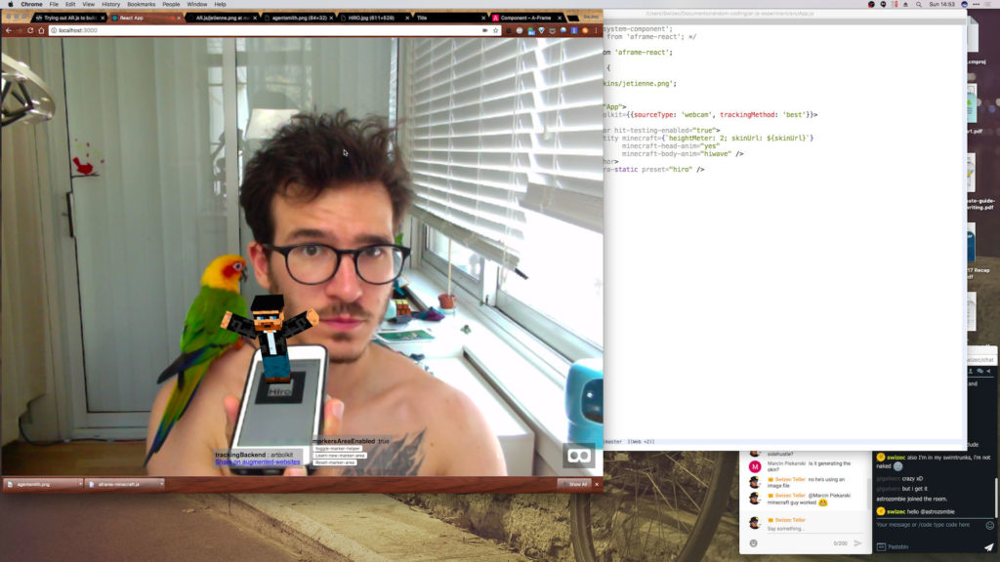
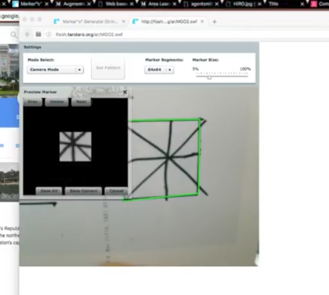

_This is a Livecoding Recap – an almost-weekly post about interesting things discovered while livecoding. Usually shorter than 500 words. Often with pictures. Livecoding happens almost **every Sunday at 2pm PDT** on multiple channels. You should follow [My Youtube](https://www.youtube.com/TheSwizec) channel to catch me live._


This Sunday we had 3 jobs:


1. Get the AR Minecraft guy working ✅
2. Use a hand drawn custom marker ❌
3. Fire an AR ballistic missile from Korea ✅❌


But AR is hard.


https&#x3A;//twitter.com/Swizec/status/904492731086528512


We got pretty close, just like I suggested in [last week's Livecoding Recap](https://swizec.com/blog/livecoding-recap-44-dipping-toes-arjs/swizec/7759) the Minecraft guy just needed some textures. After we added those, he became visible and looked great.


Here he is next to Kiwi.





To get that working we learned about [A-FRAME Schemas](https://A-FRAME.io/docs/0.6.0/core/component.html#schema). They're a way to describe the properties that an A-FRAME component can accept. A lot like React's propTypes, but as an object.


The `minecraft` component comes from `A-FRAME-minecraft.js`, which we copied off examples in [Jerome Etiennes AR.js repo](https://github.com/jeromeetienne/AR.js). That looks like this:


```
FRAME.registerComponent('minecraft', {
    schema: {
        skinUrl: {
            type: 'string',
            default : ''
        },
        wellKnownSkin: {
            type: 'string',
            default : ''
        },
        heightMeter : {
            default : 1
        }
    },
    init: function () {
        var character   = new THREEx.MinecraftChar()
        this.character = character

        this.el.object3D.add( character.root )
        // this.el.setObject3D('superRoot', character.root);
    },
    update: function () {
                if( Object.keys(this.data).length === 0 )       return
        var character = this.character
        character.root.scale.set(1,1,1).multiplyScalar(this.data.heightMeter)

        if( this.data.skinUrl ){
            character.loadSkin(this.data.skinUrl)
        }else if( this.data.wellKnownSkin ){
            character.loadWellKnownSkin(this.data.wellKnownSkin)
        }
    },
});
```


I have no idea which component system this is modeled after, but it works. Looks like we can define minecraft guy's height in meters, a URL for the skin texture, and choose one of well known skins. Those won't work in our project because we don't have the files.


Schema props are passed into A-FRAME components as a string. Like this:


```

```


You can read that as \*"Create an A-FRAME Entity composed out of `minecraft` with `heightMeter: 2; skinUrl:`, and `minecraft-head-anim` set to `yes` and `minecraft-body-anim` set to `hiwave`. Both `minecraft-head-anim` and `minecraft-body-anim` are A-FRAME components.


I don't know yet how that composition works, but it looks neat.


Equipped with a working Minecraft demo dude, we went on to try creating our own marker from scratch. According to the AR.js repo, you are to use this [Flash-based marker training](http://flash.tarotaro.org/blog/2009/07/12/mgo2/) implementation from 2009.


Flash doesn't work well in 2017. Couldn't get it to run at all in Chrome and Firefox wouldn't let us click on "Give camera permissions". Had to hack around that and manually add a rule to the global permissions table.


We were able to create a marker file. The trick is to have an enclosed area with straight lines. You can put any sort of scribble inside, as long as the outside is straight and enclosed.





Unfortunately we weren't able to convince AR.js to use our marker. Even explicitly setting the marker URL didn't work and it kept using default settings.


```

```


¯\\\_(ツ)\_/¯


Onwards to making a ballistic missile!


We went the [aframe-react](https://github.com/ngokevin/aframe-react) way to build our ballistic missile. That way we could postpone understanding true A-FRAME components a little longer.


```
class BallisticMissile extends Component {

    render() {
        const { pos } = this.props;

        return (
                                />
        )
    }
}
```


`BallisticMissile` is a class component because we wanted to use a `tickHandler` to animate as [aframe-react README](https://github.com/ngokevin/aframe-react#best-practices) suggests.


> For example, don't create requestAnimationFrames to continuously throw React prop updates to A-Frame. Instead, create an A-Frame component with a tick handler such that everything is done in memory with little overhead.


This did not work. I couldn't figure out how to set a tick handler that actually gets called, so we set up a little game loop in our `` component to make the missile fly.


```
class App extends Component {
    state = {
        missile: false,
        launching: false
    }

    launch = () => {
        this.setState({
            missile: true,
            launching: true,
            missilePos: { x: 0, y: 0, z: 0 },
            missileA: { ax: 0, ay: .005, az: 0 },
            missileV: { vx: 0, vy: 0, vz: 0 }
        });
        if (!this.launched) {
            window.requestAnimationFrame(() => this.gameLoop());
            this.launched = true;
        }
    }

    gameLoop() {
        const { x, y, z } = this.state.missilePos,
              { vx, vy, vz } = this.state.missileV,
              { ax, ay, az } = this.state.missileA;

        this.setState({
            missilePos: { x: x+vx, y: y+vy, z: z+vz },
            missileV: { vx: vx+ax, vy: vy+ay, vz: vz+az }
        });
        window.requestAnimationFrame(() => this.gameLoop());
    }
```


On every `requestAnimationFrame` we update `missilePos` with velocity on each axis, and `missileV` with acceleration for each axis. This creates a missile that flies straight up and never stops.


https&#x3A;//twitter.com/Swizec/status/904492731086528512


You can try launching a missile [here](https://swizec.github.io/ar-js-experiment/). You'll need the [hiro marker](https://jeromeetienne.github.io/AR.js/data/images/HIRO.jpg).


Join me next time as we try to make the missile look better and convince it to fly in a ballistic trajectory.


🚀