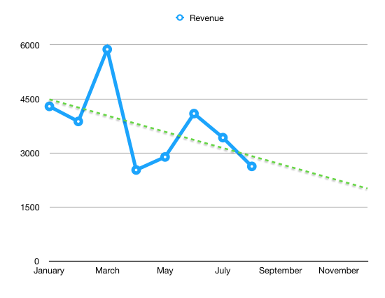

Hmm ... $2629 ... that's not a very high number at all. Something's gone terribly wrong 🤔

Oh yeah, I got so busy launching [React+D3v4](https://swizec.com/reactd3js) that I didn't publish anything on [React Native School](http://reactnative.school). That revenue is based on articles published, no articles published, no revenue. Oops. 😇

It's all good though, the sidehustle revenue for September is going to look spectacular. I'm excited already!

A smart business man once said to me: Money does not exist until it becomes cash in bank.

It's not your money until it's your money. Anything could happen. Oh you got a contract for a bunch of cash? Might get cancelled. Oh you did a bunch of work for someone? Maybe they'll go bust. Someone already wired you the cash but it hasn't arrived yet? Your bank might reject it.

That's happened to me before. Client wired me money, mis-spelled my name, bank rejected the transfer. 💩

In short: Yes, I launched React+D3v4 on August 16. Yes it made sales. No, it didn't hit my account until September.

Gumroad makes payouts on Friday the week after. Revenue for the week of August 26th is hitting my account on Friday, September 8th. Last Friday was already September so React+D3v4 had no effect on August revenue.

This scheduling quirk made my graph of monthly revenue look sad. The trend line in particular is cause for worry. 😕

Here's August in numbers 👇

**Total Revenue:** $2629

**Gumroad sales:** $1317

- React+D3v4 preorder: $685
- React+D3 ES6: $472
- ES6 cheatsheet: $19

**Leanpub sales:** $312

- Why programmers work at night: $47
- React+D3: $33
- React+D3v4: $231

**React/JavaScript coaching:** $1000

**LiveEdu premium:** $4

**Time investment:** 66 hours

**Expenses:** $1812 - Editor: $500 - VA: $400 - FB Ads: $176 - PonyFoo sponsorship: $250 - Domains: $131 - Dreamhost: $33 - AWS: $14 - now.sh: $15 - Webfaction: $10 - Drip: $184 - SumoMe: $99

Why the fuck did I buy $131 worth of domains? What did I even buy O.o And I need to shut down Dreamhost and Mailchimp. Legacy stuff that I'm not using anymore lol.

**Hourly rate after expenses:** $12

That's $2 under minimum wage. Aaaaaalmost!

I have high hopes for September 🤞