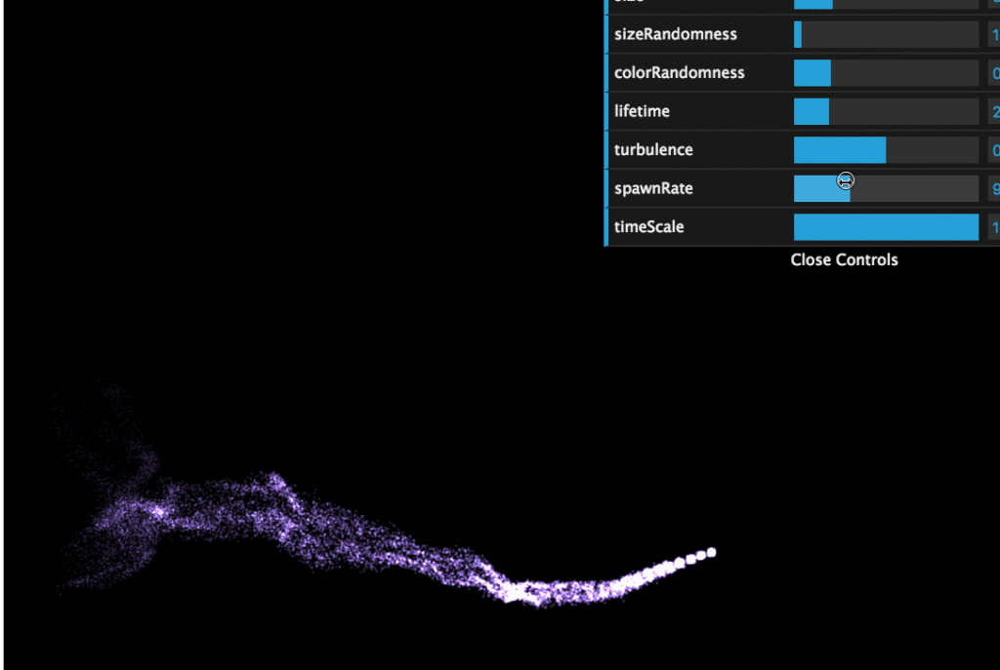

_This is a Livecoding Recap – an almost-weekly post about interesting things discovered while livecoding. Usually shorter than 500 words. Often with pictures. Livecoding happens almost **every Sunday at 2pm PDT** on multiple channels. You should follow [My Youtube](https://www.youtube.com/TheSwizec) channel to catch me live._ https&#x3A;//www.youtube.com/watch?v=aLbjwjD92Z4 You know what? This 3D stuff is way too hard. None of this makes any sense to me anymore. All I wanted to do today was make a nice little hurricane travel across an augmented reality marker. In theory, all you need for that is a nice particle system and some parameter tweaking. Instead of particles flying around randomly, you want them to twirl around in a cone shape of some sort. But noooo… We tried with [aframe-particle-system-component](https://github.com/IdeaSpaceVR/aframe-particle-system-component).  That did not quite work. Then we searched for [three.js examples](https://threejs.org/examples/) that looked close enough that they could be a hurricane with some param tweaking. The closest we could find was the [GPU Particle System example](https://threejs.org/examples/#webgl_gpu_particle_system). It's got everything we need:

1.  Many particles
2.  Particles follow some sort of wind pattern
3.  Parameters to tweak

 Turning it into an [aframe component](https://aframe.io/) for [our setup](https://github.com/Swizec/ar-js-experiment) should be easy. Aframe is an abstraction on top of Three.js, after all. _In theory_, all you have to do is to register a new Aframe component, put your example initiation into `init()`, and your animation stuff into `tick()`. Instead of rendering with the Three.js renderer, you `setObject3D` on the Aframe object.

    AFRAME.registerComponent('hurricane', {
        scheme: {},
        init: function () {
            // initiation code
        },
        tick: function (now, delta) {
            // animation code
        }
    });

Then you could use it like this: `<Entity hurricane />`, or without JSX, like this: `<a-entity hurricane />`. It didn't work. We tried fiddling with it and changing things here and there and nothing worked. No matter what, nothing showed up on screen. In a final act of defiance, we found this cool [aframe-environment-component](https://github.com/feiss/aframe-environment-component) and put a giant mushroom forest around our Minecraft guy. https&#x3A;//twitter.com/Swizec/status/907022919028457472 I guess that's cool, too. I dunno, I'm kinda disappointed. I was hoping we could build something cool, but this whole 3D-on-the-web business is almost as big a mess as all the D3 examples you find out there. What is it with everybody who writes these examples and relying on global variables for everything? Use function arguments, damn it! That's what they're there for 😖 And what's with all the imperative code? Everything is just add this and this and this and then change this and that. How am I supposed to understand what's going on? Ugh ... we'll play with something new next week. Any suggestions?
