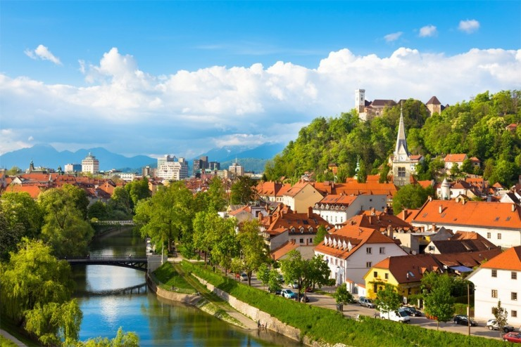
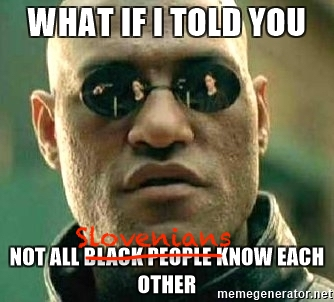

A nice people-of-color-in-tech activist once told me that when I come to America, my identity is stripped and I become a white male. Grouping by nationality, he said, is too arbitrary. You can't just conjure arbitrary identities so you can feel special. Even my dear girlfriend once said that I don't get to identify as a minority. I am a white male, and that's that.  Before I ever became a white male, I was Slovenian. Part of a small nation tucked away between the Alps and the Adriatic. It represents just 0.03% of the world's population.[1](#fn1) With a uniform distribution of tech talent, you would expect to see around 180,000 Slovenians in tech globally.[2](#fn2) The Statistics Bureau of Slovenia says there are about 23,000 Slovenians in tech. If you generously add another 5,000 to account for the Slovenian diaspora[3](#fn3), that makes 28,000. 28,000 is a whole order of magnitude less than 180,000. If the goal of tech is total inclusivity and equal opportunity for all, where are all the Slovenians? ¯\\\_(ツ)\_/¯ Some four years ago, I moved to the San Francisco Bay Area. According to the napkin math, I could expect to find some 400 Slovenians in the local tech scene. 7,150,000[4](#fn4) \* .2 [5](#fn5) \* .0003 = ~400 I think even 100 is pushing it. I know of around 30 who live here and maybe another 30 who visit regularly.

## What that looks like in practice

 Nobody discriminates against us. There's no precedent. Say you're from Slovenia and it's the same as saying you're from some random town nobody's heard of. But that does make me everybody's token Slovenian. Go to a tech event and the conversation always involves the bit where somebody asks _"Whoa, where is YOUR accent from?"_ … uh, Slovenia … _"Whaaat!? That's so cool! What's Slovenia?"_ … uh, small country next to Italy … _"That's so radical. I’ve always wanted to visit Italy! Are you close to Venice? Have you been? What's the weather like? Why are you here?"_ Yeah, Venice is a 2 hour drive away from home. No, that's considered very far. I've only been twice. No, I promise you, you wouldn't go every weekend if you lived there. From that moment onward, I am _THE_ Slovenian. Whatever I do and say becomes the lens through which they judge all of Slovenia. Kinda cool, but also kinda burdensome. After the thousandth time, it also gets tiring. Imagine you were a woman and everyone you met said things like _"Oh wow a woman in tech! What's it like? Are all women just like you?"_ I was at a conference once where another Slovenian showed up. Completely unrelated. It just so happened that there were two of us. Every conversation had this bit: _"Holy shit, you're Slovenian! OMG have you said hi to the other Slovenian yet? Do you know each other? THAT'S SO COOL THERE'S TWO OF YOU OMG!! Come let me go get him, you two can chat"_ 🙄 Imagine doing that to a black person. _"Dude whaaat you're black!? I know this other black person! Do you know them? Let me go get them, you two can talk about being black"_ It's all well intentioned, I know. Everybody means well. They're excited that they discovered something new. It's cool. But I've had this conversation with exactly everybody I met in the past 4 years of my life.

## Does that make me a minority?

I don't know. I _am_ both white and a dude. So maybe not? Not until I open my mouth at least. Not until I have no shared history with anyone and it's difficult to relate with anyone. Not until I experience every same thing that all minorities experience. **Lack of \[global] role models? Check.** Growing up, how many Slovenians do you think I saw in Hollywood or world-class sports or leading global corporations? Not many. One actress made it in Hollywood by the time I was 26. She had a role in Wolf of Wall Street. Her whole thing was _"You're Slovenian! You can help us smuggle money because you speak so many languages. It's perfect!"_ 🙄 There's rumors that another Slovenian actress in Hollywood existed in the 1920's. We have people in the NBA and such, and they're national heroes. No superstar global entrepreneurs, especially not in tech. We had our first unicorn exit 3 months ago. **Nobody famous looks/identifies like me? Check.** At home, this isn't a problem. We have plenty of famous Slovenians in Slovenia. On the global stage? Nah. **Lack of resources in youth? Kinda.** We're a post-socialist country that only became a country when I was 4 years old. Our entire GDP is less than what Apple makes in three months. How many resources do you _think_ I had? My family did okay for our locale and situation, but compared to somebody growing up in suburban America? Ha! **Lack of shared history and experience? Yes.** There's about 100 other Slovenians in a 500-mile radius. There's _nobody_ I can chat with about common experiences and stuff. There aren't even enough of us to form support structures based on identity. At such a small scale, inter-personal dynamics and individual friendships trump anything identity based. **Lack of or bad perception in media? Uh-huh.** Because Slovenia is so small, we become grouped with other Slavs in popular culture. You know what Slavs do in US media? Slavs are either janitors or part of the Russian mafia. They wear tracksuits, speak in a funny accent, and do stupid shit on dashcams. They're also always drunk and maybe a little dirty. https&#x3A;//www.youtube.com/embed/oRIsC764Nn4 Yeah, there's even a standup about it. It's funny. But worry not. I will continue to be your token Slovenian. Because what else can I do?

1.  There are between 2,000,000 and 2,500,000 Slovenians in the entire world.Given a global population of 7,500,000,000 that makes just 0.03%. [↩](#ffn1)
2.  This Quora guesstimate puts 20% of the world's workforce in tech. https&#x3A;//www.quora.com/How-many-people-work-in-the-tech-industry-worldwide [↩](#ffn2)
3.  About 2,000,000 Slovenians live in their homeland, some 500,000 are external. 23,000\*.25% = ~5,000 [↩](#ffn3)
4.  https&#x3A;//en.wikipedia.org/wiki/San_Francisco_Bay_Area [↩](#ffn4)
5.  https&#x3A;//www.quora.com/What-percentage-of-Bay-Area-residents-work-at-technology-companies [↩](#ffn5)
