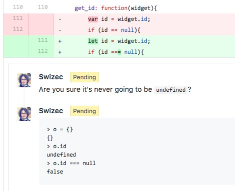

 I was doing code review for a coworker yesterday, and it soon became obvious that he used a linter and that the linter gave him a bright idea: _use strict comparisons_. Using strict comparisons is a great rule to follow. `===` instead of `==`, `!==` instead of `!=`. Your life will be better. You're ensuring not only that your _values_ are equal or unequal, you ensure their _types_ match as well. Because [JavaScript has funny types](https://www.destroyallsoftware.com/talks/wat), strict comparison lets you avoid painful pain. Things like this:

    > "0" == 0
    true

And like this:

    > true == 1
    true
    > false == 0
    true

Even things as silly as this:

    > new Array() == 0
    true
    > [] == 0
    true

Run a linter on those examples, and it will sagely say _"Dude, use strict comparison. ALWAYS use strict comparison.”_ And your linter would be right. `===` fixes all of those examples.

    > "0" === 0
    false
    > true === 1
    false
    > false === 0
    false
    > new Array() === 0
    false
    > [] === 0
    false

👌 Problem solved. 👌 But here's one situation where it gets tricky. Checking undefinedness:

    > null == undefined
    true
    > null === undefined
    false

Under loose comparison, `null` and `undefined` are equal. Under strict, they're not. This can cause all sorts of issues. Here are some examples I found in my coworker's PR. 👇

    const url = $(elem).data('url')
    if (url !== null) {
        // ...
    }

But if your `elem` doesn't have a `data-url="..."` attribute, jQuery returns `undefined`, not `null`. Strict comparison fails. A better approach is to use `if (url)` because `undefined` is falsey and so is an empty string. That makes your code robust against `data-url=""` :)

    function scroll({ elem, offset, duration }) {
        duration = duration !== null ? duration : 2000;
    }

But if you call `scroll()` without duration, it's `undefined`, and your code breaks. No default duration for you. A better approach is to use destructuring defaults, like this: `function scroll({ elem, offset, duration = 2000 })`.

    function get_id(widget) {
        let id = widget.id;
        if (id !== null) {
            // ...
        }
    }

But reading an inexistent object property returns `undefined`, not `null`, and this code breaks. Once more, you're better of relying on inherent falsiness 👉 `if (id)`.

    function createWidget(defaultText, onClick, markBusy) {
        new Widget({
            text: defaultText,
            onClick: onClick,
            markBusy: markBusy !== null && markBusy
        })
    }

This one is tricky. It's trying to pass `markBusy` into the `Widget` constructor, but only if it's defined. You can't use default param values because there's no destructuring so hmm… 🤔 Then again, the whole exercise is futile. You can achieve the same effect if you rely on inherent falseyness: `markBusy: !!markBusy`. I guess my point is that you have to be careful. Don't blindly trust your linter when it says change `this code` to `that code`. Happy hacking 🤓
