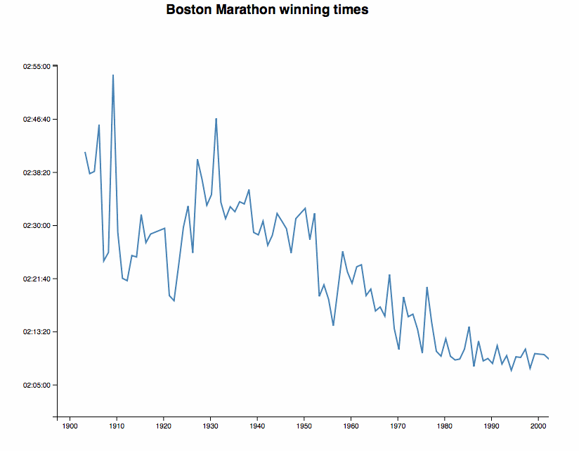
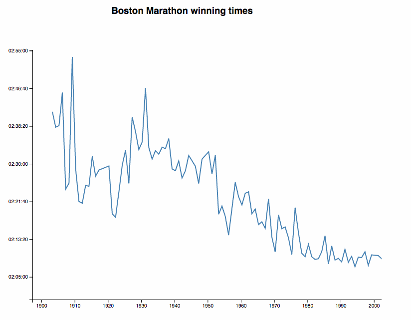

The Flash of Doom is one of the most annoying issues with D3 charts. You load the page, then you load the data, _then_ you render your chart. Everyone's staring at a blank screen while the data loads. With React 16, we can fix that using server-side rendering and the new `ReactDOM.hydrate` feature. The idea is to serve a fully rendered chart in the initial HTML payload, then take over with JavaScript and become a normal webapp.  Pay close attention to that gif. The flashing red shows repaints. When I reload the page, the whole thing re-renders and shows a line chart. Axes show up after a little while, and they're the only part of the page that re-renders. Here's a slower version without the flashing.  Here's what you're seeing 👇

1.  You hit reload
2.  Server reads `index.html` from [create-react-app](https://github.com/facebookincubator/create-react-app)
3.  Server reads local CSV file with data
4.  Server renders `<App />` into root HTML element
5.  Server sends the full `index.html` to your browser
6.  Browser shows HTML with the chart
7.  Browser loads remote CSV file with data
8.  Browser runs `ReactDOM.hydrate()` to render `<App />`
9.  `<App />` takes over the DOM and becomes a normal webapp

Some parts of this are efficient. `ReactDOM.hydrate` avoids re-rendering parts of the DOM that were already rendered by your server. In our case, that's everything except the axes. Some parts of this are inefficient. The server shouldn't need to read the CSV and HTML files on every request. You could do that on startup and save the strings in a variable. They're static. We're also rendering `<App />` and running all of our React code twice. But this doesn't need to happen every time on the server. Cache that stuff!

## How to

You can try it out for yourself [on Github](https://github.com/Swizec/server-side-d3-poc). The hardest part was adding a small Express server to `create-react-app` that supports `import` and React syntax. I couldn't figure it out on my own, so I used [Ben Lu's](https://medium.com/@benlu/ssr-with-create-react-app-v2-1b8b520681d9) amazing [SSR with create-react-app](https://medium.com/@benlu/ssr-with-create-react-app-v2-1b8b520681d9) guide. The main trick seems to be installing `ignore-styles` so your server doesn't error out when `require`-ing CSS files (no webpack), and figuring out just the right incantation of Express setup to get the server working. I tried simplifying his setup, but it didn't work. In the end, your best bet might be to just copy his `server/` directory and go from there. Adapt `server/universal.js` to render your `<App />` instead of his ReactRouter stuff. You also have to go into `public/index.html` and add `{{SSR}}` to the body of `
`. The server looks for `{{SSR}}` and replaces it with the rendered HTML from your React app. You can see my server-side code that reads a CSV file and renders the chart into a string [on Github](https://github.com/Swizec/server-side-d3-poc/blob/master/server/universal.js).

## Adapting your React D3 app to server-side

Adjusting to server-side rendering required a small mind shift in the way I built my chart. Usually, I like to use `componentWillMount` in the `<App />` component to load data. Until data loads, the app renders a `null`; after that, it returns a chart component. This makes apps easy to build and avoids issues with undefined data when rendering. But it throws away all benefits of server-side rendering. With the `componentWillMount` approach, you're loading the fully rendered chart, replacing it with an empty component, then re-rendering it once data loads on the client.  Here's what you do instead: Accept data as props. Only load in `componentWillMount` if no data was given. Like this 👇

    class App extends Component {
        constructor(props) {
            super(props);

            this.state = {
                data: (props.data || []).map(this.rowParse)
            }
        }

        dateParse = d3.timeParse("%d %b %Y");

        rowParse = ({ date, time, runner }) => ({
            date: this.dateParse(date),
            time: time.split(':')
                      .map(Number)
                      .reverse()
                      .reduce((t, n, i) => i > 0 ? t+n*60**i : n),
            runner
        });

        componentWillMount() {
            if (!this.state.data.length) {
                d3.csv("https://raw.githubusercontent.com/Swizec/server-side-d3-poc/master/src/data.csv")
                  .row(this.rowParse)
                  .get(data => this.setState({ data }))
            }
        }
        
        // render stuff
    }

In the `constructor`, we copy data from props into `state`. That's because components that load their own data usually keep it in state and putting it there means fewer changes to the rest of your code. `rowParse` is a helper method that turns individual rows from CVS strings into correct data types: dates for `date`, seconds for `time` to win the marathon, and `runner` stays a string. In `componentWillMount`, we now check if data is already present. If it isn't, we load it and everything works the same as it always has.

## Hydrate _after_ data loads

The final piece of the puzzle is hydrating your app _after_ your data is done loading. You're already showing a chart, so there's no need to be hasty and `ReactDOM.hydrate` as soon as your JavaScript loads. https&#x3A;//twitter.com/dan_abramov/status/913353504856723458 You can't detect that your component already had children and avoid replacing them until you're ready. Instead, you can wait to hydrate in the first place.

    d3.csv("https://raw.githubusercontent.com/Swizec/server-side-d3-poc/master/src/data.csv")
      .row(this.rowParse)
      .get(data =>
          ReactDOM.hydrate(, document.getElementById('root'))
      );

And you have successfully solved the Flash of Doom seen in most D3 charts. \\o/

## Caveat

Now you need a server. No more static page serverless webapp for your beautiful chart. No gh-pages and simple hosting… You _could_ use now.sh, and that's nice, but I don't know how to make it run my server. See 👉 <https://server-side-d3-poc-mamdozxwze.now.sh> The panacea is to figure out how to tweak the create-react-app build process to insert your server-side rendered `<App>` right into its `index.html`. That's what I really want. I wonder if they'd accept a PR for that 🤔
