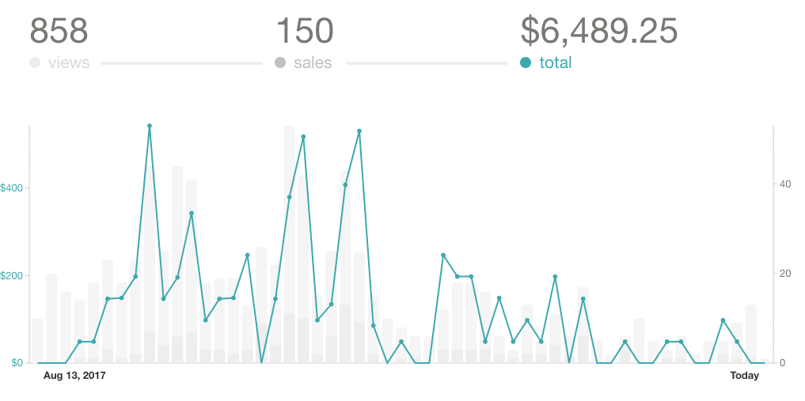

https&#x3A;//twitter.com/Swizec/status/915239443337854976

Didn't I tell you [last month](https://swizec.com/blog/2629-august-sidehustle-report/swizec/7782) that fitting linear trends to seasonal data was a Bad Idea™? That's why I wasn't worried when the line showed my business was failing and all hope was lost.

This sort of thing is why insider trading is bad. Insiders know when trendlines are wrong, and outsiders do not.

You read stories online about people who launch their book and make 6 figures in a week. I am not one of those people. My launch was two orders of magnitude more honest.

Here's why 👇

https&#x3A;//twitter.com/Swizec/status/915738664818245632

I have all the prerequisites for a huge launch:

- friendly email list of more than 7,000 people
- a blog/site that gets okay traffic
- a kickass product
- people eagerly waiting to give you money
- somewhat recognizable brand

A couple of things went wrong though. First and foremost is that I missed the market. I launched too late.

Interest first started drumming up around December last year, and it made pre-orders absolutely amazing. I was making sales left and right, and it was great.

Then it took me another 7 months to finish the book. Oops.

By the time React+D3v4 launched, half the people who replied to my _"Why didn't you buy this?"_ email said things like:

- uhhh… I needed this 6 months ago
- dude, I've switched teams, we do Angular
- can you do something with Vue? React is old

💩

Sell to people when they're ready to be sold to, not 6 months later. This is something I suspected long ago and need to work on. People get into React and D3 and they have immediate need for help. Then, a few months later, they already figured it out and don't need help anymore.

The need to learn a piece of tech is time sensitive.

Another timing mistake was launching in the last two weeks of August. I suspect people are still in vacation mode and aren't ready to think about work.

Should've waited until September. I was late already.

I also learned that React+D3 is _work_ for most people. Not everyone is crazy like me and learns this stuff just for fun.

That's one of those \\important lessons about understanding your market that I often miss. While I like to learn stuff just for the fun of it, most people learn it so they can get better at their job, land that freelancing client, or quickly ramp up after winging their way through an interview or client call.

Sales were okay overall, but there's a worrying detail hidden in this graph 👇

There's no spike.

Books and info products often follow the “huge spike followed by meager steady sales” pattern. This is not the sort of product where you can continuously make a hundred sales per day.

You launch and make most of your sales for the year. Then, if your book is any good, it gets some float and keeps making a sale or three per day.

My launch did not go that way. No big spike anywhere to be seen. There's a few smaller spikes and they combine into one hell of a month, but there's no _huge_ spike that's 100x a normal day.

I don't know why.

But I think it has to do with the 2nd most common reply people gave me:

_"Dude, I love your stuff, but I don't need it just yet. When I'm ready and have time, I'll buy, I promise"_

Five bucks says you won't remember 😉

Here's where people who are smarter than me introduce artificial scarcity. Something that pushes people over the edge and makes them hit the buy button even if they don't need something just yet.

I've certainly done that before. OH YOU HAVE A COOL THING THAT IS USEFUL TO MY LIFE AND I DON’T HAVE TIME BUT YOU’RE TAKING IT AWAY IN TWO DAYS!!? **YES → BUY**

I didn't have one of those because I think it's gimmicky. Next tim,e I'll have it and try to do it un a nongimmicky way.

## Key takeaways

There are two action items from what I've learned during this launch:

1. Have a rolling launch. Run launch activities every 3 months or so. Try to automate this.
2. Set up a time limit to encourage people to buy _now_, not later when they forget

* * *

Here's September in numbers 👇

**Total revenue:** $9013

**Gumroad sales:** $5845

- React+D3v4: $5785
- ES6 Cheatsheet: $32

**Leanpub sales:** $312

- React + D3: $33
- React + D3v4: $231
- Why Programmers Work at Night: $47

**Packt Royalties:** $722

**React Native School:** $1905

**Patreon subscriptions:** $254

**Time investment:** 69 hours

**Expenses:**

- Editor: $500
- VA: $400
- Facebook ads: $674
- FrontApp: $360
- Drop: $184
- SumoMe: $99
- Webfaction: $10
- LiveEdu Pro: $10
- Breakthrough Advertising book: $135
- AWS: $14
- now.sh: $15

Can't wait to get that [Breakthrough Advertising book](https://www.breakthroughadvertisingbook.com/). Soooo many people have recommended it, and it's supposed to be the absolute best anyone has ever written on the topic. Straight outta 1966.

**Hourly rate after expenses:** $102/hour

Now we're talking 🤘

_That's_ why I sidehustle: Time stays constant, revenue goes up.