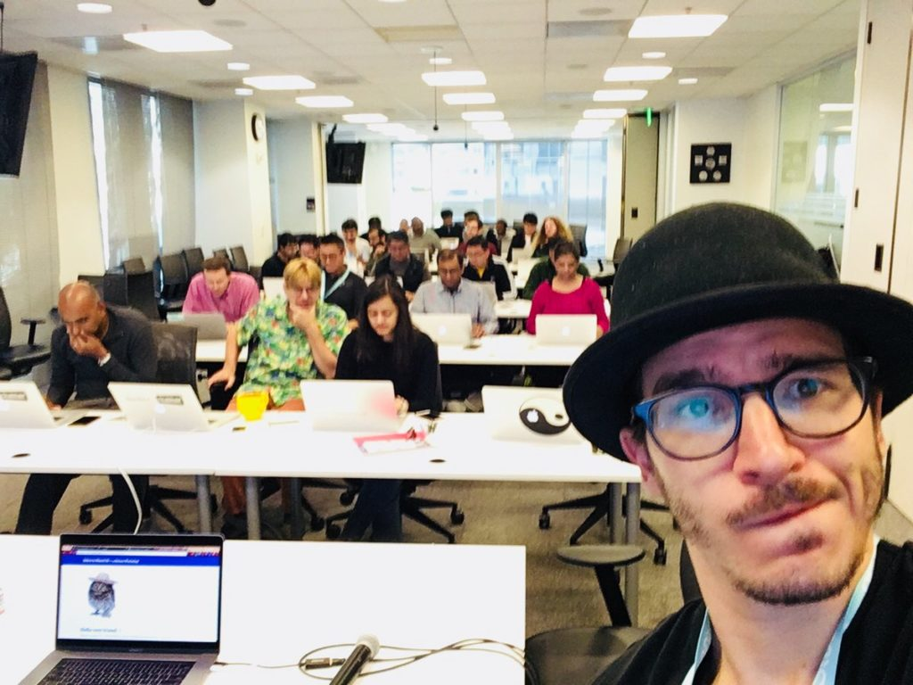
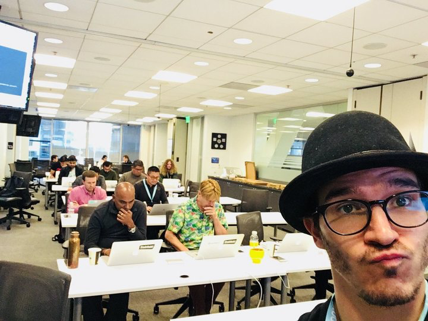

> Hey Swiz,  
> We have a 2-day Intro to React and Redux workshop scheduled at Big Company next next Tuesday and our instructor dropped out.  
> 1 day of React, 1 day of Redux a week later. 7 to 8 hours each. Can you jump in? ~ Ben

It was Ben from [Real World React](http://www.realworldreact.com), the React training company with a great meetup here in San Francisco, but no real website. They do things the hard way: sales and networking. By the time we met with StubHub to discuss what they were looking for, solidified that I was in fact doing it, and agreed on the business side of our arrangement, it was 4 days until the first workshop. I was trembling. How the hell do you prepare a full day workshop in just 4 days? From scratch because all your materials are [React+D3v4](https://swizec.com/reactd3js/). 2 days into that weekend from hell, I got an email:

> Workshop pushed to Friday. 2x people signed up. Needed bigger conference room.

Phew… Now I gotta entertain ~26 people, and I have 3 extra days to prepare 😅 https&#x3A;//www.youtube.com/watch?v=ix5iqTZ8WCo My previous workshops had been with [Freddy](https://github.com/freddyrangel). He did React in the morning, I did D3 and React+D3 integration in the afternoon. All of our workshops were either at conferences or self-organized for people who wanted to improve their careers and paid for their own ticket. A full day workshop… that's new territory. Can I even keep people engaged for 7 hours all on my own? Are corporate training people just as motivated? If your boss says _"Yo, we're moving to React. Here's a workshop we organized for you. Go learn,”_ will you still care enough to pay attention? Like… challenge accepted, I guess?  Stressss The first workshop… well, I wouldn't say it was a disaster. People learned React fundamentals and asked a lot of questions about state management. My answer to most of those was _"We're going to talk more about that next week.”_ I think I aimed the content a little low for the room. Half the feedback said that we could have covered more content in a whole day workshop and spent less time coding things that aren't super relevant to React principles. Examples are hard. Balancing how much to let your audience code on their own and how much to hold their hands is tough as nails. On the first day, I missed the mark. Everyone started super engaged then drifted off and got bored. By 4pm, I lost half the room. The rest stuck with me until 5 even though it was Friday. \[caption id="attachment_7859" align="alignnone" width="720"] See how tired I get towards the end?\[/caption] I had exactly a week to prepare the 2nd workshop. It was focused on Redux, but I don't use Redux on the day to day! A lot of my code uses MobX because there's less to type. Hell, my day job is still all Backbone 😅 But so is StubHub. Their goal with my workshops was to accelerate the transition from Backbone to React. Objective for the week: Create and prep a more \~~boring\~~ real world example, something more e-commercey, the kind of stuff these people do in their jobs. Reduce the gap between what you're teaching and what they're doing so it's easier for them to apply later. Less coding, more hand holding. https&#x3A;//twitter.com/Swizec/status/918871504347021313 And you know what? The 2nd workshop day went much better. People didn't get bored, they didn't drift off, and there was a palpable reluctance in everyone who left at 4pm. That's just the way it is in the corporate world, you know. Friday 4pm, you're out. Can't blame 'em. It was hard to stay focused and engaged for 7 hours straight for me, too. We did take breaks, but when that 3:30pm/4pm hits… you just start fading and becoming less and less engaging and vivacious as one audience member put it. "Very Vivacious presenter”… what a lovely compliment. ❤️ The hard part of leading a workshop like that is that your energy dictates the room of the whole energy. _You_ have to bring the energy. _You_ have to be engaged and engaging and vivacious and high energy. _You_ have to pull everyone back when their eyes start to close and their mind starts to wander. https&#x3A;//youtu.be/FaAlBSVp9M0 Questions were much better at the Redux workshop, too. It's hard to put my finger on it, but I think that's because Redux is a bigger intellectual leap from how they already do things than React is. With React, you get HTML as a first-class citizen of JavaScript. Great. With Redux, you get a completely new way of thinking about the architecture of your webapp. Whoa. https&#x3A;//twitter.com/Swizec/status/918934965051461632 So… what did I learn from all of this? A few things 👇

1.  **You _can_ prepare a good full day workshop in 1 week**. It's stressful as fuck, but doable.
2.  **Materials don't matter** as much as you think. With a good example project, you can wing it for 5 hours and everyone will love it.
3.  **Use your livecoding practice**. Write code live, talk about what you're doing, take questions.
4.  **Leave smaller blanks for people to fill**. At a workshop, people want to write code and see it run on their laptop. But the blanks you leave for them should be small. Smaller than you think is worth leaving.
5.  **Show some code, leave a blank, fill the blank, repeat**. People are most engaged with short 2 to 3-minute blanks to fill. Write a bunch of code, leave a blank, tell them what to do, give them a few minutes, fill it in yourself, continue showing code.
6.  **Take anonymous feedback**. In person, everyone says they loved your thing. Or they say nothing. When it's anonymous, they don't fear telling you exactly how it is.
7.  **Just do what the feedback says** When you get that feedback, you know what, just do whatever it says and everyone's happy. Who woulda thought, eh?
8.  **This stuff is still new to a lot of people** My biggest surprise was that when you step away from the bleeding edge conversation Twitter, the world is gigantic and huge. We live in a little bubble where everyone knows more than we do and is far more advanced and we feel left behind. People at big corporations, the people writing JavaScript every day for billions of dollars, they still struggle with fat arrow functions and spread operators and transpiling and all the things we take for granted.
9.  **Enterprise sales are hard** Ben says it took him around 6 months to organize this workshop from when he first started talking with StubHub. Corporate training is an enterprise sales business.
