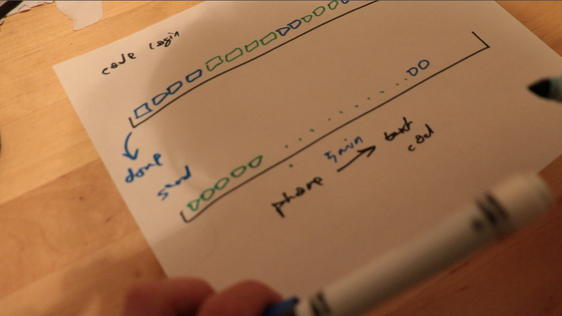
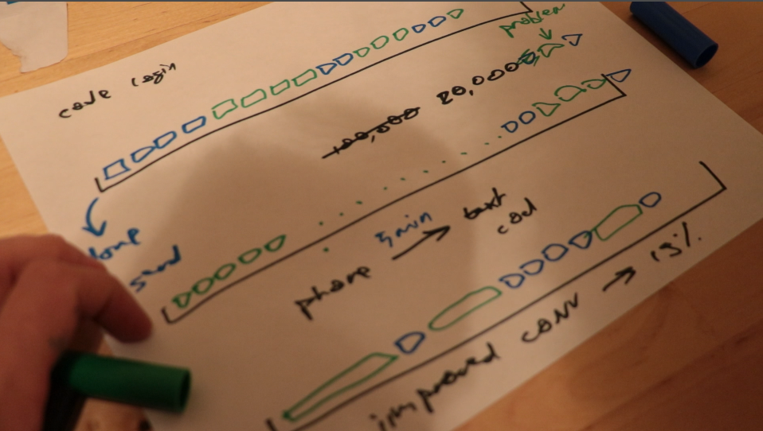

Once upon a time, I made a brilliant decision: We're going to make a new background worker for every analytics event on our platform. The goal was simple: have real-time analytics, don't be bound to a single provider, keep local copies of all events in case something goes wrong. I designed a system that does that. Clients (web and mobile) send events to our server, our server stores them in the database and creates a new worker on the queue. That worker runs, sends the event to Mixpanel, and marks it as sent. With this design, we can easily switch to a different provider. Just change the call on our backend, clients keep the same API. Wonderful. If anything goes wrong when talking to Mixpanel, or if we need to run a complex query involving events and the rest of our data, we can. All events are stored. Wonderful. Job well done.  Until one day [Yup](https://www.yup.com) got a lot of traffic. No, the analytics didn't stop working. Our database didn't get flooded. Oh no. Don't you worry about our database. Postgres can handle hundreds of millions of rows. Postgres is a champ. No, no. What happened was that our "We send code to your phone to log in" system stopped sending out codes. 2 minutes, 3 minutes, sometimes an hour late. Often ten codes at a time would arrive to the same person because they retried so often. Codes were out of sequence, too. Wait what? A-ha! Let me explain! You see, we use [Sidekiq](https://github.com/mperham/sidekiq) to queue our background jobs. It assigns all your tasks to a `default` queue unless you specify. Somewhere along the line, we got lazy and we stopped specifying. Everything went to the same queue and it worked great. Until we had traffic.  Once we had traffic, our analytics workers filled up the queue. Users created tens of them before they even got to the login screen. Others were creating hundreds past the login screen. At one point, we estimate we had almost 20,000 jobs stuck in the queue. Most of them were analytics. Some of them were business critical. Many of them were waiting to let people login and try our service. 😅 How do you fix this? With a `for` loop. Let me explain. Say you're sending each event in its own worker. The job itself is really fast. It takes less than 1 second to execute. But scheduling that job, keeping it around, making a worker to run it, executing the Ruby on Rails machinery… all that takes time. A lot of time. But instead of being eager and opportunistic, you can send events in batches. Say a worker wakes up every 5 minutes and sends all events from the past 5 minutes that haven't been sent yet. Now you have a worker that takes longer to run. Several seconds, even a few minutes. **But you run only 30 jobs per hour instead of 10,000.**  The downside? Instead of real-time analytics, you have to wait 5 minutes to see what's up. How often do you check those charts anyway? Once a day? Every hour? Pretty sure you're not checking every two seconds. Code send times dropped from an average of 3 to 4 minutes to an average of about 10 seconds. Sometimes 20. Our conversion rate from downloading [Yup](https://www.yup.com) to having a trial increased by 19%. All from a 5-line `for` loop. Boom. 
