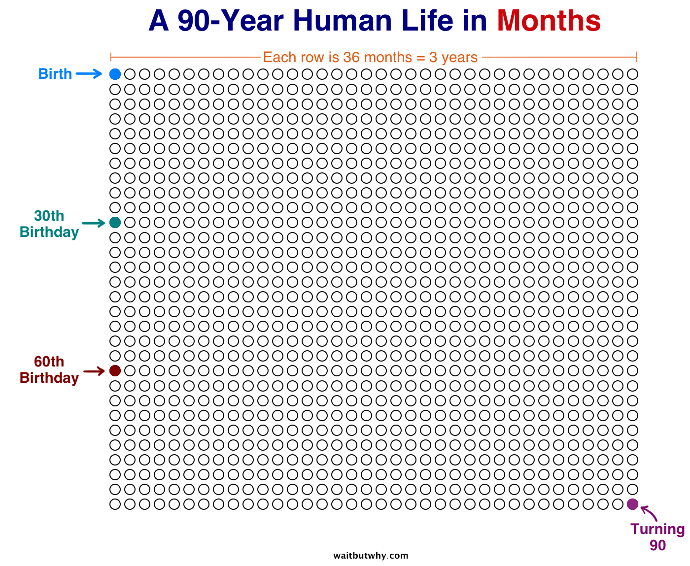

 I turned 30 last week. That's one of those big round numbers that feels like a milestone. Something to write about. To shout from the rooftops about all the lessons you've learned and the wisdom you gained. Friends call you old and joke about youth long gone. Every ache and pain explained with a _"Ya old now, grandpa!"_, every yawn met with a joke about your advanced age. Your mum still thinks you're a kid and people in their 40s and 50s chuckle and say you're barely getting started. Which is true. 30 is about 37% of your life. Assuming a few things like no bad luck and no breakthrough medical advances. 37%… I honestly can't decide if that's a lot or not. It's not _nothing_. But it's not all that much either. If your life was like Friends, you haven't even finished the first season. If it's like Breaking Bad, you're 2 episodes into season 3. [Wait But Why](https://waitbutwhy.com/2014/05/life-weeks.html) says 30 years puts me here 👇  ¯\\\_(ツ)\_/¯ Honestly, I think the biggest surprise about turning 30 is that there is no profound wisdom, no profound life advice, nothing much to say really. It happens then friends bring you good whisky.

> [One benefit of turbing 30 is that people bring you really good #whiskey](https://www.instagram.com/p/Ba2dmp8F_gn/)
>
> A post shared by Swizec Teller (@swizec) on Oct 29, 2017 at 4:50pm PDT

Maybe the thing that happens somewhere between 25 and 30 is that you gain just enough perspective to see everything as gray, but not enough perspective to know what to do with it. There's no right or wrong, there's just _"Eh, it depends"_. No gooder or worser technology, just _"Eh, depends"_. No truth, lie, or fact, it all depends. At 27, I had a lot of advice and my opinions were strong. At 30, all I can do is listen, and my opinions are It Depends. I don't know if that's good.
