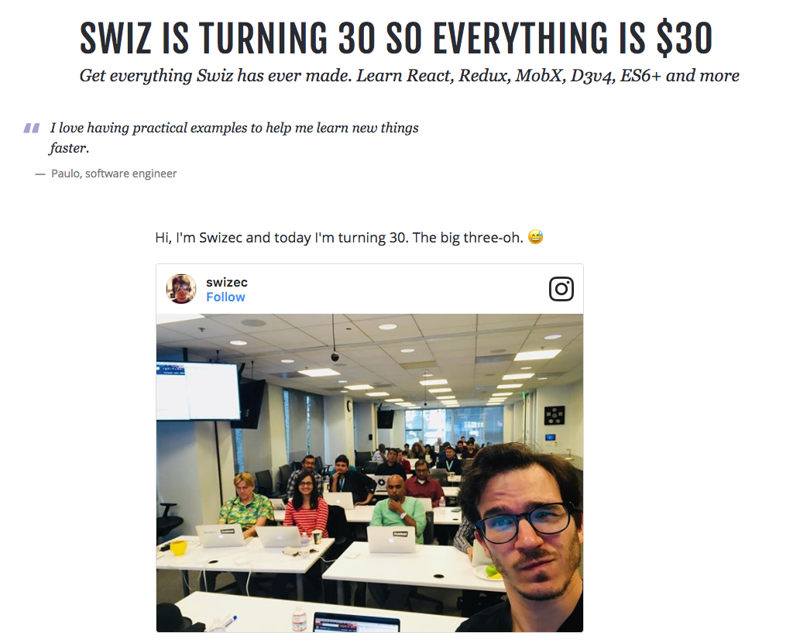

October was fire 🔥

https&#x3A;//twitter.com/Swizec/status/924020785710227457

The whole month comes down to dumb luck, timing, and seizing opportunities. And a little elbow grease.

You see, October actually started way back in August. [Real World React](https://www.meetup.com/Real-World-React/events/242620292/) was organizing a hack night and needed mentors. I said what the hell and signed up. They took me on.

At the hack night, I met Ben, the organizer. He mentioned that he was looking for React trainers who could run workshops because Real World React's workshop and corporate training business is growing.

I said, “Yep, I'm your man.”

In mid-September, he pinged me and said they had a deal with StubHub to do an [Intro to React and Redux workshop](https://www.youtube.com/watch?v=ix5iqTZ8WCo), but nobody to do it. The usual guy dropped out.

I sensed a disturbance in the force, but didn't want to push for a reason. Because screw _why_, focus on YES LET'S DO THIS.

So I prepared a full day workshop in like a week. 👇

https&#x3A;//www.youtube.com/watch?v=ix5iqTZ8WCo

It went okay. Got some feedback, made some adjustments, prepared another full day workshop in a week for Redux, Day 2. 👇

https&#x3A;//www.youtube.com/watch?v=FaAlBSVp9M0

That one went much better. More attendees stayed until the end, asked more questions, and generally had more fun. There may or may not have been an inside joke going around the room.

I learned that people enjoy more handholding than I do myself and that they love it when [I draw on the whiteboard while talking about React and Redux](https://swizec.com/blog/teaching-stubhub-react-redux/swizec/7860). Fun to do as well. Helps me think and keeps me from rambling :)

That was the first half of the month.

After those two weeks, life slowed because I was le tired. And no, I didn't [fire ze missiles](https://www.youtube.com/watch?v=kCpjgl2baLs)

Oh no, I did much more than fire ze missiles. I launched a last minute birthday promotion in the last week of October.

Built [the landing page](https://swizec.com/30) in a couple hours overnight, wrote two launch emails, set up a Facebook ad and a Twitter ad. Made 203 sales in a day and a half.

I was thinking a hundred sales would be my benchmark for success. Sold 2x that.

Not sure what that says about my regular pricing. Maybe it's too high?

Normal sales for React+D3v4 have pretty much dried up, but when there was a promotion, people pounced. 🤔

More \\importantly, I'm getting very close to having a good framework for building landing pages. There's still some copypasta going on, but time to launch a good page has gone from "a few days" to "a couple hours".

The key, really, was discovering [GatsbyJS](https://www.gatsbyjs.org/). Been looking for that for years and didn't even know it 🤙

Here's the month in numbers 👇

**Total revenue:** $16,863

**Gumroad sales:** $6,888

- 30-at-30: $5,818
- React + D3v4: $752
- React + D3 old versions: $77
- ES6 Cheatsheet: $76

**Leanpub sales:** $392

- Why Programmers Work At Night: $29
- React + D3 old versions: $14
- React + D3v4: $348

**Patreon pledges:** $180

**Amazon Associates:** $22

**Workshops:** $9,381

**Time investment:** 95 hours

**Expenses**

- Editor: $500
- VA: $400
- Facebook ads: $605
- Twitter ads: $200
- Drip: $149
- SumoMe: $99
- Webfaction: $10
- LiveEdu Pro: $10
- AWS: $14
- now.sh: $15
- SmartBribe: $35
- Time Capsule: $299
- AirPods: $172
- 2FA security keys: $43
- HDMI dongle: $16

**Effective hourly rate:** $150/hour 😛

Now I have two problems on my hand 👇

First, I need to learn about cashflow management. 3x your J.O.B income is a lot to make in a single month. Wtf do I do with all this money?

No, "Go shopping" is not the answer. Neither is "Give it to me", or "Drinks for everyone". I'm putting a lot of it towards my fuck-you-fund, investing some of it into prepaying a bunch of SaaS services for next year and… I don't know. Maybe crypto?

Crucially, the sidehustle itself is not in a position to turn a financial injection like this into 2x money by buying ads or something. Not there yet.

Second, I want to repeat this, but I don't know how. We're doing another StubHub workshop in Boston this month. That means it's going to be a good month, but not _this_ good.

Maybe if I launch another product 🤔