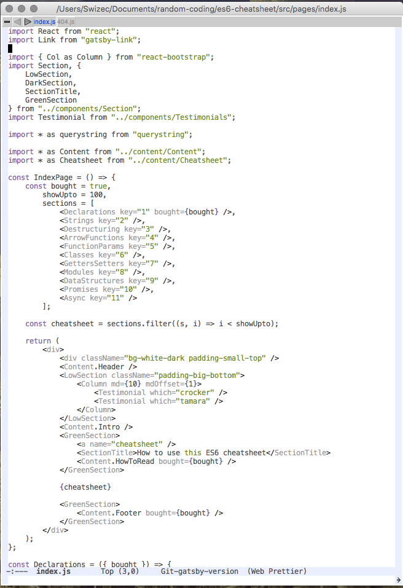
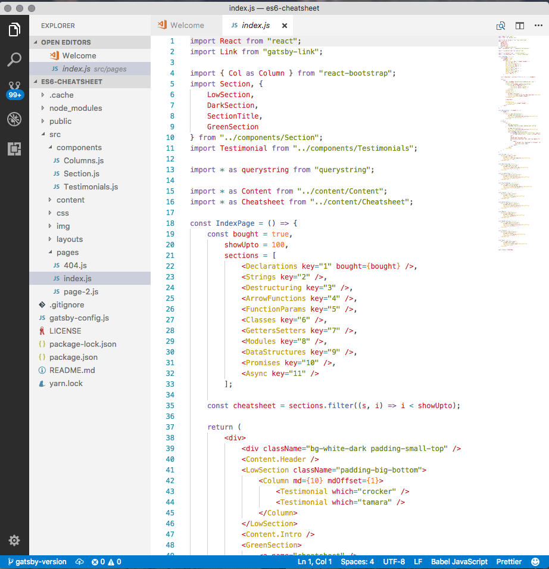
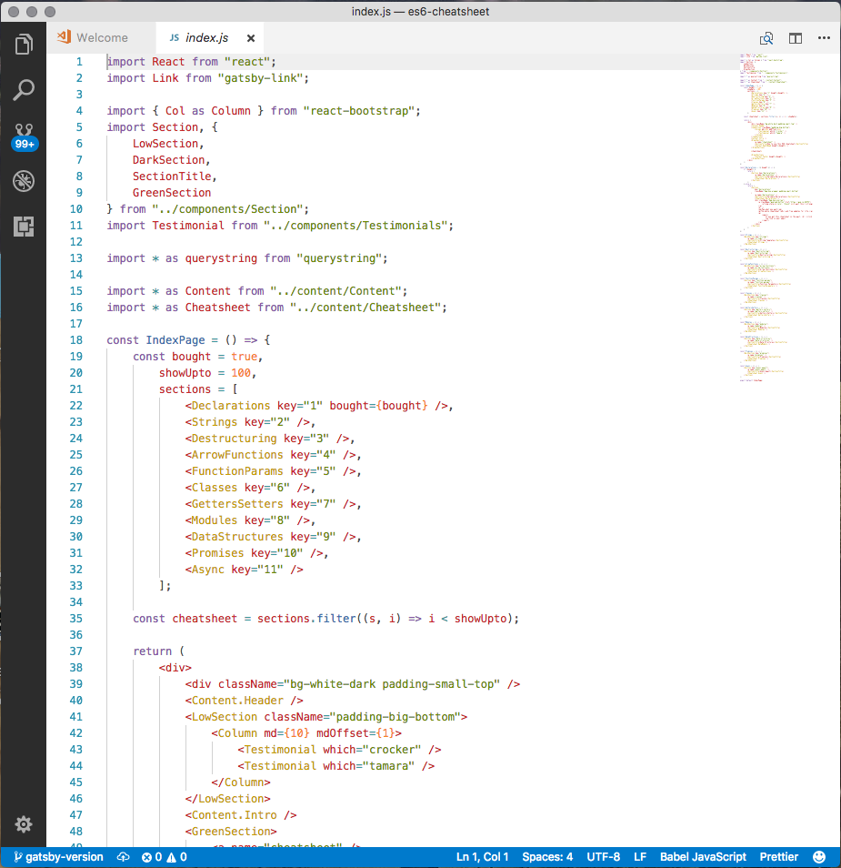
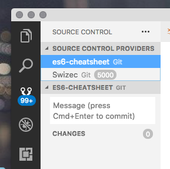
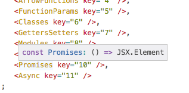
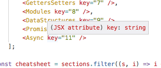
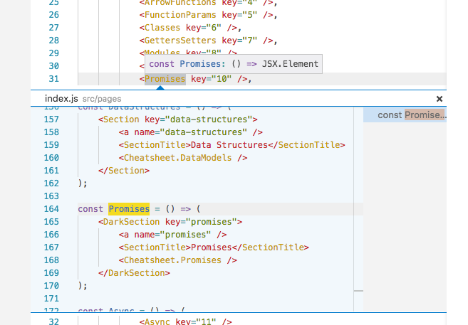

Tried VSCode last night, spent 18 minutes yak shaving my config, couldn't make it visually pleasant, moved back to Emacs. Everyone raves about VSCode, and I'm sure it's a great editor/IDE, but it's just not for me.

Maybe I'm holding it wrong. You tell me. I _want_ to give it another chance.

Here's what I didn't like 👇

In Emacs, I use the Tomorrow theme, I think. My coding OS (that's an old timey joke, btw) looks like this.

There's not much going on, and I like that. The code looks pleasant, the background is white. Nothing to the left or right of the code.

The window header tells me my file's full path, and there's a narrow strip of file tabs. Tabs filter based on file mode so when I'm in JavaScript, I only see JavaScript files, in Ruby only Ruby, in CSS only CSS, etc. This is neat when you're working on large projects with many different file types.

At the bottom, you have a small command line. This is where my _"Find open file using fuzzy search"_ lives. Makes it easy to navigate when there are 50 different files open. You can use it to fuzzy search un-open files too.

I rarely close my editor and often forget to close files.

Also at the bottom, you have a git indicator that tells you which branch you're on, whether the current file is dirty, which mode you're in, etc.

## VSCode – visual clutter

Here's what that same file looks like in VSCode.

Using the same (I think?) Tomorrow light theme, but it feels less clean. It feels like too many colors pop, and the font looks less pleasant.

This is just habit, however. I could get used to it quick.

What I don't like is all the visual cruft that VSCode puts on my window.

There's the weird gigantic scrollbar they took from Sublime. Why do I need a zoomed out version of my file cluttering up my view?

The tabs are also bigger, and there's buttons top right that I think should exist solely as keyboard shortcuts. Two of them (the find and the 3 dots) don't do anything. The split view is nice, maybe.

On the bottom, you have basically the same information that my Emacs provides, but on a brighter poppier background. I think that makes it look distracting.

My code should be the most visually pronounced part of my editor. Not my editor's tools.

To the left, we have an atrocity: A project explorer.

Yes, you can close it. Then VSCode looks like this 👇

Better, but still cluttered. _grump_

## VSCode – "project explorer"

Fundamentally what I don't like about the concept of a "project explorer" is that it promotes the concept of adding projects to your editor. They clutter up for years and why does my editor care anyway?

Yes, to give me helpful search functions and code explanations and stuff. All of that is great.

But it's also implicit.

Emacs looks at your current directory and provides fuzzy search through files within. VSCode takes a whole directory tree and provides fuzzy search.

That might be better. I don't know. I've seen my coworkers have fun times when they try to open `index.js` and their IDE helpfully suggests 50 different `index.js` files.

Are we meant to have unique filenames throughout our project? Then what's the point of structuring it in directories at all?

Then there's the uncloseable toolbar to the left.

Why does the `Extensions` button have to always be visible? How often do people fiddle with their extensions?

Why is `Search` always there? Should be just a shortcut everyone learns within 3min of using an editor.

The debugger is nice.

Why do I need source control stuff right there always bugging me?

Why is it trying to show stuff from multiple git repos at the same time? I'm only working on one project, yo.

Actually, that might be my bad. I seem to have run `git init` on my home directory at some point. Now VSCode thinks everything is a project and gets confused.

It also complains that 5000+ unstaged files might be too much.

Emacs wouldn't even think about poking that. Doesn't think about projects you see. Oh, you're in a file? Here you go. Oh ,you want to search the directory? Sure.

## VSCode – trying to be too helpful

And then there's this stuff. It tries to be helpful and I'm sure for some people it works really well and helps a lot.

Thank you, VSCode. I had no idea that `<Promises>` was a JSX element. Very helpful advice right there.

And `key=""` is an attribute! How wonderful, I never would have guessed.

Maybe I'm holding it wrong. Maybe in bigger contexts, this is super useful, or maybe I need TypeScript to make it shine.

Right now, it's just annoying that I have to be super careful about where I put my mouse lest some tiny popup pops up and obstructs my code.

I guess the `Peek Definition` option is nice. But whose fingers are stretchy enough to press alt-F12 comfortably?

Yeah, I can see that being useful in a large codebase.

Oh, and VSCode does that annoying thing where you write a `(` and it adds a `)`. I've always found that infuriating ever since the first editors started doing it in the early aughts. Stop that.

At the same time, it doesn't autocomplete HTML and JSX tags. I got used to typing `</` and Emacs automatically closing my open tag. That is nice, but VSCode doesn't do it.

Maybe there's a plugin I'm missing?

## Why I'm not switching yet

Habit.

VSCode has plenty of features that my Emacs setup does not. It's a great editor, and I can see myself growing to like it.

But it just doesn't offer any killer features to make me invest the time to get over the little niggles that annoy me.

Unless you can suggest plugins I'm missing to fix those? [Shout at me on Twitter](<http://twitter.com/home?status=.@swizec's%20VSCode%20opinion%20is%20dumb%20because:  https://swizec.com/blog/wont-be-switching-vscode/swizec/7898>).