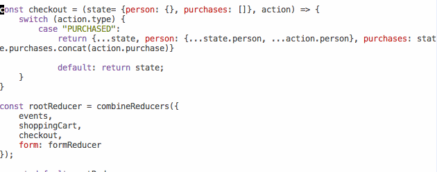
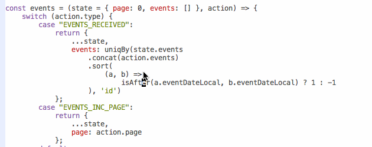

I've been using [Prettier](https://github.com/prettier/prettier) for a month. How did I ever live without it? If you haven't heard, Prettier is an opinionated code formatter. That tells you everything and nothing about how great it is and why you might use it. Here's a gif instead 👇  You write some nasty code, press save, and Prettier makes it look good. That might not look like much, but it changed my life. You never realize how much time you're wasting on formatting code until a machine starts doing it for you. I wish I knew how to measure the difference. One thing I do know is that it's a big enough difference that when I ran an [Intro to React and Redux workshop](https://swizec.com/blog/teaching-stubhub-react-redux/swizec/7860) with and without Prettier, people found it easier to follow when I had Prettier. You could _feel_ that they were paying more attention. Part of the reason is that my code was no longer idiosyncratic. Not in formatting, at least. There are always going to be _some_ idiosyncrasies, but Prettier resolves most of the stuff that usually trips you up when reading code. Using parentheses around single argument fat arrow functions, `(a) => b` or `a => b`? Who cares? Prettier fixes it. Self-closing JSX tags or not? _shrug_. Prettier. Splitting long argument lists into many lines or one long line or just a few lines? Don't know. Prettier will do it. The amount of decisions you'll never have to make again. You'll never have to worry about in code-review. You'll never have to debate and discuss for hours on end… it's amazing. I mean look at this!  Shitty code. Good code. My favorite part is never pressing enter ever again. I just type and type and type, then save and voila.

## How to introduce Prettier at work

_"Ah but, Swizec, I have a big old codebase! We can't start using this now, can we?"_ Yes, you can! Here's how you do it. At least how I did it at the J.O.B after using it for 1 day at home. My mind went like this _"OMG this is awesome! I'm setting this up for everyone tomorrow!"_. And so I did. For a codebase that's been growing since before ES6 came out. Yes, that old. **1.** Set up a git commit hook. [There are instructions in the Docs](https://prettier.io/docs/en/precommit.html). I used the `lint-staged` option because it required the least setup. **2.** Set up your `.prettierrc`. I like to set `tabWidth: 4` and `printWidth: 80`. This ensures everyone's Prettier will follow the same rules. **3.** You run Prettier on all your files. For us, that looked like this: `prettier app/assets/**/*.js --write`. You'll have to change it based on where your code lives **4.** Submit a PR and pray it gets merged soon because anything else that gets merged before it will introduce conflicts. **5.** Deal with small annoyances until everybody's feature branches catch up and start using Prettier. Congratulations! Your team will never again have to debate whether to use double or single quotes!  Oh and no, Prettier won't introduce any bugs. It's been battle tested, and you should be fine. Might want to run a quick smoke test before deploying to production though ☺️ You might find some of your old code funny to look at. All modern and styled and beautiful, yet somehow odd. Odd because it doesn't use all the ES6 things you use today, but looks just like you wrote it yesterday. 

## Things I wish Prettier could do, but can't (yet?)

As lazy as I've become with Prettier, I want to grow even lazier. I want to be able to write not just sloppy code, but _terribly_ sloppy code and have Prettier fix it. For example, right now when I write `"string'` (mismatched quotes), Prettier complains about a syntax error. What if it fixed the syntax error instead? Or when I get sloppy with closing my parens in a long function chain, what if Prettier could fix it instead of complaining?

    export default withRouter(
    connect(state => ({
    items: state.shoppingCart.items
    }))(ShoppingCart)
    );

See all those little parens that have to be just right? Wouldn't it be great if Prettier could just figure it out for us and close them as necessary? 😛 Quote and paren matching isn't _that_ difficult to implement. I remember learning about it in a compilers course in college. It increases complexity by a lot because you have to keep track of context, but it's doable. A potentially bigger problem is that it might be hard to guess what you want as a user. Are you trying to close everything? Just one expression? _shrug_ But maybe I'm the only person who wants this because everybody else uses their editor to automatically close parens as soon as they type. You know, the part where `(` autocompletes to `()`. That removes any need for this feature 🤔 Automatic quote matching tho, I want it. **PS:** I now want Prettier for all the languages I use. Indenting Ruby is just such a pain. 😇
