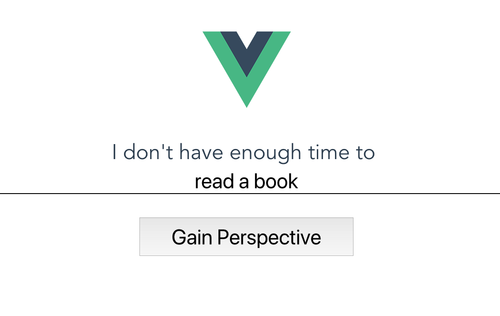

_This is a Livecoding Recap – an almost-weekly post about interesting things discovered while livecoding. Usually shorter than 500 words. Often with pictures. Livecoding happens almost **every Sunday at 2pm PDT** on multiple channels. You should subscribe to [My Youtube](https://www.youtube.com/TheSwizec) channel to catch me live._


https&#x3A;//www.youtube.com/watch?v=MZBVM6zwvkA


This weekend I set out to build an idea @TheKitze had on Twitter. An app that gives perspective to your life. Oh, you don't have time to read a book? Well, you spent 5 hours on Twitter yesterday. Are you sure?


https&#x3A;//twitter.com/thekitze/status/931948509472927744


For the MVP, I envisioned a form where you fill out what you don't have time or money for, ask for some perspective, and the webapp delivers. It doesn't deliver yet because I decided to build it in [Vue](https://vuejs.org/).





You can see some of my initial struggles with Vue in the video above. In a few bullet points 👇


1. Vue's onboarding experience feels like a warm hug. You're immediately showered in community support, example projects, and helpful resources.
2. vue-cli is more accommodating to different preferences than create-react-app. It asks questions and tries to configure itself for a good experience.
3. The default ESLint config that comes with vue-cli is woefully incompatible with my Prettier config. That was painful. I wish it came with a `.prettierrc` file so it would configure my autoformatter to the settings it expects.
4. Throwing linting errors instead of warnings by default feels a little forceful. I had to re-make my project from scratch without ESLint.
5. Choosing the right VSCode extension to get Vue support… well, there are a lot of them. I ended up going with the Vue Extension Pack. I don't know everything that it did for me, but I'm sure I'll need it eventually.
6. Out-of-the-box support for end-to-end testing with Nightwatch is 👌
7. The Vue coding experience itself… I think I need to give it more time.


Vue feels like a bastard child between React 13 and Angular 1. I love that it uses and promotes components. That's how it should be. I like that it tries to conform to the web-components standard. It's a good standard, and this will help it come about quicker.


I hate the Angular 1 style `v-if` and `v-for` stuff where you shove a bunch of complex logic into your templates. I know this is hypocritical coming from the React world where we shove our templates into JavaScript, but somehow that feels more elegant.


Yes, the React approach does lead to some horrendous code when people put too much logic into their JSX.


Yes, it's all about programmer discipline to avoid mixing presentation with logic too much.


And yet, I still feel like it's more elegant to treat HTML as a first-class citizen in your JavaScript than to treat JavaScript as a 2nd class citizen in your HTML.


With React, it feels like my JavaScript directly manipulates what's on the screen. I'm building a UI and have direct control of what's being shown to the user. I can assign pieces of the UI to different variables, treat them as Just Data™, and generally have fun and feel in control.


Vue, on the other hand, enforces an artificial separation of concerns that I don't think is useful. I'm still building a UI and manipulating what's on the screen, but it feels removed. Like trying to tie a knot with 10 foot tweezers instead of your fingers.


With React, I can reach in and get dirty. With Vue, my dandy little hands never touch anything real.


That's what it feels like anyway. _shrug_


And the syntax for building components feels strange too. Very React 13 where we didn't have proper JavaScript class or function support yet.


```
export default {
    name: "MyComponent"
    data() {
        return {
            data1: "",
            data2: ""
        }
    },
    methods: {
        doThing() {
        },
     
        onClick() {
        }
    },
    components: {
        ChildComponent
        AnotherChild
    }
}
```


o.O


That, to me, looks weird. Where are all the advances we've made in JavaScript over the past few years?


Why am I defining child `components` with an object, internal state, called `data`, with a function, and a list of `methods` as what looks almost like a class but isn't quite? Feels weird.


I like the React approach where you have a JavaScript class. Its methods are its methods, its props can be state, there's a `.state` variable which is the proper connected state, and children are automagically defined by being nested in the component. You know, just like in normal HTML.


Wouldn't it be weird if in HTML you had to declare all the children you're going to use in a certain element?


So far I am more weirded out than impressed. Perhaps with time Vue will grow on me.


🤓