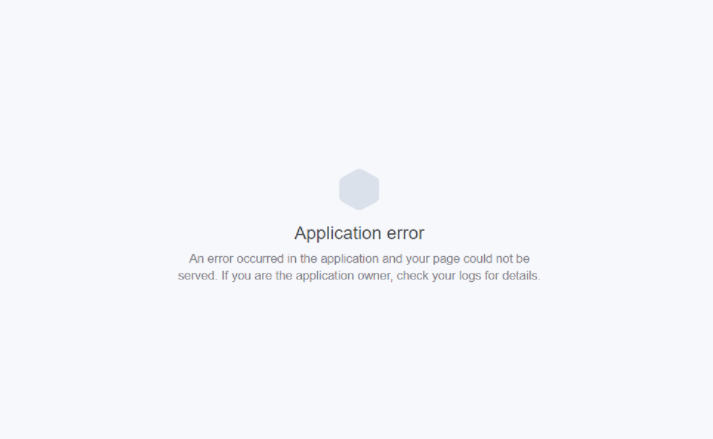

_"Application error is preventing tutors from ending their shifts_ 😞"

...

_"Tutors in sessions are noticing that it says they are offline!"_

...

It was 1:28am Monday night, two days before Thanksgiving. Literally the lowest hour of the lowest week for traffic all year. Our servers were melting.

I saw the message by accident. Good thing I was up 😅

\*"@sharon looks like everything is down and our servers are on fire. I restarted the server, can you see if that helped?"

Average API response time → 30 seconds. Usually, it's 0.3 seconds.

Restarting helped. Restarting a Rails server always helps. I went to bed.

At 9am, our servers were melting.

I restarted.

At 10:30am, our servers were melting.

We suspected analytics, deployed a quick patch to disable the workers, restarted servers, and got to work.

## The perfect storm

> Saving blobs of JSON into an array is hard
>
>
>
> ~Swizec

> LoL it's just an array with some objects how hard can it be
>
>
>
> ~The Internet

So how does a server melt on the lowest week of traffic for the entire year? And how does it start melting again just a few hours later even though it was fine for many months before that?

The problem with exponential problems is that you don't see them coming until it's too late.

API response times grow millisecond by millisecond, getting ever so much larger. “Nothing alarming, normal fluctuation,” you say to yourself.

Then BAM! Response times are 30 seconds and Heroku force timeouts all your requests. Now you're in trouble.

That's why it happened so much faster the 2nd time. And even faster the 3rd time.

But _why_?

Because saving a bunch of JSON blobs reliably is hard. The "reliably" part is what gets you.

How do you make sure clients can send analytics events and ensure none of them get dropped?

If the request fails, you store the event and try again later.

How do you avoid sending too many requests since failing requests are the likeliest cause of most errors?

You batch multiple events into the same request.

Congratulations, you just created an API that can lead to your clients [DDoSing](https://en.wikipedia.org/wiki/Denial-of-service_attack) your own server.

😁

A DDoS is a distributed denial of service attack, by the way. It happens when so many clients send your server so many requests that it crumples under the pressure.

Similar in principle to the Reddit or HackerNews [hug of death](https://en.wikipedia.org/wiki/Slashdot_effect). That's when a link gets so popular that the flood of traffic melts servers.

## Why storing, retrying, and batching requests spells trouble

You see, there is nothing wrong with storing failed requests and retrying them. Or with batching multiple small requests into one being one. It's the smart thing to do even.

It's when your backend has bugs that it leads to trouble.

What happens if you send a batch of 10 events and the server fails to process 1 of them? Say, because an error happens when attaching additional properties?

The server says _"Hey, I couldn't process this batch.”_

So you say, _"Oh, it failed. I'll try again later.”_

Later comes. You have some new events, too. So you send a batch of 20 events.

The same event fails. Next time, you send 30.

See what that leads to yet?

That's right. Eventually, you're sending so many events at the same time that the server has trouble processing them all within a single request. This begins to impact other clients' requests.

The server is busy processing. Other clients say _"Yo, here's my stuff”,_ and get denied.

Failures happen with no rhyme or reason. It depends completely on who is currently using the service and whether their client has a large backlog of events to send.

The problem festers and grows.

The more clients experience an issue, the more clients have large backlogs, the more issues occur.

Eventually, your server melts, and nobody can't do nothing no more.

## The fix?

A preprocessing queue.

When a client sends a request with some events, just store the raw payload somewhere and deal with it later.

Requests almost always succeed, so events don't pile up on clients. Saving the raw payload is also fast, which makes overall performance faster for the clients, too.

Processing offline also gives you more time. Instead of having to do everything in 30 seconds, you can spend many minutes on a big request if you have to.

Plus, you can mark specific events as failing, but still process everything else.

## Lessons learned →

Saving arrays of JSON blobs is hard.