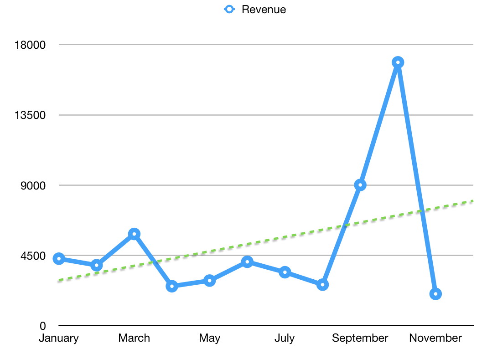

You know how [last month](https://swizec.com/blog/16661-october-sidehustle-report/swizec/7883) was huge and money rained from the sky? November, not so much. Didn't even break even. That's one of the main surprises for my friends about running a business. They see a report like last month's and their eyes go wide and they whisper amongst each other and crack jokes about how much money I have. They ignore the other reports. What they forget is that a spike is not a trend. It can indicate a trend, but it rarely means you're going to be making that much or more from now until eternity.

November was bad. Sure, there was a lot going on, attempts were made, but ultimately not much happened. Running a sale like my 30-at-30 promotion is like frontloading your customers. You get an infusion of money now and it's great, but those people from your audience aren't going to be ready to buy anything else for a while. So instead of a trickle of sales every week for the next few months, you compact all those future sales into _now_. That's kinda what happened. Going to take a while for regular sales to rebound. Gonna need to develop some new products too. Like that Intro to React and Redux video course I promised. Working on it :) You may also have noticed that I haven't been publishing as much in November. That's because I was working on a lot of things that are going to show up in December's report. Some stuff I can't talk about yet, other stuff you've likely already seen. Like the [JS Bundle](https://bestjavascript.io) we put out with a bunch of other authors. If you haven't seen that, then our marketing sucks. Actually… I'm gonna have some thoughts on that soonish 🤔 Because it did not go as well as I'd hoped 😅 Anyway, here's November in numbers 👇 **Total revenue** $2249 **Gumroad sales** $1309 - [React D3v4](https://swizec.com/reactd3js): $1272 - [JS cheatsheet - es2017](https://es2017.io): $37 **Leanpub sales** $392 - React D3v4: $348 - React D3 old versions: $25 - [Why Programmers work at Night](http://nightowlsbook.com) **Patreon pledges** $211 **Educative** $274 - React D3v4 course: $274 **Time investment:** 78 hours **Expenses →**

-   Editor: $500
-   VA: $400
-   Facebook ads: $985
-   Twitter ads: $600
-   Reddit ads: $36
-   Drip: $149
-   SumoMe: $99
-   Webfaction: $10
-   LiveEdu Pro: $10
-   AWS: $14
-   now.sh: $15
-   bestjavascript.io domain: $46
-   domainsquatting for ES6 domains: $149
-   SmartBribe: $35
-   mailchimp: $20
-   MicroConf April ticket: $918
-   DJI Spark: $649

**Effective hourly rate:** -$44/hour 😂 Okay okay, the accounting for this month is weird. The DJI Spark will serve me for months if not years. Real accountants look at things like that using something called [amortization](https://en.wikipedia.org/wiki/Amortization). You say _"Okay, this cost $649 and has an effective lifespan of 24 months. Therefore, it costs $27/month"_. But I'm lazy so I make that calculation in my head to decide if buying something is worth it, then put it in my reports as a one-time cost. It all evens out in the end. As long as the average trend across months is up 📈 I'm okay. PS: The hella expensive ads were for the JS Bundle, the revenue of which comes next month.
