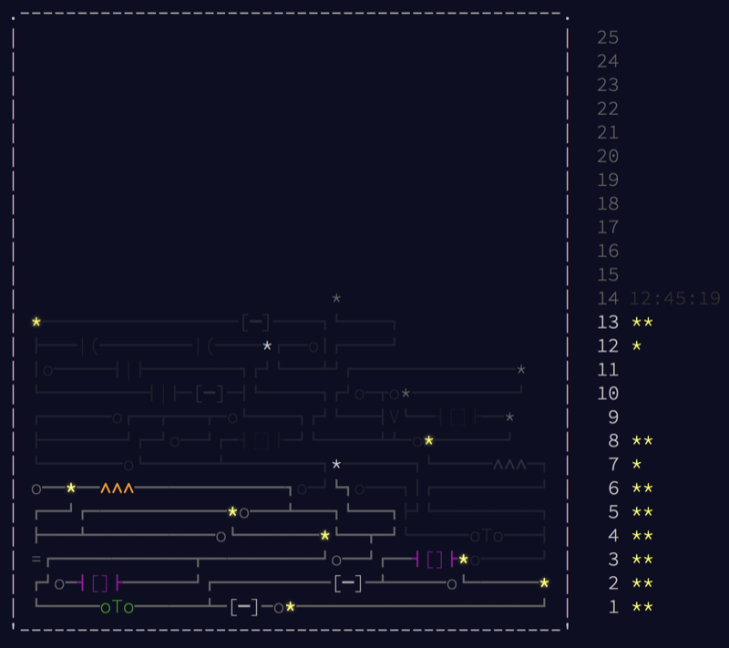

https&#x3A;//www.youtube.com/watch?v=3abrq1N5ITU [Advent of Code](https://adventofcode.com/) is an advent calendar for coders. A daily puzzle that exercises that algorithmic part of coding that you don't usually get to use in day to day programming. Here's what mine looks like right now 👇  The game works like this: Every day at midnight, a new puzzle opens up. It follows a storyline of traveling through a computer. You start with some memory access, go through registers and CPUs, and on Day 13, we dealt with some firewalls. [I've been playing with it](https://www.youtube.com/playlist?list=PLF8WgaD4xmjWaUkBRoQiYGCV3WSKRH0pU) in Haskell and Python. Python because it's perfect for algorithmic puzzles like this, Haskell because I wanted to brush up. Been years since I did Haskell. I miss Haskell. JavaScript is clunky for this sort of thing. 🤷‍♀️ You can [see my code on Github](https://github.com/Swizec/advent-of-code-2017). You should join my leaderboard, too. Some friendly competition that I am currently losing. 👉 `193241-e9880d10`

## Packet Scanners in Haskell

On Day 13, we had to fly through a firewall without getting found by the scanners.

> You need to cross a vast firewall. The firewall consists of several layers, each with a security scanner that moves back and forth across the layer. To succeed, you must not be detected by a scanner.

> By studying the firewall briefly, you are able to record (in your puzzle input) the depth of each layer and the range of the scanning area for the scanner within it, written as depth: range. Each layer has a thickness of exactly 1. A layer at depth 0 begins immediately inside the firewall; a layer at depth 1 would start immediately after that.

Visually that looks like this:

    Picosecond 0:
     0   1   2   3   4   5   6
    [S] [S] ... ... [S] ... [S]
    [ ] [ ]         [ ]     [ ]
    [ ]             [ ]     [ ]
                    [ ]     [ ]

Vertical columns are the firewall layers, `S` symbols are the packet scanners. Each picosecond they move down by `1`. At the bottom, they bounce back. We move one layer to the right on each picosecond. Always on the top row. Each time we are seen by a scanner (same position at same time), it adds `depth*range` to our travel cost.

### Star 1

For the first star, we have to calculate how much it costs to get through the scanner. Rather than simulate the firewall and our travel through it, we can rely on two key insights:

1.  The depth of a layer is the same as the number of picoseconds it takes to get to it. Layer 0 is at 0 picoseconds, layer 10 at 10, 90 at 90, and so on.
2.  Scanners return to their 0th position periodically. We can calculate if a scanner is at 0 for any particular picosecond.

Finding the series formula for #2 was the tricky part because I suck at finding series formulas by inference. This is the pattern 👇

    A scanner with range 1, is at 0 every 1 picosecond.

    With range 2, every 2 picoseconds
    3, every 4 picoseconds
    4, every 6 picoseconds
    5, every 8
    6, every 10
    ...

You might find it obvious, but it wrinkled my brain six ways to Sunday. A scanner returns to 0 every `range*2-2` picoseconds. That means we can see if a scanner is at zero at any particular time by checking the modulus with time 👉 `time % (range*2-2) == 0` Since we know we reach each layer at the depth of that layer, we can substitute `time` for `depth` and calculate the cost, or severity, at each layer with this function 👇

    severity::(Int, Int) -> Int
    severity (depth, range)
        | mod depth (range*2-2) == 0 = depth * range
        | otherwise = 0

`severity` takes a tuple of two integers, a depth and a range, and checks if the scanner on that layer is at position `0` when we reach it. If it is, it returns `depth*range` the cost of getting caught; otherwise, it returns `0`. No cost. We can then use this function to `sum` the cost of our entire trip.

    star1::[String] -> Int
    star1 input = sum $ map severity $ prepInput input

`star` takes a list of strings and returns an integer. First, it parses the list of strings into a list of `(depth, range)` tuples. That's `prepInput`, and it's [not very interesting](https://github.com/Swizec/advent-of-code-2017/blob/master/13.hs#L50). After the input is parsed, we `map` through with the `severity` function to get a list of costs for every layer, and `sum` them up. That's our result.

### Star 2

Star 2 adds an interesting twist to the story. We have to avoid getting caught.

> Now, you need to pass through the firewall without being caught - easier said than done.

> You can't control the speed of the packet, but you can delay it any number of picoseconds. For each picosecond you delay the packet before beginning your trip, all security scanners move one step. You're not in the firewall during this time; you don't enter layer 0 until you stop delaying the packet.

Our goal is to find the smallest delay that gets us through the firewall uncaught. Uncaught is the same as cost of the trip being 0. That means we can use the `severity` function from before. Since we think of each layer's depth as the picosecond when we reach that layer, we can fake the delay by making the entire firewall deeper. That means adding `+1` to every layer until the cost of our trip becomes zero.

    smallestDelay::[(Int, Int)] -> Int
    smallestDelay input
        | sum severities == 0 = delay
        | otherwise = smallestDelay $ map (\(a,b) -> (a+1, b)) input
        where severities = map severity input
              (delay, _) = head input

`smallestDelay` takes a list of `(depth, range)` tuples and returns an integer. If the `sum severities` (cost of our trip) is `0`, we return the current delay; otherwise, we construct a new faux firewall whose layers are shifted by `+1`. Each time we do this, we use `map severity input` to get a list of costs and take the `head` of our input firewall to see the delay. Since we're shifting the whole firewall, the "depth" of the first layer represents our delay. And that's the solution in Haskell 🤓 Happy hacking. PS: in [the video](https://www.youtube.com/watch?v=3abrq1N5ITU), you can see me trying to solve Day 12 as well. That's because I'm behind and playing catchup.
