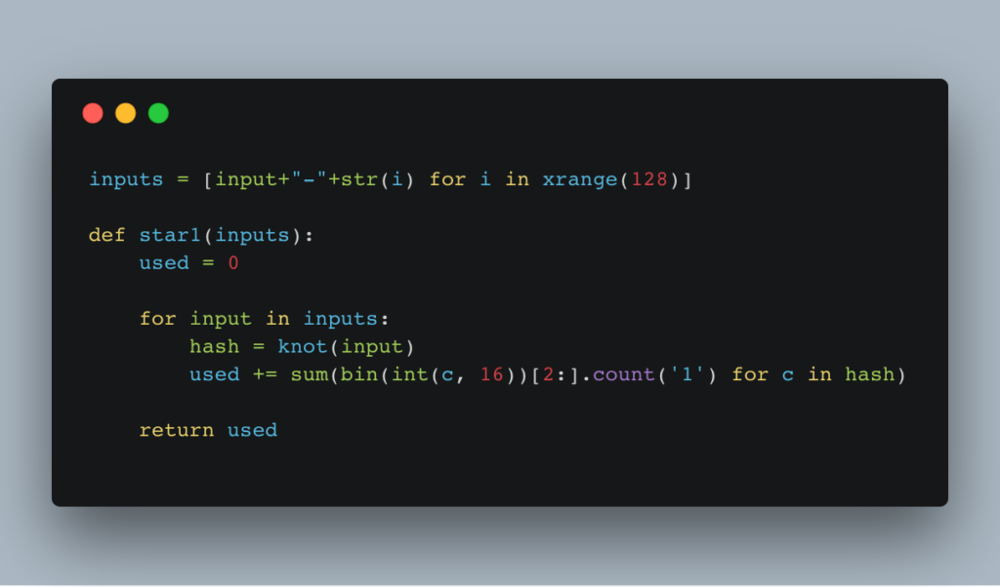
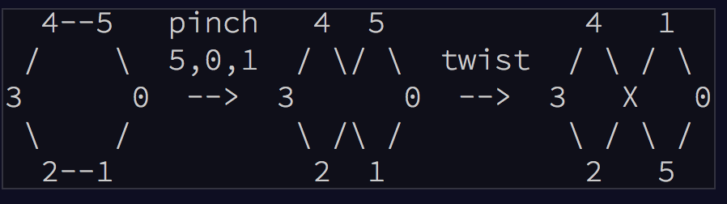

\[caption id="" align="" width="600"] Day 14 was trivial after I solved Day 10\[/caption]


https&#x3A;//www.youtube.com/watch?v=e9duNOVdHFk


Advent of Code Day 14 was a strange, strange thing. At first, it made no sense. Something about disk fragmentation and encoding addresses as knot hashes and whatnot.


What the hell is a knot hash? O.o


Turns out it's from Advent of Code Day 10. Conveniently called "knot hash". On Day 10, you build a general hashing function following this schema 👇





Don't worry, that image didn't tell me anything either.


AoC's description of the process makes more sense


> To achieve this, begin with a list of numbers from 0 to 255, a current position which begins at 0 (the first element in the list), a skip size (which starts at 0), and a sequence of lengths (your puzzle input). Then, for each length:


> Reverse the order of that length of elements in the list, starting with the element at the current position.
>
>
>
> Move the current position forward by that length plus the skip size.
>
>
>
> Increase the skip size by one.
>
>
>
> The list is circular; if the current position and the length try to reverse elements beyond the end of the list, the operation reverses using as many extra elements as it needs from the front of the list. If the current position moves past the end of the list, it wraps around to the front. Lengths larger than the size of the list are invalid.


Okay. So that's difficult to follow, and it's kind of annoying to build, but Day 10 boils down to what we do best in our day-to-day programming: Follow instructions to implement a random piece of business logic.


## Day 10, star 1


The puzzle is the instructions. We just gotta write the correct code. In Python, mine looks like this:


```
def knot_1round(pos, skip, lengths, input):
    for length in lengths:
        if pos+length > len(input):
            wrap = (pos+length)%len(input)
        else:
            wrap = 0

        nums = input[pos:pos+length] + input[:wrap]
        nums = list(reversed(nums))
        
        if wrap > 0:
            input = nums[-wrap:] + input[wrap:pos] + nums[:-wrap] + input[pos+length:]
        else:
            input = input[:pos] + nums + input[pos+length:]

        pos = (pos+length+skip)%len(input)
        skip += 1

    return pos, skip, input
```


Boring, predictable, nothing special. Go through the list of \[0 .. 255] numbers, use input lengths, do the knot hashing. The neat part of this code is Python's spectacular support for list slicing and dicing.


You can use the `:` operator to get different parts of a list. Left side means "up to" and right side means "after". You can use negative numbers.


Dealing with the circular wraparound part was mindbendy and a bit tedious. You can't just cut the list and put it together. You have to use a bunch of different bits and sections.


## Day 10, star 2


For the second part, we assembled 64 single rounds of knot hashing into a full knot hash. Again, just following instructions and most of the hard work coming down to understanding those instructions.


No fun insights needed 😴


```
def knot(input):
    lengths = [ord(str(c)) for c in input] + [17, 31, 73, 47, 23]

    pos = 0
    skip = 0
    numbers = range(0, 256)
    
    for i in xrange(64):
        pos, skip, numbers = knot_1round(pos, skip, lengths, numbers)
        
    blocks = [reduce(lambda b, n: b^n, numbers[i:i+16]) for i in xrange(0, len(numbers), 16)]

    print numbers[0:16]

    return "".join(["%0.2X" % c for c in blocks])
```


You take the input, turn each character into its ASCII number, add a static salt thing `[17, 31, 73, 47, 23]`, then run the knot round 64 times. Make sure each round feeds the current position and skip size into the next one.


In the end, you take that result and parse it back into a hexadecimal string.


So an empty string input produces `a2582a3a0e66e6e86e3812dcb672a272`, for example.


_shrug emoji_


## Day 14, star 1


With our general knot hashing function in hand, we could take on Day 14. Only took me 70 minutes to get here 😂


But Day 14, the first part at least, was trivial now that the hashing made sense.


The goal is to figure out how many blocks of a disk space are occupied. You are given an input string, and you compute it into 128 knot hashes, then you transform those knot hashes into binary, and count how many 1's there are.


Again, in Python, it looks like this 👇


```
inputs = [input+"-"+str(i) for i in xrange(128)]

def star1(inputs):
    used = 0

    for input in inputs:
        hash = knot(input)
        used += sum(bin(int(c, 16))[2:].count('1') for c in hash)

    return used
```


Make a list of 128 inputs, walk through it, calculate hashes, transform them into binary, count the 1's and sum it up. Done.


That was easy.


Then **Star 2** came along, and it asked to count _regions_. That is adjacent 1's that are touching.


So I said, “Screw this, I'm tired,” and went to bed. 😴