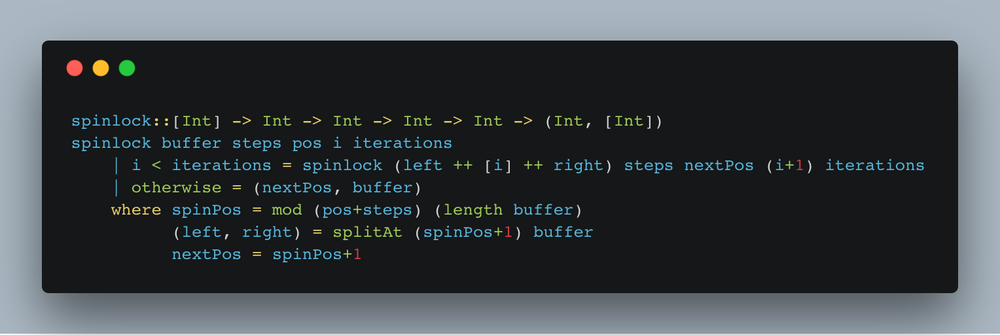
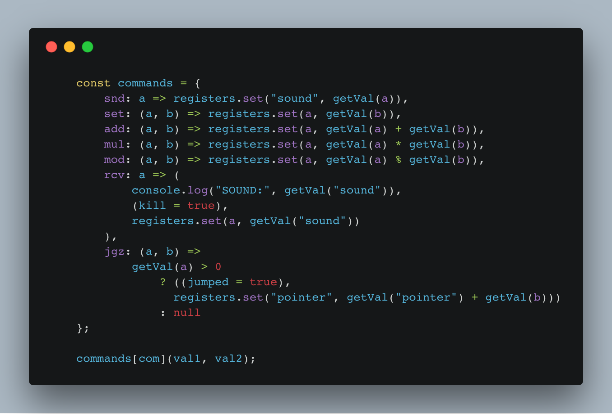

https&#x3A;//www.youtube.com/watch?v=3Eee0va5t0A Days 17 and 18 both defeated me. Star 1 was easy, Star 2 was not. Both were pretty quick to solve for the first star, though, so let's look at that.

## Day 17 – Spinlock

For Advent of Code Day 17, we had to implement a [spinlock](https://en.wikipedia.org/wiki/Spinlock). Spinlocks are a way to implement busy waiting 👇

> In software engineering, a spinlock is a lock which causes a thread trying to acquire it to simply wait in a loop ("spin") while repeatedly checking if the lock is available. Since the thread remains active but is not performing a useful task, the use of such a lock is a kind of busy waiting.

\[caption id="attachment_7975" align="alignnone" width="1528"] A naive spinlock implementation in Haskell\[/caption] There's no video for Day 17 because I was doing it in bed and yes, I did fall asleep while waiting for Star 2 to finish computing. It never did; my algorithm was too slow. Unlike a real spinlock, the puzzle spinlock is trying to eat up infinite memory as well as infinite time.

> For example, if the spinlock were to step 3 times per insert, the circular buffer would begin to evolve like this (using parentheses to mark the current position after each iteration of the algorithm):

> (0), the initial state before any insertions. 0 (1): the spinlock steps forward three times (0, 0, 0), and then inserts the first value, 1, after it. 1 becomes the current position. 0 (2) 1: the spinlock steps forward three times (0, 1, 0), and then inserts the second value, 2, after it. 2 becomes the current position. 0 2 (3) 1: the spinlock steps forward three times (1, 0, 2), and then inserts the third value, 3, after it. 3 becomes the current position.

The question was _"What is the value right after 2017 gets inserted into the buffer?"_. To find out, I built a recursive implementation of the spinlock algorithm above in Haskell. Because Haskell is fun.

    spinlock::[Int] -> Int -> Int -> Int -> Int -> (Int, [Int])
    spinlock buffer steps pos i iterations
        | i < iterations = spinlock (left ++ [i] ++ right) steps nextPos (i+1) iterations
        | otherwise = (nextPos, buffer)
        where spinPos = mod (pos+steps) (length buffer)
              (left, right) = splitAt (spinPos+1) buffer
              nextPos = spinPos+1

The `spinlock` method takes 5 arguments, which I'm sure is sacrilege in Haskell, and returns a tuple: An integer and a list of integers. Arguments look like this:

-   `buffer` is the current state of our circular buffer
-   `steps` tells us how many steps we do on each spin
-   `pos` gives us the current position in our buffer
-   `i` says how many times we've iterated
-   `iterations` tells us how many times to iterate in total

The algorithm itself was simple to implement, but fraught with [off-by-one errors](https://en.wikipedia.org/wiki/Off-by-one_error). If we have to keep going – `i < iterations` – then recurse with an edited buffer, updated position and `i+1`. Otherwise, return the result. A tuple with the next position and final buffer. We get the position after spinning, `spinPos`, as a remainder between current position `pos` and `steps`, and the buffer length. Split the buffer into `left` and `right` at position after the spin, and say the next position is going to be there too. This worked great for the `2017` iterations from Star 1.

    star1::Int -> Int
    star1 steps = buffer!!pos
        where (pos, buffer) = spinlock [0] steps 0 1 2017

A little slow maybe, but it worked. For Star 2, they wanted us to find the value after `0` when 50,000,000 iterations are performed. This did not go so well.

    star2::Int -> Int
    star2 steps = buffer!!(zeroAt+1)
        where (pos, buffer) = spinlock [0] steps 0 1 50000000
              zeroAt = Data.Maybe.fromJust $ elemIndex 0 buffer 

The idea is simple: Iterate 50 million times, look for the `0`, return the value after it. But the spinlock never finishes. Haskell's [lazy evaluation](https://en.wikipedia.org/wiki/Lazy_evaluation) gets in the way, and I couldn't figure out how to make it stop. With lazy evaluation, we keep all iterations of the spinlock in memory until we print the final result. That's a problem. _shrug_

## Day 18 – A programming language interpreter

\[caption id="attachment_7976" align="alignnone" width="1356"] The gist of a simple interpreter built in JavaScript\[/caption] On Day 18 of our Advent of Code, we had to build an interpreter for a simple programming language. There are 7 commands that take 1 or 2 arguments. Arguments can be registers or values.

> `snd X` plays a sound with a frequency equal to the value of X. `set X Y` sets register X to the value of Y. `add X Y` increases register X by the value of Y. `mul X Y` sets register X to the result of multiplying the value contained in register X by the value of Y. `mod X Y` sets register X to the remainder of dividing the value contained in register X by the value of Y (that is, it sets X to the result of X modulo Y). `rcv X` recovers the frequency of the last sound played, but only when the value of X is not zero. (If it is zero, the command does nothing.) `jgz X Y` jumps with an offset of the value of Y, but only if the value of X is greater than zero. (An offset of 2 skips the next instruction, an offset of -1 jumps to the previous instruction, and so on.)

Our goal is to find the first non-zero value that `rcv` finds. I built this one in JavaScript because why not. 😇 We start with a bunch of `registers`, which are a JavaScript `Map`.

    function initRegisters() {
        const registers = new Map(
            "abcdefghijklmnopqrstuvwxyz".split("").map(l => [l, 0])
        );
        registers.set("sound", null);
        registers.set("pointer", 0);

        return registers;
    }

This creates a register for each letter of the alphabet plus a `sound` register and a `pointer`. `sound` will be where `snd` puts its values and `rcv` reads them from, `pointer` is going to point to the current line of code we're executing. The interpreter itself comes as just 39 lines of code. It's a simple language after all. Although I do think it's got enough instructions to be [Turing-complete](https://en.wikipedia.org/wiki/Turing_completeness), but it lacks the memory. 25 registers won't cut it for Turing completeness. You could, of course, expand it to have infinite registers 🤔 Anyway, the interpreter 👇

    function execute(registers, command) {
        const [com, val1, val2] = command.trim().split(" ");

        function getVal(val) {
            if (registers.has(val)) {
                return registers.get(val);
            } else {
                return Number(val);
            }
        }

        let jumped = false,
            kill = false;

        const commands = {
            snd: a => registers.set("sound", getVal(a)),
            set: (a, b) => registers.set(a, getVal(b)),
            add: (a, b) => registers.set(a, getVal(a) + getVal(b)),
            mul: (a, b) => registers.set(a, getVal(a) * getVal(b)),
            mod: (a, b) => registers.set(a, getVal(a) % getVal(b)),
            rcv: a => (
                console.log("SOUND:", getVal("sound")),
                (kill = true),
                registers.set(a, getVal("sound"))
            ),
            jgz: (a, b) =>
                getVal(a) > 0
                    ? ((jumped = true),
                      registers.set("pointer", getVal("pointer") + getVal(b)))
                    : null
        };

        commands[com](val1, val2);

        if (!jumped) {
            registers.set("pointer", getVal("pointer") + 1);
        }

        return [kill, registers];
    }

We split the line of code into a `command` and two values, `val1` and `val2`. Then we define a function for reading values, `getVal`. If the value given is a known register, we read from it; otherwise, we return the value itself. After that, we need two flags: `jump` tells us if we executed a jump command, and `kill` tells us if we have to stop executing. A dictionary mapping all possible commands to a function that executes them helps us run the commands. Each function manipulates the `registers` and potentially flips the `jump` and `kill` flags. When the current line of code is executed, we advance our `pointer` by `+1` if we didn't jump. The interpreter returns the `kill` flag and the new `registers`. The registers are actually changed in place, and there's no need to return, but I think this approach makes our implementation clearer. With the interpreter in hand, we then have to add some looping to find the answer to AoC 18 Star 1.

    function star1() {
        let registers = initRegisters(),
            kill = false;
        const program = input.split("\n").filter(command => command.length > 0);

        // find sound value at first non-zero rcv
        while (
            registers.get("pointer") >= 0 &&
            registers.get("pointer") < program.length &&
            !kill
        ) {
            [kill, registers] = execute(
                registers,
                program[registers.get("pointer")]
            );
        }
    }

Create registers, split program into lines, `execute` until a `while` condition is met. Either we jumped out of the program, or a line set the `kill` flag. Works like a charm 👌 **Star 2** is where it gets tricky. Those `snd` and `rcv` commands weren't actually about sound; they were `send` and `receive` commands, and you're meant to run two copies of this code in parallel. They communicate with `snd` and `rcv`. We have to expand our `sound` register into a message queue and add some logic for how it's shared between the two programs. Additionally, the puzzle wants us to pause execution of each program while it waits for the queue to get values.  Sounds hard. So I went to bed.
