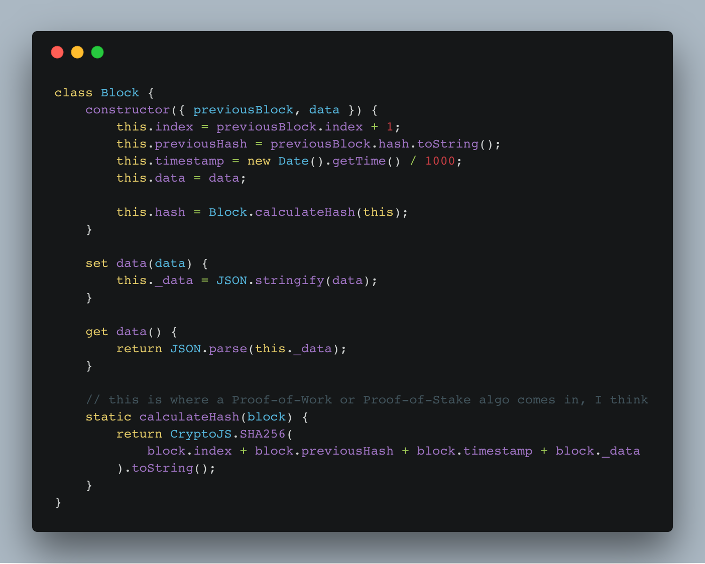

https&#x3A;//www.youtube.com/watch?v=kVLrT92US4U _**Big fat disclaimer: This is Part 1 of an experiment. It is not yet secure, it does not yet share the blockchain between nodes, it still needs a proof-of-work or proof-of-stake algorithm.**_ With that out of the way, let us begin. https&#x3A;//twitter.com/Swizec/status/938983218975449088 Redux is great because it keeps a chain of immutable data forever. What if we backed that chain with a blockchain? What would happen? 🤔 \[caption id="attachment_7979" align="alignnone" width="1404"] Blockchain in a nutshell\[/caption] So I fired up [this amazing Medium post](https://medium.com/@lhartikk/a-blockchain-in-200-lines-of-code-963cc1cc0e54) on building a blockchain in 200 lines of code and built a blockchain-backed Redux clone in about 2 hours. Mine is just 105 lines tho 😛 You can see the [code on Github](https://github.com/Swizec/blockchain-redux). It's not quite useful yet. The blockchain doesn't get shared between nodes, and there's no proof-of-stake or proof-of-work algorithm. That's all coming soon. First, I wanted to make sure I understood both [blockchains](https://en.wikipedia.org/wiki/Blockchain) and Redux enough to make this work.

## Blockchain

Turns out blockchains are pretty simple. It's just a reversed linked list where every node holds some data, a hash, and points to the previous node.  We use the hashes to verify our chain. Verification is important when we start sharing chains between nodes. Our blocks are JavaScript objects.

    class Block {
        constructor({ previousBlock, data }) {
            this.index = previousBlock.index + 1;
            this.previousHash = previousBlock.hash.toString();
            this.timestamp = new Date().getTime() / 1000;
            this.data = data;

            this.hash = Block.calculateHash(this);
        }

        set data(data) {
            this._data = JSON.stringify(data);
        }

        get data() {
            return JSON.parse(this._data);
        }

        // this is where a Proof-of-Work or Proof-of-Stake algo comes in, I think
        static calculateHash(block) {
            return CryptoJS.SHA256(
                block.index + block.previousHash + block.timestamp + block._data
            ).toString();
        }
    }

The `constructor` doubles as our block generator. It takes the `previousBlock` and some `data`, adds some metadata, and calculates a `hash`. A `data` setter and getter help us JSONify data transparently. Users can pass simple objects as data, and the blockchain will handle it. The `calculateHash` function right now just uses SHA256, but I think this is where a [proof of work](https://en.wikipedia.org/wiki/Proof-of-work_system) or a [proof of stake](https://en.wikipedia.org/wiki/Proof-of-stake) algorithm would come into play in a real blockchain. Haven't figured that part out yet :) Kind of surprisingly, that's all we need to build a blockchain. You could build it like this `new Block({ previousBlock: new Block({ previousBlock: genesisBlock, data: {hai: "world"}}), data: {hai2: "world2"}})` But that's cumbersome, so let's add a Redux.

## Redux

Redux, if you don't know, is a state management approach based on the functional concept of a `reducer`. At each change, we take the current state and a change descriptor, and produce the next state. A tiny Redux implementation that maintains history would look something like this 👇

    function createStore(initialState, reducer) {
        let state = [initialState];
     
        function getState() {
            return state[state.length-1];
        }
     
        function dispatch(action) {
            state.push(reducer(getState(), action));
        }
     
        return {
            getState: getState,
            dispatch: dispatch
        }
    }

👆 That's Redux in a nutshell. Unlike the real Redux, this one maintains history. We'll expand that into a blockchain. `getState` returns the latest state and `dispatch` takes an `action` and calculates the new state using the `reducer` function. Using this Redux to implement a counter looks like this 👇

    const store = createStore({ counter: 0 }, rootReducer);

    function rootReducer(state, action) {
        switch (action.type) {
            case "inc":
                return { counter: state.counter + 1 };
            case "dec":
                return { counter: state.counter - 1 };
            default:
                return state;
        }
    }

We can use this to verify that it works. Using tape in this case because [LukeEd05](https://twitter.com/lukeed05) on the livestream suggested it.

    test("count to 5", t => {
        for (let i = 0; i < 5; i++) {
            store.dispatch({ type: "inc" });
        }

        t.equal(store.getState().counter, 5);
        t.end();
    });

Works 👌

## blockchain-redux

Now, how do we add the blockchain? 🤔 Well, instead of putting `initialState` directly into our state, we put a genesis Block with that state. And instead of pushing new state calculations directly, we add blocks.

    function createStore(initialState, reducer) {
        let blockchain = [
            new Block({ 
                previousBlock: {
                    index: 0,
                    hash: "0",
                    timestamp: new Date().getTime()
                },
                data: initialState
            })
        ];

        function getLastBlock() {
            return blockchain[blockchain.length - 1];
        }

        function dispatch(action) {
            const lastBlock = getLastBlock();
            const nextData = reducer(lastBlock.data, action);

            addBlock(new Block({ previousBlock: lastBlock, data: nextData }));
        }

        function addBlock(newBlock) {
            if (isValidNewBlock(newBlock, getLastBlock())) {
                blockchain.push(newBlock);
            }
        }

        function isValidNewBlock(newBlock, previousBlock) {
            if (previousBlock.index + 1 !== newBlock.index) {
                console.log("invalid index");
                return false;
            } else if (previousBlock.hash !== newBlock.previousHash) {
                console.log("invalid previoushash");
                return false;
            } else if (Block.calculateHash(newBlock) !== newBlock.hash) {
                console.log(
                    "invalid hash: ",
                    Block.calculateHash(newBlock),
                    newBlock.hash
                );
                return false;
            }
            return true;
        }

        function isValidChain(blockchain) {
            for (let i = 0; i < blockchain.length - 1; i++) {
                if (!isValidNewBlock(blockchain[i + 1], blockchain[i])) {
                    return false;
                }
            }
            return true;
        }

        function replaceChain(newBlocks) {
            if (isValidChain(newBlocks) && newBlocks.length > blockchain.length) {
                blockchain = newBlocks;
                // tell others here
            }
        }

        return {
            getState: () => getLastBlock().data,
            getLastBlock: getLastBlock,
            dispatch: dispatch,
            addBlock: addBlock,
            replaceChain: replaceChain, // primarily used when starting up to take latest available blockchain
            _blockchain: blockchain
        };
    }

Okay that's plenty of code to spring on you. Let's go through it function by function.

### getState

        function getLastBlock() {
            return blockchain[blockchain.length - 1];
        }

Takes last block from the blockchain and returns it. That's our current state. We export a helper `getState` that does `getLastBlock().data` to avoid changing external APIs.

### Dispatch

        function dispatch(action) {
            const lastBlock = getLastBlock();
            const nextData = reducer(lastBlock.data, action);

            addBlock(new Block({ previousBlock: lastBlock, data: nextData }));
        }

Same as `dispatch` before. Takes current state and builds new state with the `reducer`. Then it uses `addBlock` to insert a newly generated block into the chain.

### isValidNewBlock

        function isValidNewBlock(newBlock, previousBlock) {
            if (previousBlock.index + 1 !== newBlock.index) {
                console.log("invalid index");
                return false;
            } else if (previousBlock.hash !== newBlock.previousHash) {
                console.log("invalid previoushash");
                return false;
            } else if (Block.calculateHash(newBlock) !== newBlock.hash) {
                console.log(
                    "invalid hash: ",
                    Block.calculateHash(newBlock),
                    newBlock.hash
                );
                return false;
            }
            return true;
        }

Every new block has to be validated. Especially because they can come from other nodes. This checks that indexes and hashes all match up so we can avoid conflicts.

### isValidChain

       function isValidChain(blockchain) {
            for (let i = 0; i < blockchain.length - 1; i++) {
                if (!isValidNewBlock(blockchain[i + 1], blockchain[i])) {
                    return false;
                }
            }
            return true;
        }

This will be used later on in conflict resolution. It goes through an entire proposed chain and validates every block.

### replaceChain

        function replaceChain(newBlocks) {
            if (isValidChain(newBlocks) && newBlocks.length > blockchain.length) {
                blockchain = newBlocks;
                // tell others here
            }
        }

Another part of conflict resolution and node communication is replacing the whole chain. If a new valid chain comes in that's longer than what we already have, we replace our internal state with the new chain. This will be particularly useful when we boot up a new client and it needs to get the whole chain.

## Fin

That's pretty much it. A naive blockchain implementation that gives you a Redux-like API to store and manipulate data. Next I'm going to add communication between nodes, probably through Firebase, and a proof-of-stake algorithm. Then we can start building something interesting. And maybe you now understand blockchains a little better 🤓
