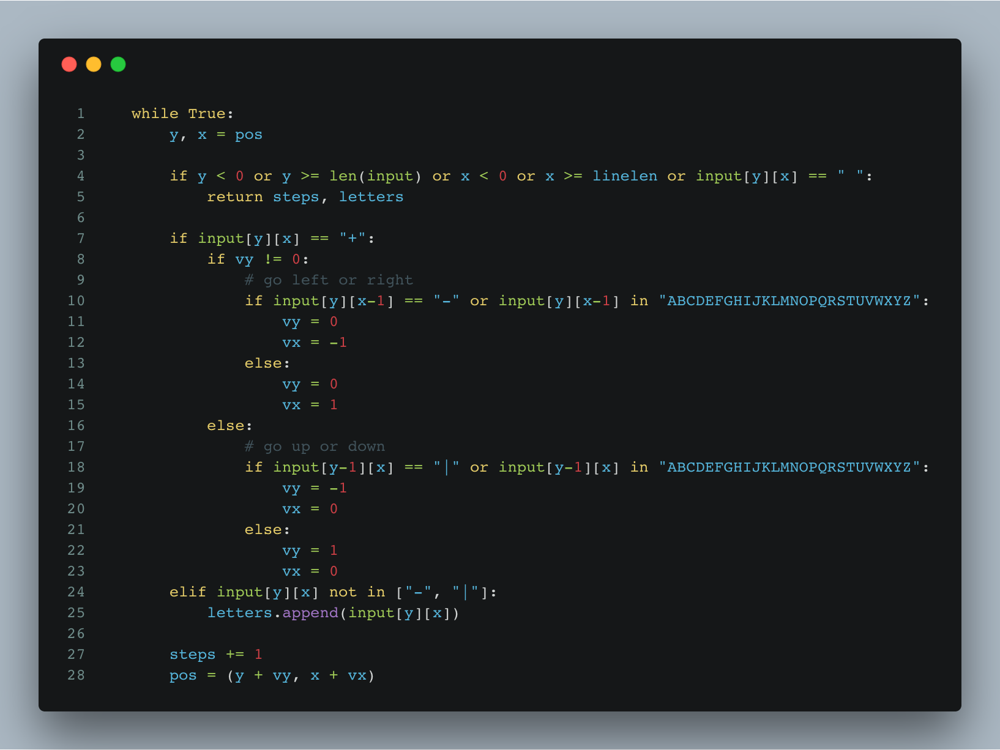

https&#x3A;//www.youtube.com/watch?v=3f_f1T7kaK4


Advent of Code Day 19 was one of those light, easy challenges. Just hard enough to make you think a little, easy enough to solve in 20 minutes.


This could make a great interview question 🤔


The gist of the problem is this:


- you are given an ASCII drawing of a path
- you have to follow it to the end
- collect letters as you pass them
- print them in sequence


For a map like this 👇


```
     |          
     |  +--+    
     A  |  C    
 F---|----E|--+ 
     |  |  |  D 
     +B-+  +--+ 
```


Your result is `ABCDEF`.


The real map is… bigger. 201x201 characters. Or at least mine was.


Far too large to trace with your finger. I mean, you _could_ if you had the patience of a gnat, but that's why the 2nd part of today's puzzle asks you to count the number of steps.





Ain't nobody got the patience to count the number of steps by hand.


Luckily coding up a solution in Python is pretty simple.


You take a current position, `pos`, that starts at the only `|` in top row – your entry point. And a vector `(vy, vx)` pointing downwards, `(1, 0)`, and you travel through the map.


If you encounter a corner, `input[y][x] == '+'`, you change direction – the movement vector. If so far you were traveling vertically, then you go either left or right depending on which direction has inputs. If you were traveling horizontally, then you switch to vertical.


```
        if input[y][x] == "+":
            if vy != 0:
                # go left or right
                if input[y][x-1] == "-" or input[y][x-1] in "ABCDEFGHIJKLMNOPQRSTUVWXYZ":
                    vy = 0
                    vx = -1
                else:
                    vy = 0
                    vx = 1
            else:
                # go up or down
                if input[y-1][x] == "|" or input[y-1][x] in "ABCDEFGHIJKLMNOPQRSTUVWXYZ":
                    vy = -1
                    vx = 0
                else:
                    vy = 1
                    vx = 0
```


`vy` being different than `0` tells you that you've been moving vertically. If there's something to the left, you go there; otherwise, you go the opposite direction.


Same approach for the horizontal change.


When you encounter a letter, you add it to the list of letters.


```
        elif input[y][x] not in ["-", "|"]:
            letters.append(input[y][x])
```


In the end, you make sure to update your current position and steps counter.


```
        steps += 1
        pos = (y + vy, x + vx)
```


That applies the movement vector to our position `pos` and increments the `steps` counter. Easy 👌


When we put it all together and add a loop, the path following implementation looks like this 👇


```
def followpath(input):
    linelen = max(len(line) for line in input.split("\n"))
    input = [line.ljust(linelen, " ") for line in input.split("\n") if len(line) > 0]

    pos = (0, input[0].index("|"))
    vx = 0
    vy = 1
    letters = []
    steps = 0

    print linelen, len(input)

    while True:
        y, x = pos

        if y < 0 or y >= len(input) or x < 0 or x >= linelen or input[y][x] == " ":
            return steps, letters

        if input[y][x] == "+":
            if vy != 0:
                # go left or right
                if input[y][x-1] == "-" or input[y][x-1] in "ABCDEFGHIJKLMNOPQRSTUVWXYZ":
                    vy = 0
                    vx = -1
                else:
                    vy = 0
                    vx = 1
            else:
                # go up or down
                if input[y-1][x] == "|" or input[y-1][x] in "ABCDEFGHIJKLMNOPQRSTUVWXYZ":
                    vy = -1
                    vx = 0
                else:
                    vy = 1
                    vx = 0
        elif input[y][x] not in ["-", "|"]:
            letters.append(input[y][x])
        
        steps += 1
        pos = (y + vy, x + vx)
```


We prep the input, start an infinite loop, break out of the loop when we fall outside the `input` field or hit an empty spot (meaning line is over), and use our path-following logic to move around.


Eventually, we reach the end of the line and return our result: The number of steps and the sequence of letters encountered.


You can see [everything on Github](https://github.com/Swizec/advent-of-code-2017/blob/master/19.py).


That was fun 🤙