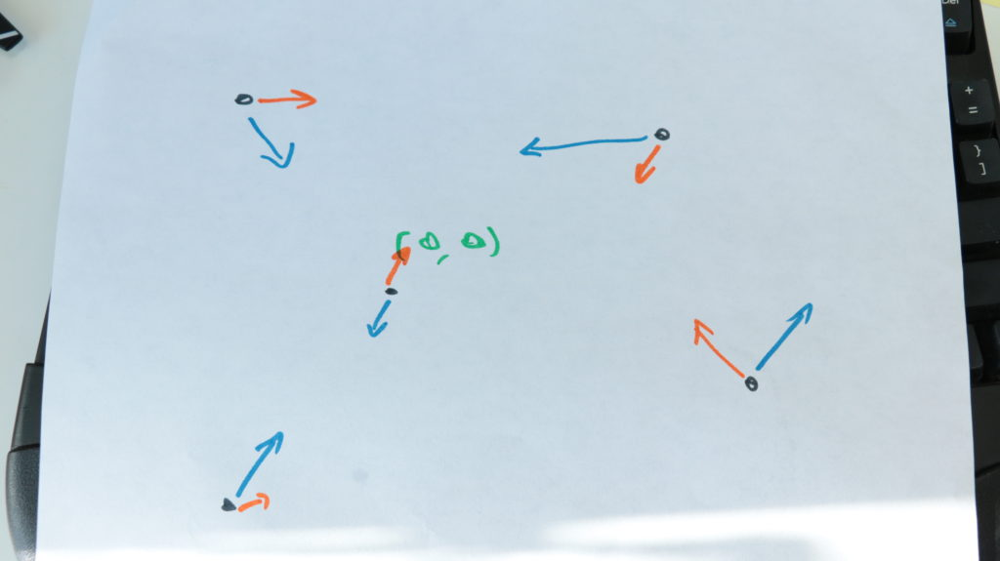

https&#x3A;//www.youtube.com/watch?v=ekm7m9CDnBQ Day 20 smells like one of those problems that you have to math. https&#x3A;//twitter.com/Swizec/status/943380787528835072 You're given a large list of particles that each have a velocity vector and an acceleration vector. Velocity tells you where they move and how fast. Acceleration tells you how velocity changes. You then have to figure out which particle will stay closest to the center – `<0,0,0>` – in the "long term". You can math this.  The particle that is _accelerating_ away from center the slowest is the particle that will eventually stay the closest. This makes sense when you think about it. No matter the initial position or velocity, each particle is either accelerating towards the center, or a way from it. Even if a particle is moving towards the center, it can still be accelerating away from center. Eventually it will fly far far away. Say a particle starts at `p = <3,0,0>` and is moving away from center at `v = <3,0,0>`, but its acceleration is towards center – `a = <-1,0,0>`. If we iterate through each tick of the simulation, you'll see what I mean 👇

    p = <3,0,0>  v=<3,0,0>  a = <-1,0,0>
    p = <5,0,0>  v=<2,0,0>  a = <-1,0,0>
    p = <6,0,0>  v=<1,0,0>  a = <-1,0,0>
    p = <6,0,0>  v=<0,0,0>  a = <-1,0,0>
    p = <5,0,0>  v=<-1,0,0> a = <-1,0,0>
    p = <3,0,0>  v=<-2,0,0> a = <-1,0,0>
    p = <0,0,0>  v=<-3,0,0> a = <-1,0,0>
    ...

On each tick of the simulation, we add acceleration to velocity, then add velocity to the current position. Our particle that started life flying away from center first slows down, then stops, then hurtles towards center. After 4 ticks, it reaches center and keeps flying away ever faster. That's what I mean when by "accelerating away from center". With enough time **all** particles are accelerating away from center because if they were ever going to cross it, they already have. But math is hard and modern computers are fast. Even in JavaScript.

## Star 1

So we can [brute force the solution](https://github.com/Swizec/advent-of-code-2017/blob/master/20.js#L1037). No math required 😇 The gist of our bruteforcing is the simulation function itself, the `tick`. It goes through all particles and moves them.

    function tick(particles) {
        return particles.map(({ p, v, a }) => {
            v = v.map((n, i) => n + a[i]);
            return {
                p: p.map((n, i) => n + v[i]),
                v: v,
                a: a
            };
        });
    }

That returns a new copy of the `particles` array with changed positions, `p`, and velocities, `v`. Acceleration doesn't change. We then also need a way to find the particle closest to center. That's these two functions.

    function distance(particle) {
        return particle.p.reduce((d, n) => d + Math.abs(n), 0);
    }

    function closest(particles) {
        return particles.reduce(
            ({ min, index }, p, i) =>
                distance(p) < min
                    ? { min: distance(p), index: i }
                    : { min: min, index: index },
            { min: distance(particles[0]), index: 0 }
        );
    }

`distance` gives us the [Manhattan distance](https://en.wikipedia.org/wiki/Taxicab_geometry) between the center and a particle. `closest` finds the particle with the smallest distance and returns its `index` and distance `min`. Then we just run the simulation until the closest particle doesn't change for a while. I got good results with `"hasn't changed in 2000 ticks"`. Some fiddling required. Generally the larger that number, the more accurate your result. If you describe the problem in terms of search algorithms (you're searching for a stable state), then any sequence of stable states when the `min` distance doesn't change for a while is a local maximum. You're looking for the global maximum. The longer you keep looking, the likelier that you're at the best possible result.

    function star1(input) {
        let particles = prepInput(input);

        let stable = {
            min: 0,
            index: 0,
            iterations_unchanged: 0
        };

        while (stable.iterations_unchanged < 2000) {
            particles = tick(particles);

            const { min, index } = closest(particles);

            if (stable.index === index) {
                stable.iterations_unchanged += 1;
            } else {
                stable.min = min;
                stable.index = index;
                stable.iterations_unchanged = 0;
            }
        }

        console.log(stable);
    }

Keep track of the result and how long it's remained unchanged. Repeat until desired accuracy. Runs in about a second on my machine. 👌

## Star 2

Star 2 really stretched what I thought was possible with JavaScript: Finding collisions. When particles overlap, they are removed from the pool. Your goal is to find how many particles are left standing after "long enough". The question can once gain be translated into "What's the steady state?". But how do you find colliding particles? The simplest approach is to compare every particle with every particle. Surprisingly, that's good enough. Modern computers are _fast_. [Collision detection](https://en.wikipedia.org/wiki/Collision_detection) is a huge field of algorithmics, by the way. It is definitely not supposed to be as easy as comparing every particle with every particle.

    function collision(particles) {
        return particles.map((particle, idx) => {
            const { p: [x, y, z] } = particle;

            if (
                particles.find(
                    ({ p }, i) => i !== idx && p[0] == x && p[1] == y && p[2] == z
                )
            ) {
                particle.dead = true;
            }
            return particle;
        });
    }

Returns a new copy of the `particles` array with every particle for which a particle exists in the same position marked as `dead`. To run the experiment, we then use a similar setup as before 👇

    function star2(input) {
        let particles = prepInput(input);

        let stable = {
            length: particles.length,
            iterations_unchanged: 0
        };

        while (stable.iterations_unchanged < 2000) {
            particles = collision(tick(particles)).filter(({ dead }) => !dead);

            if (stable.length === particles.length) {
                stable.iterations_unchanged += 1;
            } else {
                stable.length = particles.length;
                stable.iterations_unchanged = 0;
            }
        }

        console.log(stable);
    }

Keep track of stable state and how long it's been stable for. Run the `tick` simulation, detection `collision`, and `filter` dead particles. After a few seconds, the result pops out. Paying [$3,000 for a laptop](https://swizec.com/blog/first-day-new-2017-macbook-pro/swizec/7643) was very worth it 👌
