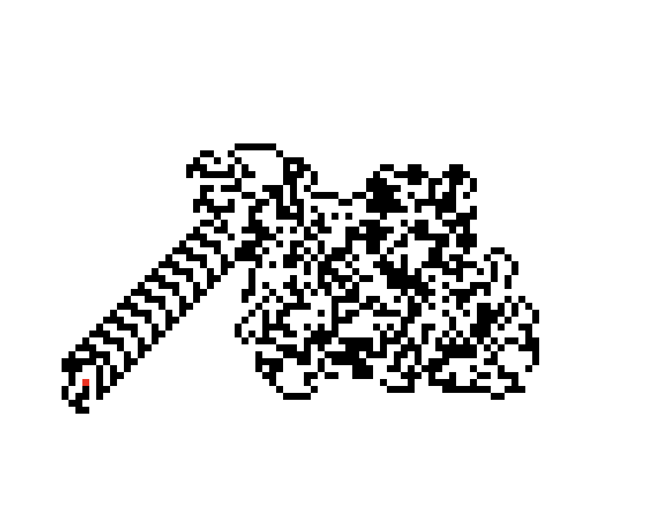

https&#x3A;//www.youtube.com/watch?v=prdKoJ5B5z8


For Day 22, we built a virus and found that Safari is much faster than Chrome.


> The virus carrier works in bursts; in each burst, it wakes up, does some work, and goes back to sleep. The following steps are all executed in order one time each burst:


1. Turn left if current cell is infected, turn right if it isn't.
2. Flip the cell (clean –> infected, infected –> clean)
3. Move forward


> Diagnostics have also provided a map of the node infection status (your puzzle input). The virus carrier begins in the middle of the map facing up.


Naturally, I decided to solve this puzzle in React. Because it sounds like it might draw something interesting. And who doesn't want to see a visualization of the spread of a deadly virus?


It draws a dick. 😑


https&#x3A;//twitter.com/Swizec/status/944147668535730176


And takes 5 minutes to run. And gets the wrong result.


**Edit:** I mixed up left and right. When you fix left and right, it no longer draws a dick, and it still gets the wrong answer 🤷‍♀️. **/Edit**


There must be an off-by-one error somewhere in the code that I can't find. The animation looks correct.


The image evolves, the virus carrier seems to follow the rules, and there are no obvious digressions from the plan. The recursive pattern it falls into around step 7,000 looks suspicious but not out of the question 🤔


## An attempt was made (and then fixed)


You can [see the code on GitHub](https://github.com/Swizec/advent-of-code-2017/blob/master/22/src/Day22.js).





It's built from 3 React components: `GridRow`, which renders a single row of the grid, `Grid`, which renders the grid, and `Day22`, which drives the whole thing.


### GridRow


If you guessed _"Oh, that should be simple"_, you were right.


```
const GridRow = ({ row, x, y, ry }) =>
    row.map((cell, i) => (
        

             
        

    ));
```


Loop through a row, which is an array, and render a `<div>` for each `cell`. Cells are 5x5 pixels and their background can be `red`, `black` or `white`.


Red if the virus carrier is currently on that cell, black if the cell is infected, white if it's not.


### Grid


Once more a simple one, walk through an array of rows, render `GridRow` components.


```
const Grid = ({ grid, x, y }) =>
    grid.map((row, i) => (
        

            
        

    ));
```


### Day 22 – the actual solution


`<Day22>` is where all the logic happens. It sets up our grid as data, drives the virus carrier, and renders `<Grid>` and some meta data.


```
const Width = 180,
    offset = 23;
    
class Day22 extends Component {
    state = {
        grid: new Array(Width).fill(".").map((_, i) => {
            let row =
                i > Math.floor(Width / 2 - input.length / 2 - offset)
                    ? input[
                          i - Math.floor(Width / 2 - input.length / 2 - offset)
                      ]
                    : null;

            let a = new Array(Width).fill(".");
            if (row) {
                a.splice(
                    Width / 2 - row.length / 2 + offset,
                    row.length,
                    ...row
                );
            }
            return a;
        }),
        x: Math.floor(Width / 2) + offset,
        y: Math.floor(Width / 2) - offset,
        vx: 0,
        vy: -1,
        bursts: 0,
        infected: 0
    };

    componentDidMount() {
        this.burstActivity();
    }

    burstActivity() {
            // snip
    }

    turnLeft(vx, vy) {
        // snip
    }

    turnRight(vx, vy) {
        // snip
    }

    render() {
        const { grid, width, bursts, x, y, infected } = this.state;

        return (
            

                

                    bursts: {bursts}, pos: ({x}, {y}), infected: {infected}
                

                

                    
                

            

        );
    }
}
```


That `state` calculation looks hairy. We're taking an array of `Width`, filling it with healthy cells, `.`, then walking through it to build `row`s. If the current index is past a certain point, we replace the middle part of the `row` with a row from our input array. We do that with a `splice`.


The result is a 180x180 grid of cells. Some of them are infected, but most aren't.


The `render` method just renders all of this.


### The virus carrier logic


The virus carrier logic comes in 3 functions. `burstActivity`, `turnLeft` and `turnRight`.


```
   burstActivity() {
        const { x, y, bursts, grid } = this.state;
        let { vx, vy, infected } = this.state;

        if (grid[y][x] === "#") {
            grid[y][x] = ".";

            [vx, vy] = this.turnRight(vx, vy);
        } else {
            grid[y][x] = "#";
            infected += 1;

            [vx, vy] = this.turnLeft(vx, vy);
        }

        this.setState({
            x: x + vx,
            y: y + vy,
            vx,
            vy,
            grid,
            infected,
            bursts: bursts + 1
        });
        if (bursts + 1 < 10000) {
            requestAnimationFrame(() => this.burstActivity());
        }
    }

    turnLeft(vx, vy) {
        let _vx = -1 * vy;
        vy = vx;
        return [_vx, vy];
    }

    turnRight(vx, vy) {
        let _vx = vy;
        vy = -1 * vx;
        return [_vx, vy];
    }
```


`burstActivity` is our main logic driver. It looks at the current virus carrier position, turns left if it's infected, or turns right if it isn't. In both cases, it also flips the cell.


If the cell was flipped to infected, we increment our solution counter of how many cells we've infected.


Then it updates state and continues the loop if there have been fewer than 10,000 bursts of activity.


`turnLeft` and `turnRight` turn the direction our virus carrier is going. Left or right using a little bit of vector maths. Thanks to a helpful stream watcher who showed me this better way. I had a huge sequence of ifs at first 🙈


## Lessons learned


I learned a couple of lessons with this build.


1. React is SO MUCH FASTER after you turn off streaming
2. If you render 250,000 DOM nodes, you're gonna have a bad time
3. Pegging your algorithm at `requestAnimationFrame` makes it slow
4. Safari is _a lot faster_ than Chrome at re-rendering a few ten thousand DOM nodes with React. I don't know why


https&#x3A;//twitter.com/Swizec/status/944241764029816832


1. When your code runs slow, development is slow, and getting the wrong result after 2+ hours of tinkering kinda sucks
2. `array.splice(5, undefined, 1,2,3,4,5)` doesn't even bat an eye, turns that `undefined` into `0` and proceeds like nothing happened


https&#x3A;//twitter.com/Swizec/status/944122955876900866


Thanks to stream watchers for pointing out that I can't spell `row.length`. You da real MVPs.


