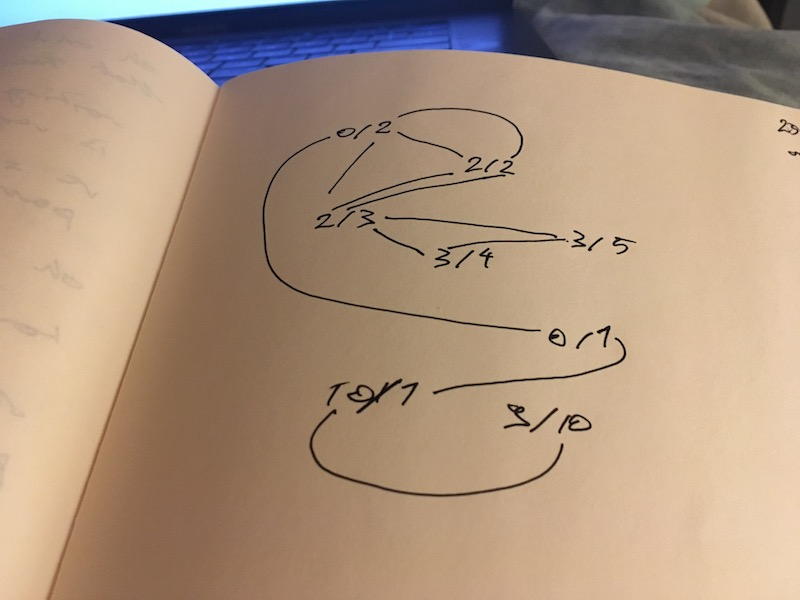
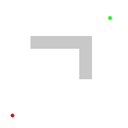

On Day 24 of Advent of Code we had to build a path finding algorithm. We're given a set of nodes and a heuristic and have to find the best possible path. https&#x3A;//twitter.com/Swizec/status/945176148358524929 The puzzle uses different phrasing, but that's what it is.

> Build a bridge out of the magnetic components strewn about nearby. Each component has two ports, one on each end. The ports come in all different types, and only matching types can be connected. You take an inventory of the components by their port types (your puzzle input). Each port is identified by the number of pins it uses; more pins mean a stronger connection for your bridge. A 3/7 component, for example, has a type-3 port on one side, and a type-7 port on the other. Your side of the pit is metallic; a perfect surface to connect a magnetic, zero-pin port. Because of this, the first port you use must be of type 0. It doesn't matter what type of port you end with; your goal is just to make the bridge as strong as possible. The strength of a bridge is the sum of the port types in each component. For example, if your bridge is made of components 0/3, 3/7, and 7/4, your bridge has a strength of 0 3 3 7 7 4 = 24.

You can model this as a ./img/graph path finding algorithm. Each component is a node. It connects to all other components with matching pin numbers. Our job is to find the most expensive path in this imaginary graph. Let's take the test input:

    0/2
    2/2
    2/3
    3/4
    3/5
    0/1
    10/1
    9/10

With those nodes, our graph of connections looks like this 👇  Sorry that's not laid out the best and I don't have my usual colourful markers on me right now. But that's our graph. The correct solution in this case is: `0/1--10/1--9/10` for a total strength of `31`.

## My A\* implementation in Haskell

[Full code on Github](https://github.com/Swizec/advent-of-code-2017/blob/master/24.hs) To find that solution we can use the famous [A\* algorithm](https://en.wikipedia.org/wiki/A*_search_algorithm), which is itself an improvement on the even more famous [Dijkstra algorithm](https://en.wikipedia.org/wiki/Dijkstra%27s_algorithm). This is the stuff I used to nerd out on in college. 😇 Now I can't promise my algorithm is a true implementation of A\* _or_ of Dijkstra's algorithm. I used what I remembered from college as inspiration and derived the search algorithm from scratch all on my own.

A\* search algorithm visualization

It was so much fun that it kept me from my Christmas duties and my girlfriend complained. A lot. The core of my solution is the recursive `buildBridge` function. It builds bridges (graph paths) from all possible candidates for the next bridge piece, then chooses the best one.

    -- build bridge with maximum score
    buildBridge::Int -> [(Int, Int)] -> [(Int, Int)] -> [(Int, Int)]
    buildBridge port [] bridge = bridge
    buildBridge port pool bridge
        | length opts > 0 = maximumBy (comparing heuristic) $ map (\(nextPort, link) -> 
            buildBridge nextPort (poolWithout link pool) (bridge ++ [link])) opts
        | otherwise = bridge
        where opts = candidates port pool []
        
    heuristic::[(Int, Int)] -> Int
    heuristic links = sum [a b | (a, b) <- links]

That's not the prettiest Haskell code. Here's what it means:

-   `buildBridge` is a function that takes a number, two lists of `(number, number)` tuples, and returns a list of `(number, number)` tuples. The number is the `port` we're trying to build bridges for, the first list is a `pool` of available components, and the 3rd list is the current `bridge` we're extending.
-   if the `pool` of available components is empty, return the `bridge`
-   build a list of `candidates` for the next component and put it in `opts`
-   if `opts` has a length greater than zero, return the best bridge where you `buildBridge` for each candidate component
-   if there are no available candidates, return the `bridge`
-   the `heuristic` function sums all ports in the bridge

Each time we go into a recursion, we take components out of the component pool that's passed into `buildBridge`. That guarantees we don't accidentally use a component multiple times. I find it difficult to visualize how this algorithm works. 😅 It's something between a breadth first search and Dijkstra's algorithm. Not actually sure it's A\* after all 🤔

## How it works

For every node, we find all possible nodes we can connect to (its neighbors). For each of those we build a path all the way to the end. This gives us all possible paths through the graph. Then we unwind the recursion to collapse them into the best possible path. For the test input, all possible exhaustive paths are:

    0/1--10/1--9/10
    0/2--2/3--3/4
    0/2--2/3--3/5
    0/2--2/2--2/3--3/4
    0/2--2/2--2/3--3/5

As our recursion unwinds, it picks the best path based on our heuristic function. You can think of that process as replacing nodes with their values and picking the best option.

    # Step 1
    0/1--10/1--19
    0/2--2/3--7
    0/2--2/3--8
    0/2--2/2--2/3--7
    0/2--2/2--2/3--8

    # Step 2
    0/1--30
    0/2--13
    0/2--2/2--13

    # Step 3
    31
    15
    0/2--17

    # Step 4
    31
    15
    19

    Step 5
    31

At each step of unwinding, we can discard low value alternatives when they share the same bridge root. Eventually we end up with a single possibility. This _sounds_ a lot like the description of A_, but I'm honestly not sure that my algorithm is A_. 😕

## The helper functions

Either way, to find those `candidates`, we use the `candidates` function:

    -- find all possible candidates for next link
    candidates::Int -> [(Int, Int)] -> [(Int, (Int, Int))] -> [(Int, (Int, Int))]
    candidates port [] acc = acc
    candidates port pool acc
        | (-1, -1) == link = acc
        | otherwise = acc    [(nextPort, link)] ++ (candidates port nextPool acc)
        where (nextPort, link) = findNext port pool
              nextPool = poolWithout link pool

This function takes a `port` we're connecting to, a `pool` of components, and the current known list of results, `acc`. We use `findNext` to find the next component we can use, called `link`. Link because it's going to be a link in the bridge. We take it out of the `nextPool` of components passed into recursion using `poolWithout`. If the `link` was found, we expand our known list of candidates, `acc`, with the new link and a call to `candidates` with the remaining pool. You may be wondering why we're spending so much time passing ports around instead of nodes. It's because each node is made out of two ports and each port can only be used once. We try to keep track of that. For instance when we look for candidates to connect to `(0, 1)` we know that `0` is already used. So we look for anything that can connect to `1`. When we find `(1,2)` and `(3,1)` we have to note that `1` is used up so the next node will have to connect to either `2` or `3`. The `findNext` function is where this finding happens.

    -- find next link in bridge and which port to use for next next link
    findNext::Int -> [(Int, Int)] -> (Int, (Int, Int))
    findNext port [] = (port, (-1,-1))
    findNext port pool
        | port == left = (right, (left, right))
        | port == right = (left, (left, right))
        | otherwise = findNext port (tail pool)
        where (left, right) = head pool

`findNext` returns the first matching component from our pool. When the pool is empty, it returns `(-1, -1)` to signify nothing was found. When the `port` matches either `left` or `right` side of the component, we return that component and the next port it can match to. If `left` matched, we return `(right, (component))`, if `right` matched, then we return `(left, (component))`. If nothing matched and there's still stuff in the pool, we return whatever `findNext` finds in the pool without the first element. Because we checked the first element just now. Recursion 🤙 The `poolWithout` function we used in a couple places is a simple `filter` by they way 👇

    poolWithout::(Int, Int) -> [(Int, Int)] -> [(Int, Int)]
    poolWithout link pool = filter (\x -> link /= x) pool

## And that works

That mass of recursion that's hard to visualize in your mind works. It really does. I'm kinda surprised. It feels like magic. I mean, I wrote the algorithm. I derived it from scratch. And when I try to think about how it works my mind just goes

Recursion is hard, okay. So did I build A\* or not? This is gonna bother me 😕

## PS: star 2

For Star 2, we had to find the longest possible bridge with the best score. Same algorithm, different heuristic function.

    heuristic2::[(Int, Int)] -> [(Int, Int)] -> Ordering
    heuristic2 a b
            | la > lb = LT 
            | la > lb = GT
            | la == lb = compare (heuristic a) (heuristic b)
            where la = length a
                  lb = length b

Compare lengths, if lengths are the same, use the previous heuristic function based on strength.
