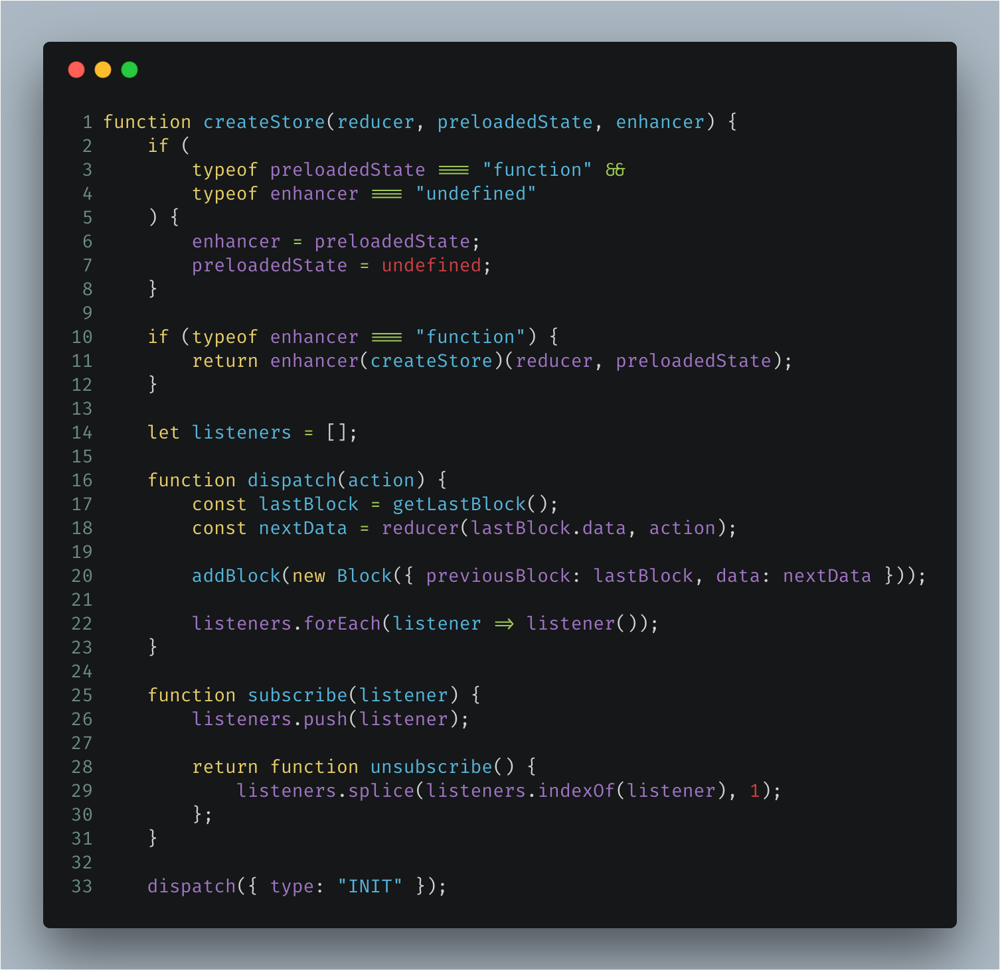
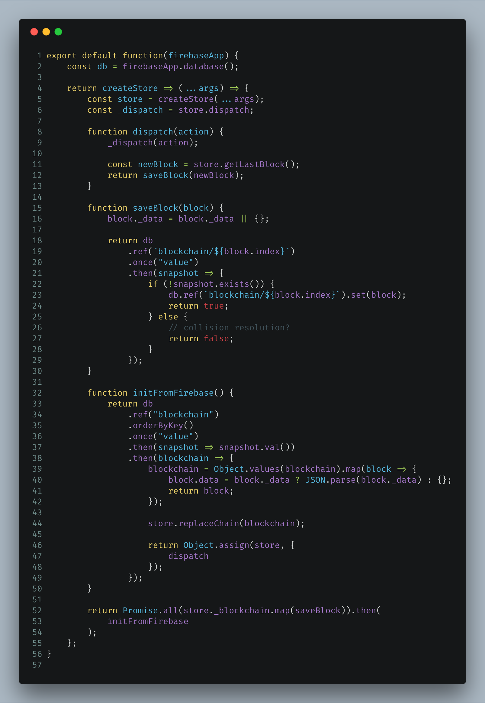

The [blockchain-redux](https://github.com/Swizec/blockchain-redux) experiment continues. State is now shared and preserved. https&#x3A;//www.youtube.com/watch?v=CREqFkX_r1o https&#x3A;//www.youtube.com/watch?v=EW8uJ8Z2pYA When I last wrote about this [blockchain-backed Redux clone in 105 lines of code](https://swizec.com/blog/blockchain-backed-redux-clone-105-lines-code/swizec/7980), it could:

-   build a local blockchain
-   add blocks on every action `dispatch`
-   verify the chain is valid
-   replace the chain with a longer chain

All the basic building blocks. But it didn't quite have feature parity with [the real redux](https://github.com/reactjs/redux), and it lacked some way to share the blockchain between nodes. You started a new chain with every call to `createStore()`. That has now been fixed.

## Feature parity with Redux

\[caption id="attachment_8053" align="alignnone" width="1506"] Basically this is it, this is Redux\[/caption] We [reached Redux feature parity](https://www.youtube.com/watch?v=CREqFkX%5C_r1o)… I think. We added the ability to subscribe to changes and to use middleware. [blockchain-redux](https://github.com/Swizec/blockchain-redux) looks and feels the same as real Redux when you're using it, and I think that means it's got feature parity. In theory, you should be able to drop-in any redux plugin or middleware and it's gonna work.

### Subscribing to changes

The concept here is simple:

1.  A method adds functions to an array of `listeners`
2.  Dispatch calls all of them

        let listeners = [];

        function subscribe(listener) {
            listeners.push(listener);

            return function unsubscribe() {
                listeners.splice(listeners.indexOf(listener), 1);
            };
        }

We keep a `listeners` array. It starts as empty. Calling `subscribe`, which is exposed as an API, adds your listener to the list. In `return` you get a function that lets you unsubscribe. Using `listeners.splice` to remove functions like that comes [straight from Redux source](https://github.com/reactjs/redux/blob/master/src/createStore.js#L136). It's probably faster than building a new list using `.filter`.

### Middleware support

Adding middleware support was trickier. Middleware, in essence, wraps the Redux store and changes how its functions work. You can think of it like a higher-order-component or a function decorator. Whichever makes more sense to you. Redux itself makes this easier with an `applyMiddleware` function, but I didn't want to build that just yet. I don't think it's strictly necessary, but maybe that breaks feature parity. 🤔 First part is to add a 3rd argument to `createStore` – the `enhancer`.

    function createStore(reducer, preloadedState, enhancer) {
        if (
            typeof preloadedState === "function" &&
            typeof enhancer === "undefined"
        ) {
            enhancer = preloadedState;
            preloadedState = undefined;
        }

        if (typeof enhancer === "function") {
            return enhancer(createStore)(reducer, preloadedState);
        }

If `enhancer` is a function, we pass the `createstore` function to it and say, _"Ok, you do this.”_ The enhancer, a middleware, then takes care of instantiating the store and changing its behavior. A simple middleware that prints out every call to `dispatch` would look like this.

    // a logging middleweare
    export default function() {
        return createStore => (...args) => {
            const store = createStore(...args);
            const _dispatch = store.dispatch;

            function dispatch(action) {
                _dispatch(action);

                console.log("ACTION", action);
            }
            
            return Object.assign(store, {
                dispatch
            });
        }
    };

We're using some functional concepts here to do our thing. Currying for the most part. Our logging middleware returns a function that takes `createStore` as its argument. This in turn returns a function that takes arguments, usually `reducer` and `preloadedState`. It immediately calls `createState` to build the store. This time without passing a middleware. Then our redux middleware overwrites the `dispatch` function with its own function that prints actions as well as calls the original dispatch. In the end, we return the augmented store. I borrowed this approach from Redux's applyMiddleware function, and it works great. Where I think my approach might suffer is applying multiple middlewares. But we can solve that problem when we get to it 😇

## Sharing the chain between nodes

We went to all that trouble of supporting middleware so that we can build different strategies for sharing our blockchain. blockchain-redux itself should focus on building the blockchain, dispatching actions, and keeping state. How that gets shared between nodes lives in a separate layer. For now, that layer is Firebase. This gives us an easy backend to work against and make sure nodes are communicating. Great way to iron out kinks, but it makes our blockchain centralized. We'll solve the centralization problem next. Here's how the Firebase middleware works 👇 \[caption id="attachment_8054" align="alignnone" width="1606"] Sharing the chain between nodes using Firebase\[/caption] Our middleware exports a function that takes an initialized FirebaseApp as its argument. This made it easier to have multiple instances of the store sharing the same Firebase when testing. Just like before, the only function it augments is `dispatch`. It now tries to save new blocks to Firebase.

            function dispatch(action) {
                _dispatch(action);

                const newBlock = store.getLastBlock();
                return saveBlock(newBlock);
            }

Dispatch the action, get latest block from the store, save block to firebase. 👌 Saving that block is fraught with some difficulty, however.

            function saveBlock(block) {
                block._data = block._data || {};

                return db
                    .ref(`blockchain/${block.index}`)
                    .once("value")
                    .then(snapshot => {
                        if (!snapshot.exists()) {
                            db.ref(`blockchain/${block.index}`).set(block);
                            return true;
                        } else {
                            // collision resolution?
                            return false;
                        }
                    });
            }

We save blocks at `blockchain/<index>`. On every save, we check if the blocks already exists. If it doesn’t, we save the block and everyone is happy. However, if somebody else already created the same block successfully, we're in trouble. Right now, the middleware silently drops the save, and that's bad. I think the easiest solution will be to sync with the Firebase blockchain before dispatching an action and making a new block. Or we could dispatch the action and run a save-dispatch-save cycle until it succeeds. Neither of those approaches is very optimal from a network utilization perspective. Not sure yet what to do here.

### Initing the store from blockchain

Another interesting problem was initializing our store from the blockchain. How do you ensure you have the whole chain before building new blocks? One approach I found was to read the whole thing from Firebase and replacing the local stub chain with the big one.

    function initFromFirebase() {
                return db
                    .ref("blockchain")
                    .orderByKey()
                    .once("value")
                    .then(snapshot => snapshot.val())
                    .then(blockchain => {
                        blockchain = Object.values(blockchain).map(block => {
                            block.data = block._data ? JSON.parse(block._data) : {};
                            return block;
                        });

                        store.replaceChain(blockchain);

                        return Object.assign(store, {
                            dispatch
                        });
                    });
            }

            return Promise.all(store._blockchain.map(saveBlock)).then(
                initFromFirebase
            );

`initFromFirebase` reads our central blockchain from Firebase, goes through the blocks and makes sure `data` is in the right format, then runs `replaceChain`. You'll notice this is now where we return the Redux store. That means `createStore` is asynchronous and wreaks havoc on just about everything we hold dear about using Redux. But I'm not sure how to fix that. We need to have the chain before dispatching our first function. Maybe a waiting mechanism in dispatch 🤔 Oh, and that last part? That's so we create the blockchain stub on Firebase in case it doesn't exist yet. Goes through blocks in the default chain and makes sure they exist on Firebase.

## What next

This is still a rough experiment. The blockchain implementation works, it communicates through Firebase so it's distributed, but it has trouble with conflict resolution, has a centralized source of truth, and is very network and memory inefficient. All of that is bad. I want to move towards using Firebase as just a communication protocol between nodes so instead of saving the whole blockchain there, we just announce new blocks and other nodes pick them up. That would be more efficient. I also want to figure out how to avoid saving the whole blockchain locally. But maybe that's fundamentally not possible 🤔 Got suggestions? Yell [at me on Twitter](https://twitter.com/swizec).
