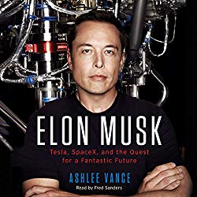

> What is the most \\important problem in my field and why am I not working on it?
>
>
>
> ~ Richard Hamming

A few months ago, I finished Tim O'Reilly's _WTF – What is The Future and Why It's Up to Us_.

WTF is amazing. You read it, and for the next couple of weeks, you're recommending it to everyone you see. Oh, you had so and so idea? WELL LET ME TELL YA, this Tim O'Reilly fellow wrote about it in his book and ho boy did he ever break it down and analyze the crap out of it.

You should read it.

It revolves around 10 or so interesting ideas and thinks through them in great detail. The idea that stuck with me the most was about Uber and Lyft and that whole ecosystem.

O'Reilly argues the innovation there wasn't improving taxi companies. The real innovations was making it feel like everyone has a personal driver. You press a button and a car shows up. You get in. You get out. No paying, no figuring out best routes, no worrying about explaining where to get picked up and dropped off.

That is _so_ true. The exact thing I love about ridesharing is that it's not like a taxi. All the annoying parts are gone.

Then he goes on to talk about how we are augmenting humans with technology and limited AI and how the future is AI assisting humans. That was interesting, too.

Fundamentally, O'Reilly's WTF book got me thinking about big, world changing ideas. Why aren't I working on those?

For the past few weeks (yes, I'm slow), I've been reading Elon Musk's biography.

The book about Ol' Musky is… inspirational?

Here's a guy with a killer life story, putting rockets into space and batteries into cars. Silicon Valley's darling who once was the butt of every joke about rich guys and wishful thinking.

His story didn't teach me much because I don't want to be a blowhard who cycles through employee after employee because they all burn out.

But reading about Elon Musk did make me self-conscious. Here's a guy with a grand unifying vision of the future, working hard to get there. First, he took on the banks, then he took on the banks in a different way, then he realized humanity is doomed and got to work saving it.

Why don't I have a grand unifying vision like that? What's my big fucking idea? (he likes to drop f-bombs, book's full of 'em)

🤔🤔

Just before Christmas, I had coffee with the founder of my day job startup. We talked about my sidehustle and how that's going and that it's growing and what to do about it.

As he was about to race off to his next meeting, he said something like _"Swiz, you're a great guy, and I support that you have a sidehustle, but come on man, that's some low-conviction bullshit. You're better than that.”_

That stung.

He's right though. It is low conviction. It's \\important to share knowledge, and the Thank You emails I get definitely say my work is \\important and helpful.

But is helping people improve their craft going to change the world? Maybe. Is it a big risky swing for the fences kind of bet? Nah.

Way back when I was a wee lad of 21, my ideas were far grander, and I was ready to take on the world. Now I'm like, How do I build a business that makes a few hundred thousand per year, maybe a million?

_sigh_

Yesterday, I read a paraphrased quote from Richard Hamming's essay [You and Your Research](http://www.cs.virginia.edu/~robins/YouAndYourResearch.html):

> You have to ask yourself: What is the most \\important problem in my field and why am I not working on it?
>
>
>
> ~ Richard Hamming

And that was the last nail in the coffin. I legit don't know what to do with myself.

My work is \\important, but is it \\important _enough_?