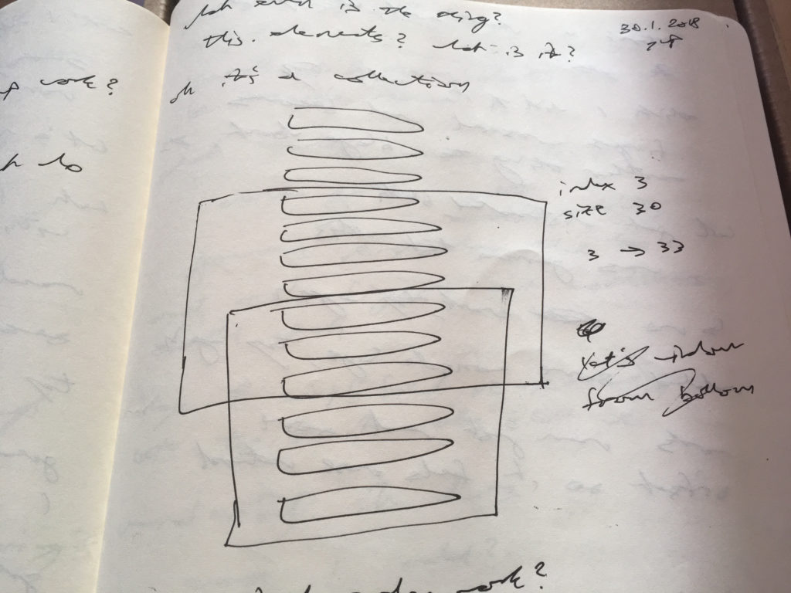
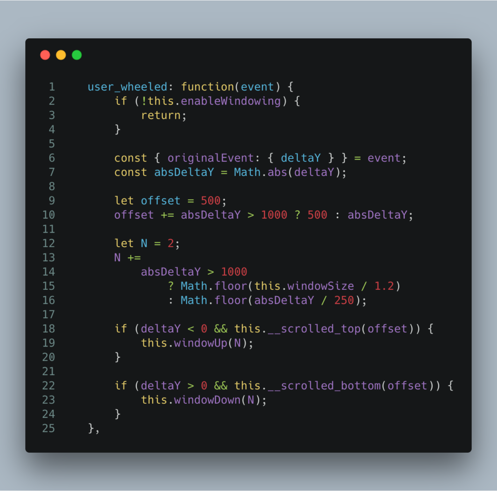

Chatroom is slow? I know, I'll just use list virtualization!

Well now you have two problems.

https&#x3A;//twitter.com/Swizec/status/958840988495093760

List virtualization is hard, dear reader. _So_ hard. “Pfft, I can build that in an hour,” I thought until I tried.

It's been 3 days. Last night, I dreamed scrollbars and mouse wheel events.

## Hold up, what's list virtualization?

[List virtualization](https://www.google.com/search?q=list+virtualization&oq=list+virtualization&aqs=chrome..69i57j0l5.2398j0j1&sourceid=chrome&ie=UTF-8) is a performance improvement technique for large lists or tables. Whenever your UI becomes slow because you're rendering too much stuff, you can use list virtualization to make it fast again.

We've been hit with this problem recently at [Yup](https://www.yup.com). When our sessions get long, like hundreds of messages between tutor and student, tutors start complaining about the UI feeling sluggish.

They can't type, they can't talk, it's like teaching through a paper bag. Terrible.

We don't know why it became such a big problem right now, but 600 milliseconds to add a message to a chatroom is just too much. Needs to be fixed.

That's where list virtualization comes in.

Instead of keeping the whole hundreds-of-messages chatroom rendered, you render just 30 messages. Or 40, or 10. Whatever the number, you render a small subset of the messages.

And that gives you a performance boost. Fewer DOM nodes to deal with, faster rendering times. Especially on slow computers.

The problem may have become a problem because of the [Spectre and Meltdown fixes that hit Intel processors with up to 30% slowdowns](https://techcrunch.com/2018/01/03/a-major-kernel-vulnerability-is-going-to-slow-down-all-intel-processors-2/). When you're already using a slow $300 computer… yeah.

## How to virtualize a list, in theory

So, how do you virtualize a list?

Virtualizing a list is simple in theory. You maintain a window and move it around your list.

A `windowSize` variable tells you how many nodes you're rendering, and a `windowIndex` variable tells you where to start rendering. Then you `.splice` your data array and render away.

https&#x3A;//twitter.com/Swizec/status/958497773749395456

I was doing it in [Backbone](http://backbonejs.org/), so it seemed super tricky. We had complex logic in place to append and remove and prepend messages to the list as necessary.

Think things like

1. Find previous message with `$("nth-child")`
2. Manipulate with `$(ul).append`
3. Find the correct scroll position

Messy.

After a few hours of that approach, I gave up.

> Screw DOM manipulation, it's 2018 and the DOM is fast. Re-render it.

To my surprise, throwing away the list and re-rendering for every message insertion or scroll event works friggin’ great. Like really seriously great. Even in Backbone where you get none of React's diffing magic.

I didn't run proper benchmarks, but on my 2017 MBP at home, re-rendering a 30-element list happens in 10 to 15 milliseconds.

1. `$("ul").html("")`
2. `elements.splice(windowIndex, windowSize)`
3. loop and append

That re-renders in just 10 milliseconds on my 15" MBP, 30 milliseconds on my 13" MBP. Both running RoR and sidekiq and webpack and the rest in the background.

13" is so much slower because it's just dual core. I'll run a proper benchmark for this soon because I'm curious.

My point is that re-rendering is fast and easy. You can totally get away with re-rendering on every mousewheel event if your `windowSize` is small enough.

I now had a virtualized list. Worked great.

https&#x3A;//twitter.com/Swizec/status/958518929504088064

Except the UX is confusing. You get to the edge of the scrollbar and it just keeps going and going. Wat?

## Where things get tricky

This strange scrolling UX is where things go belly up and life gets hard. Users don't expect to hit the edge of the scrollbar before the edge of the content, you see.

So I tried a couple things and haven't really figured this out. I think I'm on the right path, but I'm also starting to lose my mind.

Watch this gif. Scrolling up works great, but then you start scrolling down and everything goes topsy turvy.

https&#x3A;//twitter.com/Swizec/status/958840988495093760

The version in this gif tries to compensate for a few things.

1. Uses an offset from the edge to start adding messages before you hit the edge
2. Adjusts this offset to your scrolling speed
3. Adjusts `windowIndex` delta to your scrolling speed

Adding messages is basically just moving the `windowIndex`. That part is easy.

But the mousewheel is a tricky beast. On my mouse, the smallest `deltaY` is 4 pixels. That's okay.

The biggest `deltaY` I've seen is around 3000 pixels. In a single event call.

So that's what I've been dealing with. I wish I could just use [react-virtualized](https://github.com/bvaughn/react-virtualized), but I can't because _"We'll have time to rewrite later"_. Can't come soon enough 😅

## Update: OMG I DID IT

It's not as smooth as Slack, but it's good enough for now.

> OMG I DID IT! [pic.twitter.com/s85429V067](https://t.co/s85429V067)
>
> — Swizec (@Swizec) [February 1, 2018](https://twitter.com/Swizec/status/959151765185691650?ref_src=twsrc%5Etfw)

Wasn't that complicated after all. Just a bunch of maths with magic numbers.

