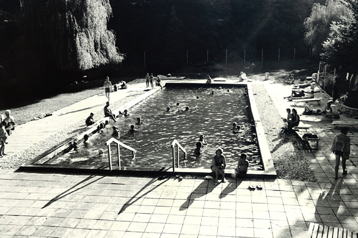
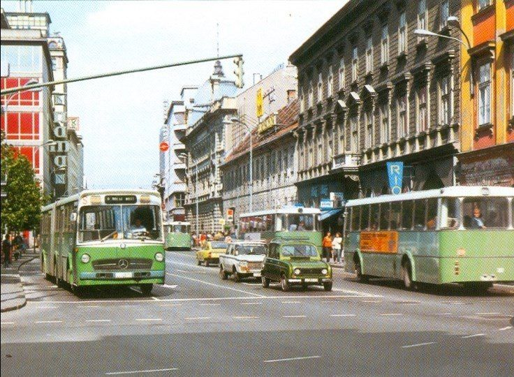
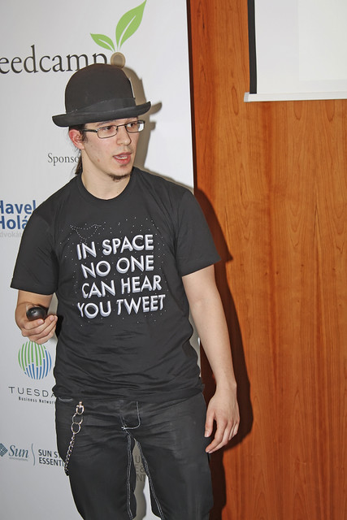

I figured it out on my 2 hour run…

A thing I’ve noticed:

Objectively, my life is going pretty well.

Subjectively, I always have a sense of impending doom and feel like I'm not living boldly enough, am underperforming, and turning into a normie.

https&#x3A;//twitter.com/Swizec/status/965072611842510848

The existential dread never goes away. And I think I know why.

Story time! 👇

My great grandparents were wealthy farmers. They owned one of the largest farms around back when [the economy was 75% agrarian](https://en.wikipedia.org/wiki/Kingdom_of_Yugoslavia#Economy).

They returned from Dachau or Buchenwald [1](#fn1) to a largely burned down and destroyed farm.

Great granddad rebuilt their wealth through livestock trading, a booming industry in an agrarian society that needs to rebuild after a war. Milk was a staple.

The stories I heard about my great grandpa paint him as sort of entrepreneurial genius. He started life as a farmhand, a young worker paid with food and board. Eventually, he bought the farm he worked at as a kid.

.jpg)

Despite his genius, the forces of industrialization [2](#fn2) were too strong. Kids went to school and wanted jobs in the city.

These days, the farm is Not Doing So Great. Those who remain get by and supplement their income with day jobs. The rest moved to the city.

Great gramps died a month before I was born. Late 80's. I'm told we're a lot alike.

Grandpa on that side of the family died in an iron factory accident when my dad was 5. Grandma died from complications during childbirth.

So my dad was an orphan growing up with my great grandmother on the family farm. More on him later.

* * *

On the other side of the family, my great grandparents did okay but not spectacular. No camps for them that I know of, but times were tough after the war. They got by.

I heard they knew of my paternal great grandpa from his cattle trading reputation and propensity for practical jokes. Maybe they even met.

My maternal grandpa complains he was often hungry as a kid. My mum says he exaggerates. Young growing boys are always hungry.

Back then, you bought jam by the spoon, not by the jar.

My grandma says she would sometimes eat plaster off the walls when she was hungry. I don't know much about her side of the family.

But grandpa decided farming was not for him, and he went to seek riches in the service industry. He finished high school in The Big City, you see. He was a hotshot.

Eventually, he and my grandma started a tavern. This must have been in the 70's. My mum says to this day that red wine smells like fat old drunk men.

The tavern was going well for a while. Then they went bankrupt. I don't know why, but they did.

Grandpa got a job as an inventory manager at a nearby pharmaceutical factory. Grandma worked as a pill packer. She was given 1 liter of milk per day to help with the chemicals.

Grandpa bought up land around their house and started a vineyard on the side.

It was going great. He won awards. But land is expensive and wine is labor intensive. He kept his high paying job until his retirement some time in the late 90's.

After retirement, he redoubled his efforts and went hard on the vineyard.

But the wine market in Slovenia collapsed, and the government started bailing people out. Cash in return for cutting down your vines.

He took the cash. Now he smokes meat as a hobby.

Sometimes, he sells some of his old wine inventory. My French girlfriend says it's some of the best wine she's ever tasted.

* * *

My mum was scarred from entrepreneurship because of grandpa, so she got a well paying government job in the city instead. She does okay but complains a lot.

A lot of stability tho. Stability is good.

Because my dad… my dad saw much opportunity in the early 90's transition from socialism to capitalism [3](#fn3). He tried many things. Some went better, some went worse.

Somehow, he was always between different schemes and different jobs.

Eventually, my mum got tired of him, and they divorced. He took the money as seed investment in a real estate business. Flipping houses.

It was going great for a while.

Then 2008 happened. The apartments he flipped got smaller and smaller. Child support checks stopped coming.

He refused to accept defeat and kept going.

Our family eventually broke ties with him. His extended family gave up even sooner, I think. He owed money to everyone, even his kids.

He went kinda coo-coo after that.

Last I heard, he was homeless. Avoiding collections.

* * *

And then there's me.

I started college right before the global crisis of 2008. I always knew there was no future for me in having a job.

So in college, I started a startup. But nobody told me a business should make money. All I heard about was VC this VC that.  

I didn't get VC. My angels fired me.

So I started a freelancing business. It was going great. Until I decided to make it _really_ great by moving to the US.

But in the US, SF Bay Area at least, nobody wants freelancers. They want full time.

Oh, and the social clout I took for granted back home? Worth nothing.

Times got tough, but I failed up into a full-time engineering job at a startup. Paying better than any of my freelancing ever did.  

But I knew my future was not in jobs. So I started a sidehustle. Training people how to be better engineers. React was just exploding, great time to get in.

That's still going great. 2x year-over-year growth so far. Wonderful.  

But the sidehustle is showing some worrying signs. It's getting smothered by my lack of time. The competition is out-executing me.

It's time to do or die. Those decisions are hard.  

Because I come from a long line of smart ambitious hardworking people plagued by unforeseen market changes and personal tragedy.

Whenever anyone in my family did or died, it was always going great until suddenly it wasn't.

And that's where my sense of impending doom comes from.

Thanks for listening.

> Caveat: This story is stitched together from memories and stories I heard. Many of them when I was very young.

1. I don't know which camp my great grandparents were in. I know it was in Germany and that it was a work camp, not an extermination camp. According to them this made it relatively tame. [↩](#ffn1)
2. Yugoslavia after World War 2 went through a period of intense industrialization. Everyone got electricity and indoor plumbing, jobs moved to cities, factories sprung up all over. People bought bicycles, cars, and tractors. [↩](#ffn2)
3. After the [10-day war](https://en.wikipedia.org/wiki/Ten-Day_War), Slovenia seceded from Yugoslavia and started transforming its economy from mostly centrally planned socialism, to a capitalist system. Those who could, bought up state-owned factories and businesses, others started their own. Entrepreneurship was encouraged at last. [↩](#ffn3)