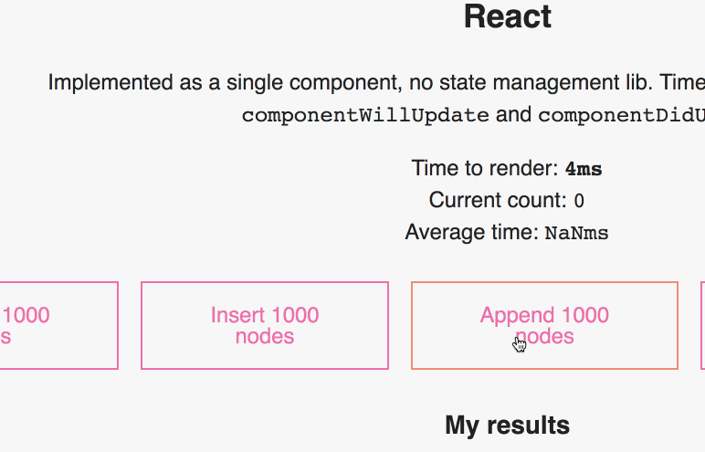

_This is a Livecoding Recap – an almost-weekly post about interesting things discovered while livecoding. Usually shorter than 500 words. Often with pictures. Livecoding happens almost **every Sunday at 2pm PDT** on multiple channels. You should subscribe to [My Youtube](https://www.youtube.com/TheSwizec) channel to catch me live._ https&#x3A;//www.youtube.com/watch?v=Ukm3mRWZtCk After that [chatroom windowing feature](https://swizec.com/blog/build-list-virtualization/swizec/8167) I built a few weeks ago, I've been thinking a lot about how fast native DOM manipulation has gotten. I've been listening to the [_"DOM is slow"_](https://www.google.com/search?q=dom+is+slow&oq=dom+is+slow&aqs=chrome..69i57j0l5.1249j0j1&sourceid=chrome&ie=UTF-8) mantra my whole life. But with that feature, I discovered that the DOM is pretty fast, actually. Did you know it's faster and easier to throw out your DOM nodes and render from scratch? That surprised me. So I started working on [this DOM manipulation benchmark](https://dom-benchmark.now.sh/). My goal is to give you a live benchmark that you can play with. A way to _feel_ how fast or slow different approaches are. It's not complete yet. You can already test React using local state, a naive vanilla JS implementation, and a smart vanilla JS implementation. I'm adding Vue, Preact, Angular, and maybe some others. The test focuses on long flat lists. Those are the most common source of having thousands of nodes. Think chatrooms, news feeds, comments, data viz. All long flat lists of nodes. We're testing how fast it is to

1.  Prepend 1000 nodes
2.  Insert 1000 nodes in the middle
3.  Append 1000 nodes
4.  Drop all nodes
5.  Remove 1 random node

## React using local state

 React is fast. Between `15ms` and `21ms` on average to prepend, insert, and append 1000 nodes. Removing 30,000 nodes is slower because it has to change a lot of individual nodes. The benchmark benefits from nodes being stable. That means a node with the same `key` never changes. You can see [the code on GitHub](https://github.com/Swizec/dom-benchmark/blob/master/src/benchmarks/ReactBenchmark.js). We manipulate a list in `this.state` and measure times between `componentWillUpdate` and `componentDidUpdate`. This should exclude the time it takes to manipulate our list. What surprised me is the stark difference between dev-mode React and production-built React. React in dev mode is not only slow, but also gets increasingly slower the more nodes you're rendering. In production mode performance is constant. Neat. 👌

## Naive vanilla JS

 The naive approach is slow. Faster than you'd expect, good for small lists, but not a scalable solution. The more nodes you render, the slower it gets. The core of this benchmark is the render code. Drops all nodes and renders from scratch every time.

        naiveRender() {
            let start = new Date();
            // remove all existing nodes
            // from https://stackoverflow.com/questions/3955229/remove-all-child-elements-of-a-dom-node-in-javascript
            let scratchpad = this.refs.scratchpad;

            while (scratchpad.firstChild) {
                scratchpad.removeChild(scratchpad.firstChild);
            }

            // append all nodes from scratch
            this.nodes.forEach(k => {
                let node = document.createElement("div");
                node.appendChild(document.createTextNode(k));
                scratchpad.appendChild(node);
            });

            let end = new Date();
            this.times.push(end - start);

            // update meta info
            this.refs.time.innerHTML = `${end - start}ms`;
            this.refs.currentCount.innerHTML = this.nodes.length;
            this.refs.avgTime.innerHTML = this.averageTime;
        }

You can see the [full benchmark on GitHub](https://github.com/Swizec/dom-benchmark/blob/master/src/benchmarks/VanillaBenchmark.js). This renders 1000 nodes in about `4ms`, which is faster than React. But 4000 takes `32ms`. Almost three times as much as React. Curiously similar performance curve to dev-mode React. 🤔

## Smart vanilla JS

 A slightly smart vanilla JS approach is _blazing fast_. Constant performance around `2ms`. Wat 🤨 I used the new `prepend()` and `append()` DOM methods. Nothing super clever, just a basic implementation of what we're testing. You can see the whole [benchmark on GitHub](https://github.com/Swizec/dom-benchmark/blob/master/src/benchmarks/SmartVanillaBenchmark.js), but here's the `prepend` code for example.

        prepend = () => {
            let nodes = this.newNodes,
                scratchpad = this.refs.scratchpad;
            this.nodes = [...nodes, ...this.nodes];

            let start = new Date();

            nodes.map(k => {
                let node = document.createElement("div");
                node.appendChild(document.createTextNode(k));
                return node;
            });
            scratchpad.prepend(nodes);

            this.updateMeta(start);
        };

We're still manipulating the `this.nodes` array. Keeps "data" and DOM in sync, stays consistent to the other implementations. Then we walk through the list of new nodes, create `div` elements for each of them, attach some text, and finally `prepend()` the whole array of nodes into the DOM. This, it turns out, is fast. 🔥 1000 nodes in `1ms` to `2ms`. A tenth of the time it takes React to do it. Similar results for inserting and appending:

-   appends in about `2ms`
-   inserts in about `5ms`

Inserting is slowest because there's no magic method for it. You have to `insertBefore` each DOM node individually. The browser then has to shove the entire list around to make room. Even dropping all nodes is crazy fast despite dropping 1-by-1 👉 around `2ms` for 40,000 nodes. Wow.

## Conclusion

In conclusion, vanilla JavaScript is fast if you know what you're doing. Faster probably than anything else I can add to this benchmark. **But** it's not as powerful as React or a similar framework. It takes more time to build, it's hyper optimized for this example, and it wouldn't scale in a real world environment. Code is hard to maintain. You waste time thinking about rendering instead of what you're building, and you will cry as soon as nodes stop being stable. Just imagine figuring out by hand which nodes' contents changed and which didn't. That's what React is doing for you 👉 Spending a little runtime to save a lot of dev time. Can't wait to add Vue and Preact to the mix. 
