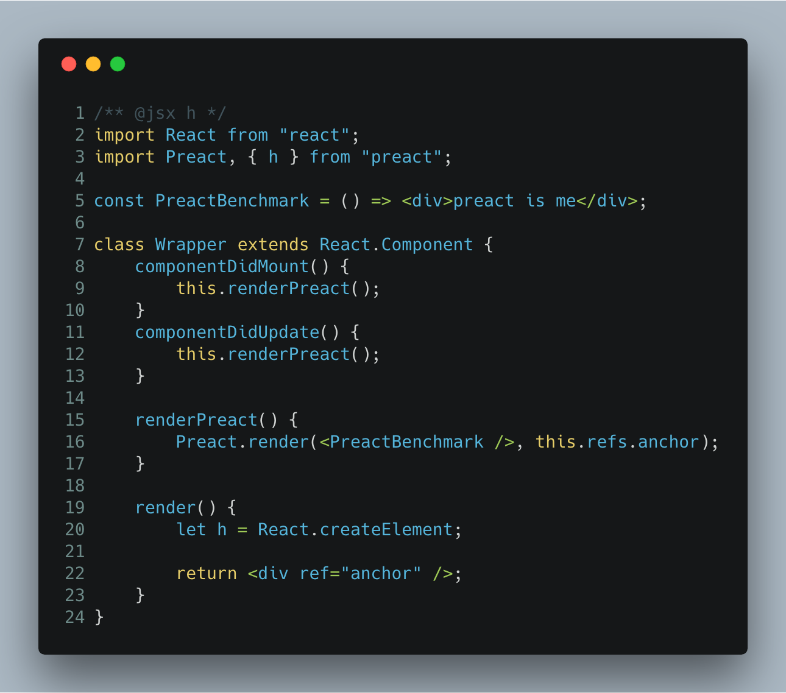
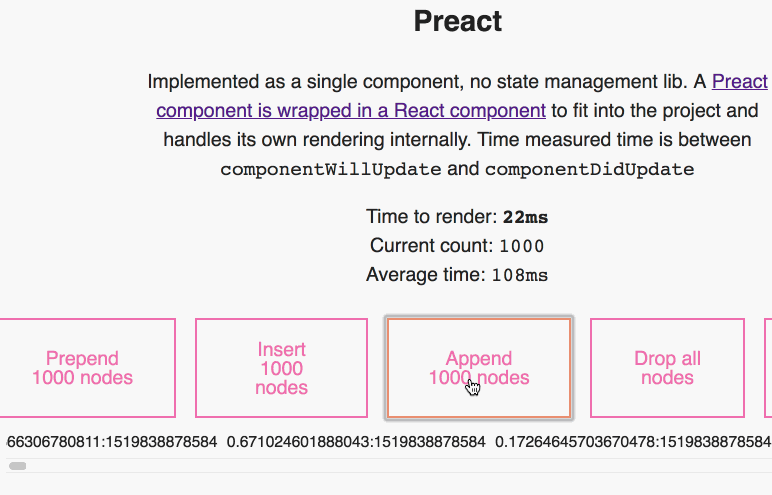

https&#x3A;//www.youtube.com/watch?v=sdxz_1A8zFk


Have you ever wanted to render a [Preact](https://preactjs.com/) component inside a React project?


It's hard, right? First of all, why? [Because](https://swizec.com/blog/building-interactive-dom-benchmark-preliminary-results/swizec/8219). Second of all, how do you reconcile the two different implementations of JSX?


Preact and React are [pretty similar](https://github.com/developit/preact/wiki/Differences-to-React), you see. Both are based on components, both leverage JSX to make your life easier, and for the most part, they look interchangeable.


```
// React component
\import React from 'react';
const Header => 
I am a header
```


```
// Preact component
\import Preact from 'preact';
const Header => 
I am a header
```


Where they differ greatly is what that `<h1>I am a header</h1>` compiles to. For React, it's a `createElement()` call. For Preact ,it's a `h()` call.


And that's where the trouble begins.


## Reconciling createElement() and h()


I got this idea from Jason himself.


> Set your pragma to \`h\` and conditionally assign h within the scope you want:  
>   
> /\*\* [@jsx](https://twitter.com/jsx?ref_src=twsrc%5Etfw) h \*/  
> \\import React from 'react'  
> \\import { h } from 'preact'  
>   
> const WithReact = () => {  
> let h = React.createElement;  
> return &lt;div>react&lt;/div>  
> }  
>   
> const WithPreact = () => (  
> &lt;div>preact&lt;/div>  
> )
>
> — Jason Miller 🦊⚛ (@\_developit) [February 26, 2018](https://twitter.com/_developit/status/968143181694033921?ref_src=twsrc%5Etfw)


Here's how it looks in code 👇





There are 4 parts to this:


1. Tell Babel to use `h` for the JSX function. That's the `/** @jsx h */` magic comment at the top.
2. Import both React and Preact. You'll need both.
3. Make a Preact component. Or take one from somewhere else. It doesn't matter. Whatever you want :)
4. Create a `<Wrapper />` React component


That `<Wrapper />` component is where the magic happens.


The `render()` method sets `h` to `React.createElement` and outputs an anchor div. Setting `h` ensures that this part of JSX compiles into React's `createElement` calls. This makes the component integrate seamlessly with the rest of your project.


Then we hook into the component lifecycle with `componentDidMount` and `componentDidUpdate`. We call `renderPreact` in both of them to ensure our wrapper component always ends up rendering Preact.


Same as my [React D3 blackbox](https://swizec.com/blog/translate-random-d3-example-react/swizec/7765) approach for quickly wrapping D3 code in React components.


In `renderPreact`, we then use Preact's `render()` function to render the Preact component into our anchor div. This works the same way as Preact's normal DOM rendering where you call `render(<App />, document.getElementById('root'))` to put your app into a root div.


The JSX compiles into Preact's `h()` calls because we didn't mess with the setting, and React refs give us a direct reference to the anchor DOM node.


👌


## The benchmark


You can now compare React and Preact side-by-side in my [interactive DOM benchmark](https://dom-benchmark.now.sh/). I think it's a fair comparison because Preact handles its own internals.





Numbers are kinda high though. Preact is supposed to be faster than React because it's closer to the metal. I wonder if it's running in dev mode 🤔