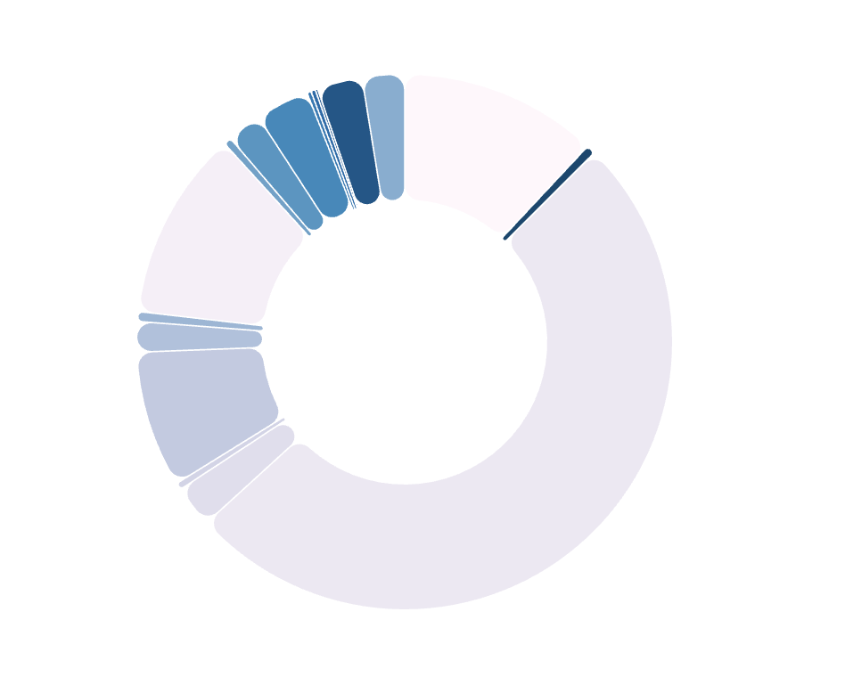
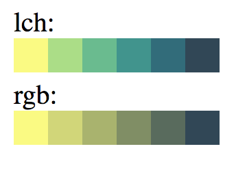
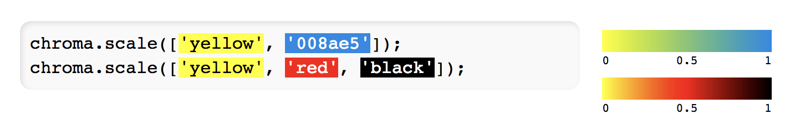
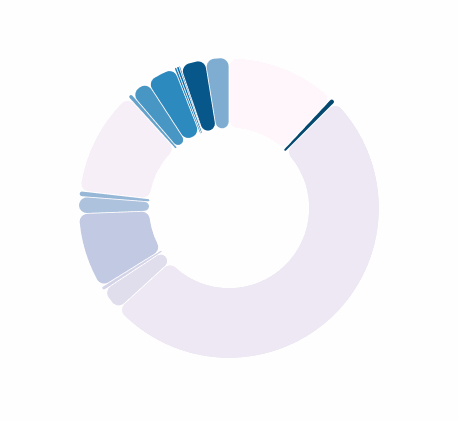

 I once asked [Shirley Wu](https://twitter.com/sxywu) how she makes all her dataviz so pretty: Baskerville font and [chroma-js](https://github.com/gka/chroma.js). https&#x3A;//twitter.com/Swizec/status/969128459011162112 Chroma is a JavaScript library for dealing with colors. Read them, change them, make some delightful scales. It has changed the way I work. I'm still new to the library, so I don't know everything. Here are some useful things I've found. You can see them in action in [this unfinished piechart](https://build-bwwgxbfasv.now.sh/) showing how I spend money on transport. More on that next week.

## Delightful color scales

Chroma color scales are designed to be delightful. You define two colors, and chroma-js finds the most pleasant path between them. \[codepen_embed height="400" theme_id="0" slug_hash="XZGvYe" default_tab="js,result" user="swizec"]See the Pen [Chroma basic scale](https://codepen.io/swizec/pen/XZGvYe/) by Swizec Teller ([@swizec](https://codepen.io/swizec)) on [CodePen](https://codepen.io).\[/codepen_embed] The quickest way to get some pretty colors going is to define an ordinal scale like this. Choose start and end points, say you want 6 colors, and pick the `lch` mode. I'm not sure what `lch` mode means, but it creates nicer colors than the default `rgb` mode. They come out brighter.  You can create continuous scales as well. Add multiple points of reference etc. Great for encoding data with color. 

## Prettier hover effects

 Chroma also helps you create prettier hover effects. Color effects in general, really. You often see in web and dataviz design that people use opacity changes to create hover effects. You mouse over something and it becomes a little transparent so the white background shines through. This works, but looks bland. It lightens the color. What you want instead is to make the color look brighter. Chroma to the rescue with its color manipulation utilities.

    chroma(color).brighten(2)

You can also `saturate`, `desaturate`, and `darken`. All useful effects if you find an excuse to use them. All better than just changing opacities.

## Color brewer

If you're color challenged like me, then you can't go wrong with the [color brewer utilities](http://colorbrewer2.org/#type=sequential&scheme=BuGn&n=3). A set of predefined colors that look great together. That piechart above is made with the `PuBu` schema. `chroma.scale("PuBu")`. No need to worry too much, just go to [color brewer](http://colorbrewer2.org/#type=sequential&scheme=BuGn&n=3), find a scheme you like, and tell Chroma to use it. Happy coloring 🙏🏻
