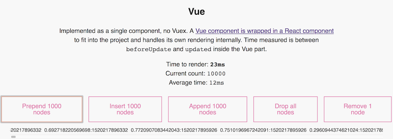

_This is a Livecoding Recap – an almost-weekly post about interesting things discovered while livecoding. Usually shorter than 500 words. Often with pictures. Livecoding happens almost **every Sunday at 2pm PDT** on multiple channels. You should subscribe to [My Youtube](https://www.youtube.com/user/TheSwizec) channel to catch me live._ https&#x3A;//www.youtube.com/watch?v=Ff5NiCzP0ek _This article builds on my previous articles about [Building an interactive DOM benchmark](https://swizec.com/blog/building-interactive-dom-benchmark-preliminary-results/swizec/8219) and [Adding Preact to a React project](https://swizec.com/blog/seamlessly-render-preact-component-react-project/swizec/8224)_ I understand why people like Vue, and those people are wrong. But this isn't a rant about Vue. If you like the ease of porting your 2012-era code to a modern framework, Vue is for you. If you're into Mustache templates, Angular directives, and love to split your code into templates, scripts, and styles just like ye olden times, Vue is perfect. Hell, if you love nothing more than to use cumbersome workarounds to avoid JavaScript classes 👉 Vue. You do you. I built a Vue component and hated every minute of it. But it's important to try new things. It took about 2 hours to add Vue to my [interactive DOM benchmark](https://dom-benchmark.now.sh/). Half the time I spent bitching about the Angular 1 style templates. The other half, I complained about 2012-era hacks designed to fake classes. Oh, and it took an hour just to get it compiling. https&#x3A;//twitter.com/Swizec/status/970435615450849280 A wonderful experience all over 👌 **BUT!** I created my first non-trivial Vue component, a simple benchmark 🎉

## My first Vue component

\[caption id="attachment_8239" align="alignnone" width="800"] The Vue benchmark component\[/caption] You can see the [code on GitHub](https://github.com/Swizec/dom-benchmark/blob/master/src/benchmarks/VueBenchmark.vue). There are 5 buttons and a scratchpad area that renders a list of immutable nodes. Much like a chatroom or a newsfeed. Buttons can `prepend`, `insert`, `append`, `drop`, and `remove` nodes. Clicks map to methods on the Vue component that manipulate a `nodes` array in data. The template renders it as a bunch of divs.

```

    

        {{ k }}
    
```

That `v-for="k in nodes"` syntax is one of my least favorite parts of Vue. Brings back memories of some Angular 1 projects I worked on. Nightmares lasted months[1](#fn1). Click events call instance methods via `v-on:click="func"`. They manipulate the `nodes` array and that triggers a re-render. These methods look a lot like to their React counterparts, but cleaner because there's no `setState` in Vue. I liked that 🤫

    prepend() {
        this.nodes = [...this.newNodes(), ...this.nodes];
    },

    append() {
        this.nodes = [...this.nodes, ...this.newNodes()];
    },

I think that looks more readable and makes more sense than going through `setState` in React. _However_, you have to define instance attributes in a `data:` key and instance methods in a `methods:` key. But you override Vue's internal instance methods in the normal namespace. 🤨

    module.exports = {
        // adding attributes here does nothing
     
        data: function () {
            // this is where you define state
            return {
                nodes: [],
                start: null,
                times: [],
                // ...
            }
        },
     
        // override Vue instance methods here
     
        methods: {
            // define custom instance methods here
        }
    }

Wat 🤨 That's kind of how we used to write code in the old days before JavaScript got better. Did I fall into a time machine? I've heard you can install plugins and tweak configs to get a better approach going, but if it's not the default in the official docs, it doesn't exist. Ask anyone. Some people like this, so here we are. It was a fun experiment, I don't like it at all. ¯\\\_(ツ)\_/¯ **Oh btw** we render benchmark results using Vue refs and direct DOM manipulation so as to avoid re-rendering via Vue after each render. That would be unfair.

## Adding Vue to a nwb-cli based project

Getting Vue to compile at all was fun, too. I started the project using [nwb-cli](https://github.com/insin/nwb), which is not The Official Way™. You're supposed to use `vue-cli`, but I didn't want to start a new project. Some finagling with `vue-loader` was necessary. Two steps 👇

1.  install some stuff
2.  tweak `nwb.config.js`.

### Install some stuff

    yarn add vue vue-loader vue-template-compiler

You need both `vue-loader` and `vue-template-compiler` because vue-loader actually installs `vue-template-es2015-compiler` then complains that it can't find `vue-template-compiler`. This is confusing. I installed [vuera](https://github.com/akxcv/vuera) as well. It gives you a wrapper component so you can render Vue inside your React project. [Vue is kept internally autonomous](https://github.com/akxcv/vuera/blob/master/src/wrappers/Vue.js%60) so it shouldn't affect the benchmark, but it makes it easier to put all benchmarks in the same project.

    // VueBenchmarkWrapper.js

    import React from "react";
    import { VueWrapper } from "vuera";
    import VueBenchmark from "./VueBenchmark.vue";

    export default () => ;

### Tweak nwb.config.js

After installing Vue, you have to tell Webpack how to use it. That goes in `nwb.config.js`.

    // nwb.config.js
    module.exports = {
        type: "react-app",
        webpack: {
            extra: {
                module: {
                    rules: [{ 
                        test: /\.vue$/, 
                        loader: "vue-loader" 
                    }]
                }
            }
        }
    };

You add a rule that tells Webpack to use `vue-loader` for files ending with `.vue`. Same as a normal Webpack config file, just wrapped in `extra:` so `nwb` knows what to do. This is where `nwb` shines over `create-react-app`. Extra config without eject.

## Next step for the DOM benchmark

What I want to do next is going to blow your mind. Maybe. Remember my [blockchain-redux](https://swizec.com/blog/blockchain-redux-experiment-part-2/swizec/8055) experiment from December? I want to use it to make [this DOM benchmark](https://dom-benchmark.now.sh/) collaborative. Every time you click a button, it adds to the benchmark blockchain, distributes it to everyone, updates graphs on everyone's page. We're going to see how these benchmarks behave in the real world on real people's computers. That's gonna be fun 🤘 

1.  This is a dramatization. There were only cold sweats every time I opened the editor to get started. [↩](#ffn1)
