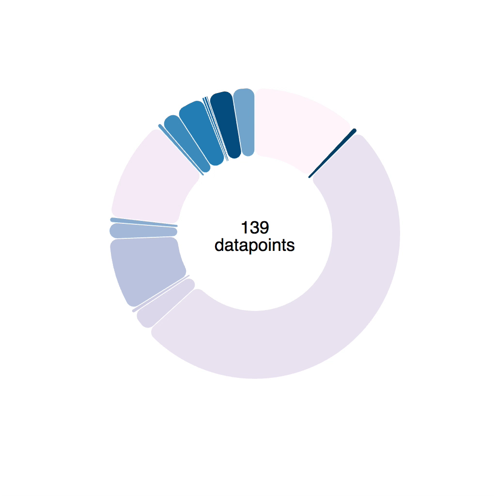
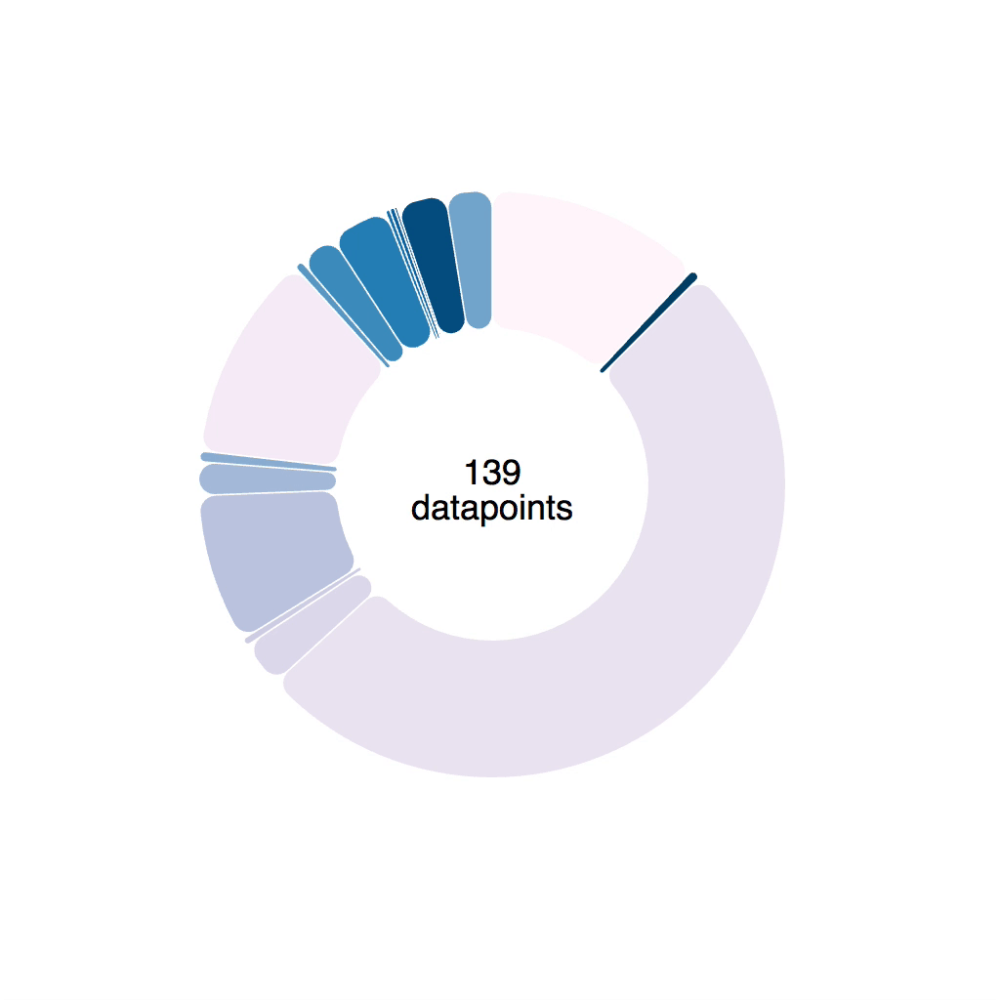

\[caption id="attachment_8254" align="alignnone" width="1024"] A pie streaming in some data\[/caption] Today, I finally figured out how to build smooth D3 arc transitions. 🎉 Got some help from Bostock's [commented arc tween](http://bl.ocks.org/mbostock/5100636) block and Andy Shora's guide on [tweening custom shapes and paths in D3.js](http://andyshora.com/tweening-shapes-paths-d3-js.html).

> The single most important requirement to perform interpolation in D3.js is that the structure of A must match the structure of B. ~ Andy Shora

That quote made it click. D'oh! So obvious.

## Why arc transitions are hard

You see, the problem with arc transitions is that their path definition has a funny shape. It looks like this:

    M100.6434055594246,-99.8203632756589A8,8,0,0,1,112.2823856114007,-99.46188154973098A150,150,0,0,1,-104.56274177607584,107.54828233063364A8,8,0,0,1,-104.38099615277264,95.90520136696549L-64.39381262786019,59.38549403963366A8,8,0,0,1,-53.635344263429694,59.35696964757701A80,80,0,0,0,61.78081312913049,-50.82451307295977A8,8,0,0,1,62.30830828934212,-61.57007978883599Z

If that doesn't make sense, don't worry. I can't read it either. Maybe [Sarah Drasner](https://twitter.com/sarah_edo) can, she's an SVG goddess 🤔 PS: she can 👇 https&#x3A;//twitter.com/sarah_edo/status/971840965488119809 When you build a transition, you're trying to smoothly move from A to B. To get from `0` to `1`, you go through `0.1`, `0.2` and so on. But a path definition is more complex. You're dealing with a bunch of numbers that have to move just right. Change them all together, and funny things may happen like arcs flying around the screen. Or an error. 😬 \[caption id="attachment_8256" align="alignnone" width="1024"] Naively implemented transition. Notice the arcs change shape sometimes\[/caption] 

## Tweens to the rescue

Luckily, D3 lets us define custom transitions called tweens. To smoothly animate a piechart, we're going to build an `arcTween`. Because piecharts are made of arcs. The idea is to move from blindly transitioning path definitions to transitioning angles on a pie slice. We're building a tween generator that takes some params and returns a tweening function. Tweening functions are what makes transitions work, by the way. They take an argument, `t`, and return the value of your prop at that specific "time" of your transition.  Our tween generator is going to need:

1.  `oldData`, the definition of our pie slice at the start of our transition
2.  `newData`, the definition of our pie slice that we want to tween towards
3.  `arc`, a [D3 arc generator](https://github.com/d3/d3-shape/blob/master/README.md#arcs)

Both `oldData` and `newData` come from a [D3 pie generator](https://github.com/d3/d3-shape/blob/master/README.md#pies). Their `startAngle` and `endAngle` is what we're interested in. Our `arcTween` function uses these to build a tween method that we then feed into `attrTween`.

    // inspired from http://bl.ocks.org/mbostock/5100636
    function arcTween(oldData, newData, arc) {
        const copy = { ...oldData };
        return function() {
            const interpolateStartAngle = d3.interpolate(
                    oldData.startAngle,
                    newData.startAngle
                ),
                interpolateEndAngle = d3.interpolate(
                    oldData.endAngle,
                    newData.endAngle
                );

            return function(t) {
                copy.startAngle = interpolateStartAngle(t);
                copy.endAngle = interpolateEndAngle(t);
                return arc(copy);
            };
        };
    }

We make a `copy` of `oldData` so we don't change input data by accident, then we return a function. This function creates two interpolators with `d3.interpolate`. Each interpolator starts from an `oldData` angle and moves towards a `newData` angle. One for start, one for end. This function then returns our actual interpolation function. It takes the argument `t`, feeds it into our two interpolators, adjusts values on the `copy` object, feeds that into the `arc` generator, and returns a new path definition.  You use it like this 👇

    // Piechart.js
    d3
        .select(this.refs.elem)
        .transition()
        .duration(80)
        .attrTween("d", arcTween(this.state.d, newProps.d, this.arc))
        .on("end", () =>
            this.setState({
                d: newProps.d,
                pathD: this.arc(newProps.d)
            })
        );

Select an element, a `<path>`, start a transition, make it last `80` milliseconds, `attrTween` the path definition, `d`, attribute using the tween returned from `arcTween`. Better? 🤪 Let's put it to use in a piechart. We're using [React and D3](https://swizec.com/reactd3js) because React makes dataviz code easier to understand. We build our piechart from 2 components:

1.  Piechart – takes data, feeds into a `d3.pie()` generator, renders a bunch of arcs in a loop
2.  Arc - takes data for an arc, feeds it into a `d3.arc()` generator, renders a `<path>` element, handles transitions

You can see the [full code on GitHub](https://github.com/Swizec/react-d3-pie)

## 

The Piechart component itself is pretty simple. Takes some data, renders some arcs.

    // Piechart.js
    class Piechart extends Component {
        pie = d3
            .pie()
            .value(d => d.amount)
            .sortValues(d => d.tag)
            .padAngle(0.005);

        render() {
            const { data, groupBy, x, y, color } = this.props;

            const _data = groupByFunc(data, groupBy);

            return (
                
                    {this.pie(_data).map((d, i) => (
                        
                    ))}
                    
                        {data.length}
                    
                    
                        datapoints
                    
                
            );
        }
    }

We define a pie generator with a value accessor `d => d.amount` that sorts arcs by `d.tag`, and adds a padding of `0.005` between arcs. To learn more about how padding works, check out this wonderful [pie padding animation](https://bl.ocks.org/mbostock/3e961b4c97a1b543fff2) by Mike Bostock. The `render` method groups `data` by a given `groupBy` function, in our case by tag, then outputs a grouping element `<g>` inside it.

1.  Loops through the output of `this.pie(_data)` and renders an `<Arc>` for each value
2.  Creates two `<text>` nodes for the center of our piechart

How data makes it into `<Piechart>` is outside the scope of this tutorial. You can assume data comes as an array that changes every couple milliseconds. This triggers a re-render, which propagates into our `<Arc>` components. You can read that code on GitHub in [the App component](https://github.com/Swizec/react-d3-pie/blob/master/src/App.js).

## 

Our `<Piechart>` gets updated data every few milliseconds and re-renders. This change propagates into `<Arc>` components via props. That means `<Arc>` has to handle transitions. Pushing transitions into the `<Arc>` component means we can preserve React's ideal of declarative rendering. Piechart just renders Arcs and gives them info. Arcs handle everything about rendering pie arcs. Even transitions. The general approach comes from my [React+D3v4 book](https://swizec.com/reactd3js):

1.  Move props into state
2.  Use state to render
3.  Transition raw attributes with D3
4.  Update state when transition ends

The outline for our `<Arc>` component looks like this 👇

    // Piechart.js

    class Arc extends Component {
        arc = d3
            .arc()
            .innerRadius(80)
            .outerRadius(150)
            .cornerRadius(8);

        constructor(props) {
            super(props);

            this.state = {
                color: props.color,
                origCol: props.color,
                d: props.d,
                pathD: this.arc(props.d)
            };
        }

        componentWillReceiveProps(newProps) {
            // transition, state update
        }

        // hover/unhover color changes via this.setState

        render() {
            const { color, pathD } = this.state;

            return (
                
            );
        }
    }

Start with an `arc` generator that takes data and returns path definitions. Ours has an innerRadius of `80`, an outerRadius of `150`, and rounded corners. In the `constructor`, we copy important props to `this.state`. A good choice are props that we later intend to change. Color on hover/unhover, and `d` and `pathD` on input data changes. `pathD` is the part we're going to transition. It's the output of calling `this.arc` on `this.state.d`. `componentWillReceiveProps` is where that transition is going to happen. `render` doesn't do much. It outputs a `<path>` element with a ref of `elem`. It also defines mouse event handlers.

## Adding a D3 transition to a React component

Now that `<Arc>` is rendering from state, we can use D3 transitions to make updates smoother. That happens inside `componentWillReceiveProps`. Our goal is to take the new props, use D3 to transition appropriate attributes on the base DOM node, then update state with the new values to ensure React's engine knows what's going on.

    // Piechart.js in 

        componentWillReceiveProps(newProps) {
            this.setState({
                color: newProps.color
            });

            d3
                .select(this.refs.elem)
                .transition()
                .duration(80)
                .attrTween("d", arcTween(this.state.d, newProps.d, this.arc))
                .on("end", () =>
                    this.setState({
                        d: newProps.d,
                        pathD: this.arc(newProps.d)
                    })
                );
        }

We update color state right away. This triggers a render, eventually. Then we start an 80 millisecond transition that uses the `arcTween` generator we built earlier. When the transition ends, we update React state with the new values for `d` and `pathD`. This triggers another render. That might sound like a lot of renders, but it works okay. Don't worry about wasting resources, you're re-rendering a single `<path>` element. [The DOM is pretty fast](https://swizec.com/blog/building-interactive-dom-benchmark-preliminary-results/swizec/8219) ☺️ \[caption id="attachment_8257" align="alignnone" width="1024"] Our pie looks nice and smooth.\[/caption]

## Recap

You learned how to build a silky animated smooth piechart with React and D3! Yay! \\o/ In a nutshell 👇

-   Use custom tweens to transition complex shapes
-   Render from state
-   Always update state after transitions end

🤘 Party hard 🤘 To learn more about using React and D3 to write declarative data visualization code, read my book [React+D3v4](https://swizec.com/reactd3js). I'm probably adding this as a new chapter.
