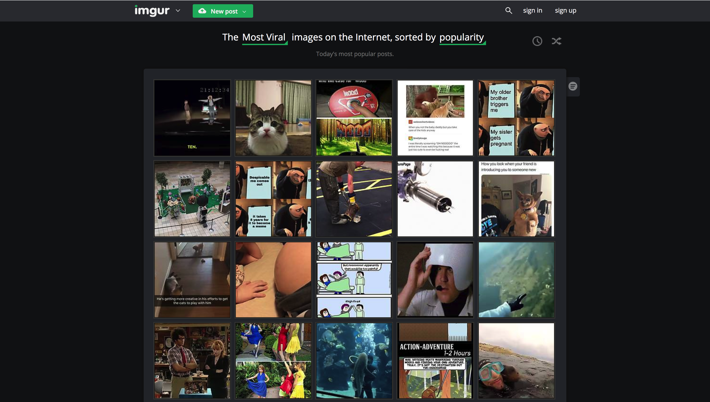
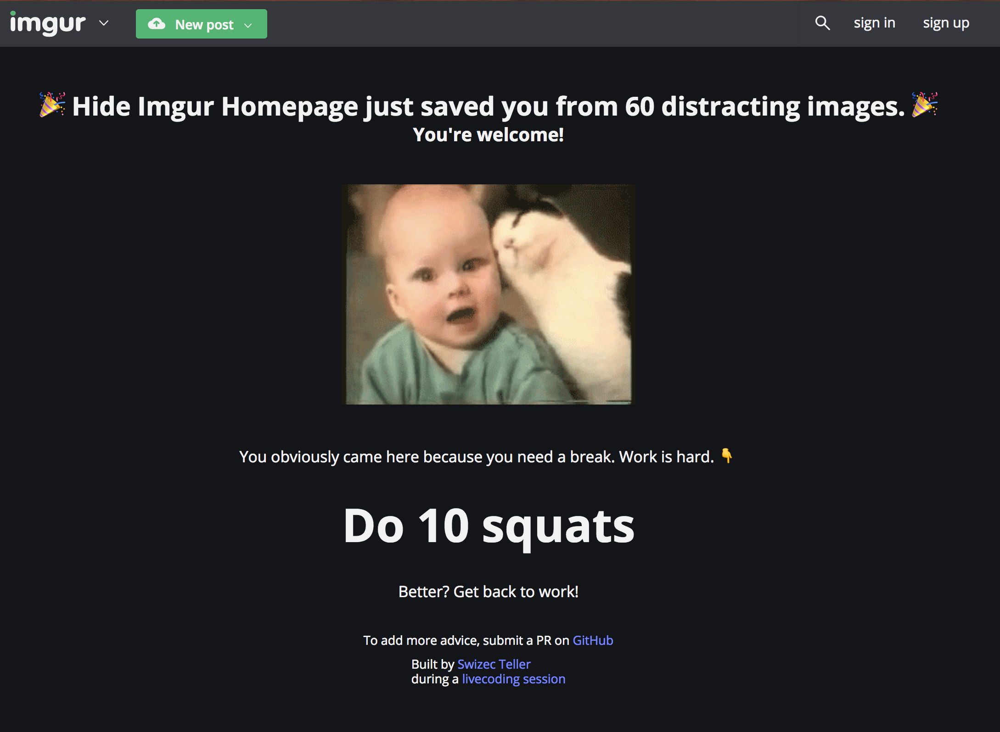
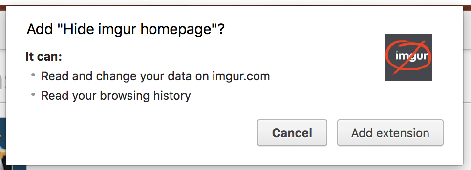
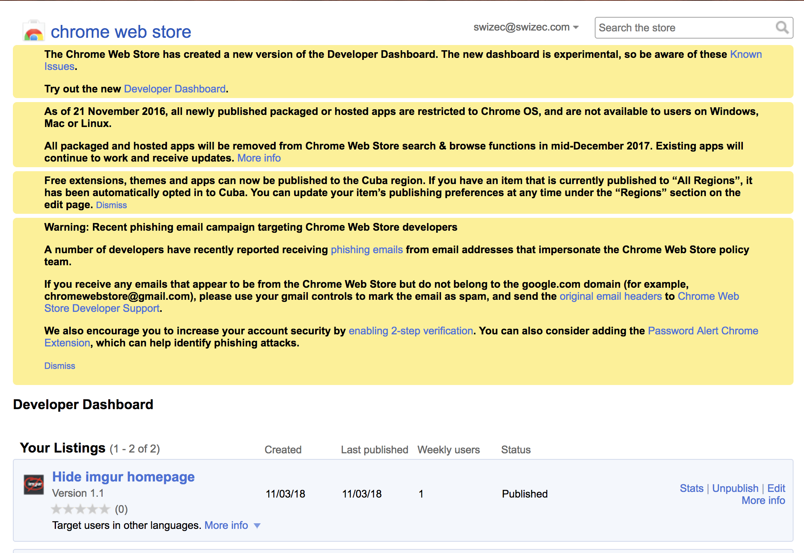
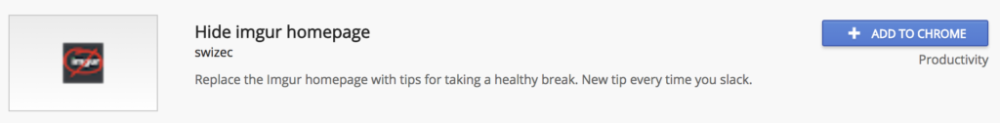

_This is a Livecoding Recap – an almost-weekly post about interesting things discovered while livecoding. Usually shorter than 500 words. Often with pictures. Livecoding happens almost **every Sunday at 2pm PDT** on multiple channels. You should subscribe to [My Youtube](https://www.youtube.com/TheSwizec) channel to catch me live._ https&#x3A;//www.youtube.com/watch?v=I7ibjBQtcQE One of my most pointless timesucks is [imgur.com](https://imgur.com). Maybe you don't know what that is, or think it's an image host for Reddit and never realized it's got a homepage. [Imgur is bigger than Reddit](https://www.buzzfeed.com/jwherrman/imgur-is-now-bigger-than-reddit), actually. That's news from 5 years ago. 🤔 Am I not hip with the kids anymore?  Either way, Imgur is great. Full of fun images, crap comments, and there's always the next gif to see. Sometimes world news. You open it up, it greets you with enticing thumbnails and before you know it, it's 20 minutes later and you're waaaaay past your break time.  I built [hideimgur.com](#) to fix that. It’s a Chrome extension that replaces Imgur's homepage with tips for taking a healthy break. Sometimes it tells you to do push ups, sometimes to go chat with a human being. It's great. And no more imgur addiction. Fixed me in 2 days! 👌 [\[caption id="attachment_8274" align="alignnone" width="2178"\] HideImgur replaces the homepage with useful tips\[/caption\]](http://hideimgur.com) You can see [the code on GitHub](https://github.com/Swizec/hide-imgur-homepage) and watch the [livecoding video 👆](#) to see how it's built. Here's the process for building and launching your Chrome extension in a nutshell. 👇

## Create an extension

[Google's official getting started tutorial](https://developer.chrome.com/extensions/getstarted) is great. You should skim it whenever you get stuck. First, you'll need to create a directory and a `manifest.json` file.

    {
        "manifest_version": 2,
        "name": "Hide imgur homepage",
        "version": "1.1",
        "description":
            "Replace the Imgur homepage with tips for taking a healthy break. New tip every time you slack.",
        "icons": {
            "16": "icon16.png",
            "48": "icon48.png",
            "128": "icon128.png"
        },
        "content_scripts": [
            {
                "matches": ["*://imgur.com/*"],
                "js": ["hide-imgur.js"],
                "css": ["hide-imgur.css"],
                "run_at": "document_start"
            }
        ],
        "permissions": ["tabs", "*://imgur.com/*"]
    }

It's a JSON config file that tells Chrome how your extension is supposed to work. The important parts are 👇

1.  `manifest_version`, `name`, and `version` are all required. You need those for your extension to work at all.
2.  `description` is useful but not crazy important. I'm not even sure where it shows up for the user.
3.  You need 3 `icons` for various places Chrome puts them. You should make a simple image and resize it to 16x16, 48x48, and 128x128 pixels.

You've created a Chrome extension! Congratz 🖐 Not very useful yet. I wanted mine to get permissions for `imgur.com` and run `content_scripts` when you open that page. That's defined in `content_scripts` and `permissions`. The first tells Chrome which files to load when the URL matches `imgur.com` and when it should run. `document_start` lets you run scripts _before_ the page is loaded. Avoids a lot of content flicker. `permissions` aspecifies which permsissinos you want to ask for. The fewer you ask for the more your users will like you. Nobody likes to see that "X asks for permission to access all your sites" notifications. Are you a keylogger? PS: You could totally build a keylogger like this. Please don't. \[caption id="attachment_8275" align="alignnone" width="964"] Hideimgur.com asks for permissions to imgur\[/caption]

## Write some JavaScript

You can [do a lot of things with Chrome extensions](https://developer.chrome.com/extensions/devguide). Everything from changing the default new tab to adding window dialogs. For Imgur hiding, we need a content script. It’s the simplest Chrome extension to build, I think. A JavaScript file that runs in the context of a page. The fun part is avoiding frameworks. The [DOM is fast these days](https://swizec.com/blog/building-interactive-dom-benchmark-preliminary-results/swizec/8219) and pretty easy to use. Here's a function that hides an element on the page whether it's loaded yet or not. Remember, we're running _before_ the DOM is done loading.

    // hide-imgur.js
    function hideElement(query) {
        let el = document.querySelector(query);
        if (el) {
            el.style.visibility = "hidden";
            return true;
        } else {
            return false;
        }
    }

    function hideAsync(query) {
        const hidden = hideElement(query);

        if (!hidden) {
            setTimeout(function() {
                hideAsync(query);
            }, 100);
        } else {
            putUpSomeContent();
        }
    }

In `hideElement`, we look for a DOM node. If it's found, we set its `visibility` to `hidden` and return `true`. Otherwise, we say nothing happened. It's important to toggle visibility instead of the usual `display: none` because it avoids removing the node, just hides it. We want to avoid removing the node because if we collapse the page to zero height, Imgur's infinite scroll falls into an infinite loop and eats all our CPU. That was fun to discover 😅 `hideAsync` is a wrapper on top of `hideElement` that waits until nodes are rendered before hiding them. Takes a query, calls `hideElement`, if nothing happens it waits `100` milliseconds then tries again. If hiding worked, it runs the function that puts healthy tips on the page. Finally, we loop through all distracting elements of Imgur and hide them in a loop 👇

    // hide-imgur.js

    // Go through dangerouns elements and hide them
    [
        "#imagelist",
        "#top-comments",
        ".sentence-sorting",
        "#right-content",
        "#extended-imagelist",
        ".next-prev"
    ].forEach(hideAsync);

You can find those elements with the Elements tab of your Chrome dev tools. The key is to find the topmost node that wraps all the content, but doesn't wrap too much of the content. Bit of an art. And it's gonna break when Imgur redesigns. The definition of fragile code 😛 

## Launch

Launching your extension takes you to one of the worst designed websites I have ever seen: The [Chrome Web Store Developers Dashboard](https://chrome.google.com/webstore/developer/dashboard?pli=1&authuser=1)  [Detailed instructions in Google's devguide](https://developer.chrome.com/webstore/publish) You pay a $5 fee the first time you publish, upload a zip file of your directory, add some descriptions and screenshots, and you're off to the races. Next time you search Chrome extensions, your baby will be there.  🤘 PS: It helps to make a nice landing page before you post to ProductHunt and places like that. I used [carrd.co](https://carrd.co) to do that.
