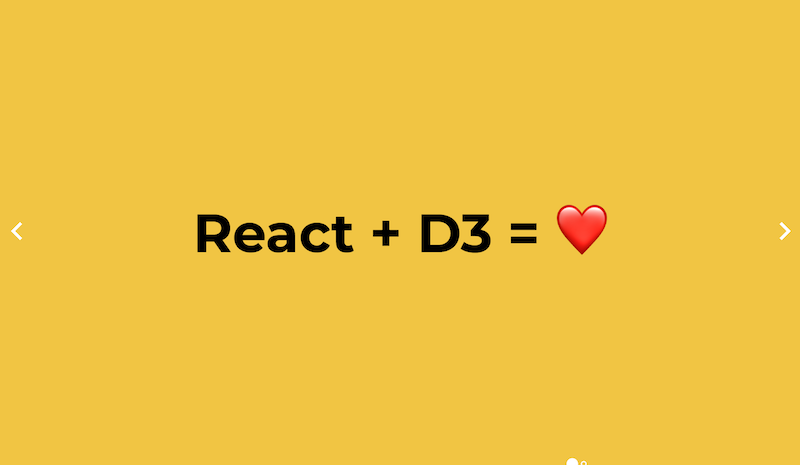

Reactathon 2018 was a hoot. Met a bunch of great people, saw some great talks, gave a 7 hour workshop, and a 20 minute talk. Both on [React + D3](https://swizec.com/reactd3js).

🤘

I'm missing Day 2 of the advanced conf and 2 days of the hackathon because gotta get back to work. Don't think I could make it anyway. It's been an intense week and a half.

Turns out it's not a good idea to be bad at calendars. 😅

**BUT** I prepped a workshop in a week of nights and mornings, made a great talk in four hours the night before, and nobody even noticed. Someone even said they _"Loved how well prepared you were"_ for the workshop.

And my talk was described as _"Very charismatic"_ and _"Went great"_

Rock on

You can see my slides here 👉 <https://react-d3-reactathon.now.sh/> but they're better with jokes. Reactathon is publishing professional video some time soon. I'm not sure when.

This is the most \\important slide. It comes last 👇

React+D3 = ❤️

Reactathon itself was great too. Talked to the founder of [Netlify](http://netlify.com/), the founder of [Gatsby](http://gatsbyjs.org), the founder of [GraphCool](https://www.graph.cool/), the team of [Hasura](https://hasura.io/), and some folks at [Flexport](https://www.flexport.com/). They had a cool dataviz at their table. Yes I talked to not-founders too, but I can't remember all the companies they worked for.

I did chat to a team from Tile. Asked for a way to contact the person who finds my lost keys. They nodded politely, said it was an interesting idea, and thought I was an idiot.

> Ok I’m sold, I need to get on the GraphQL train [#reactathon](https://twitter.com/hashtag/reactathon?src=hash&ref_src=twsrc%5Etfw) [pic.twitter.com/5p4SBlpe1H](https://t.co/5p4SBlpe1H)
>
> — Swizec (@Swizec) [March 21, 2018](https://twitter.com/Swizec/status/976561136383410176?ref_src=twsrc%5Etfw)

GraphQL definitely looks like the future. Either using GraphCool, or their new thing Prisma, or Hasura, or something completely different. I have got to get on the GraphQL train. Startups are building tools that make it easy to adopt, no need to write backend code anymore. Which is exactly what I don't want to do 👌

I also enjoyed Kyle Matthews' point that React sites should be deployed as static by default. Gatsby isn't so much a framework as it is a compile step in your toolchain and that makes so much sense. Never thought of it that way before.

> I didn’t get any cool slide pics but I liked this insight:  
>   
> 1. Measure  
> 2. Fix low hanging fruit  
> 3. Verify  
> 4. Find next fruit  
>   
> Or if you’re a normal person, let [@kylemathews](https://twitter.com/kylemathews?ref_src=twsrc%5Etfw) and his Gatsby team do all that and focus on your fun problems. [#reactathon](https://twitter.com/hashtag/reactathon?src=hash&ref_src=twsrc%5Etfw)
>
> — Swizec (@Swizec) [March 21, 2018](https://twitter.com/Swizec/status/976601418839744513?ref_src=twsrc%5Etfw)

Besides, why would you want to deal with performance optimization, if there's a whole team of people dedicated to making your site faster for you?

Oh and WebAssembly. Smells like the future, wags its pointy little finger at the future, still doesn't seem to quite be here for us to use quite just yet. Looks exciting tho. JavaScript compiled down to byte code running directly on the browser VM without parsing? Yes!

> WebAssembly - byte code for the web, the cool new thing by [@\_jayphelps](https://twitter.com/_jayphelps?ref_src=twsrc%5Etfw)  
>   
> Solves the problem of parse times being slower than network times 😱[#reactathon](https://twitter.com/hashtag/reactathon?src=hash&ref_src=twsrc%5Etfw) [pic.twitter.com/KeOpLXSUqh](https://t.co/KeOpLXSUqh)
>
> — Swizec (@Swizec) [March 21, 2018](https://twitter.com/Swizec/status/976517985702563840?ref_src=twsrc%5Etfw)

There was also a great talk by Erica Cooksey about sharing code between React Native and real native. It went way over my head, but I love it when first time speakers present and completely crush it.

> Learning all about talking between native code and react native code from [@ericacooksey](https://twitter.com/EricaCooksey?ref_src=twsrc%5Etfw) [#reactathon](https://twitter.com/hashtag/reactathon?src=hash&ref_src=twsrc%5Etfw) [pic.twitter.com/QfAsU9q2Bw](https://t.co/QfAsU9q2Bw)
>
> — Swizec (@Swizec) [March 21, 2018](https://twitter.com/Swizec/status/976553676507512832?ref_src=twsrc%5Etfw)

And I love that Reactathon had first time speakers despite being a big conference. Fresh faces are \\important. Nobody wants to keep seeing the same 10 people present at every conference.

Wish I went to the blockchain talk. Chatted with the dude giving it, talked him out of livecoding too much, and he seemed like an interesting dude and the blockchain stuff sounded cool, but I was chatting with Hasura about wrapping PostgreSQL in GraphQL instead.

Heh.

Solid 7/7 conference, would stress about presenting at again

[Comment at me on twitter 🤙](https://twitter.com/swizec)