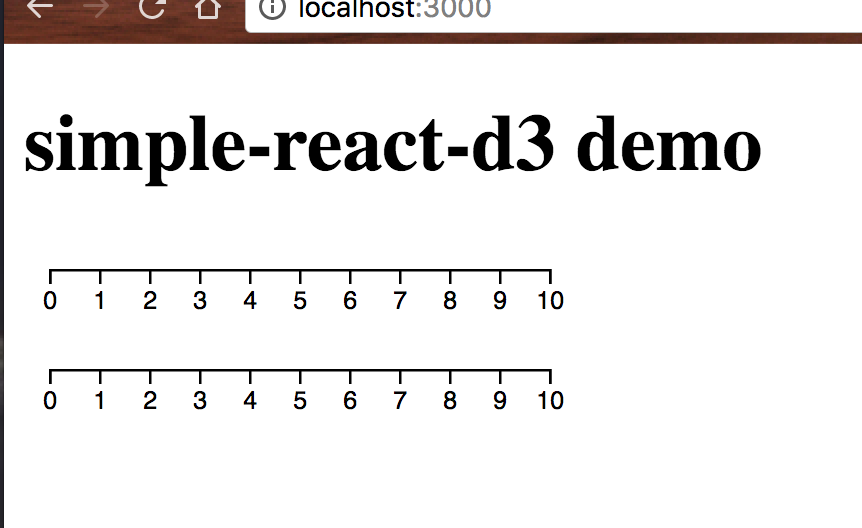
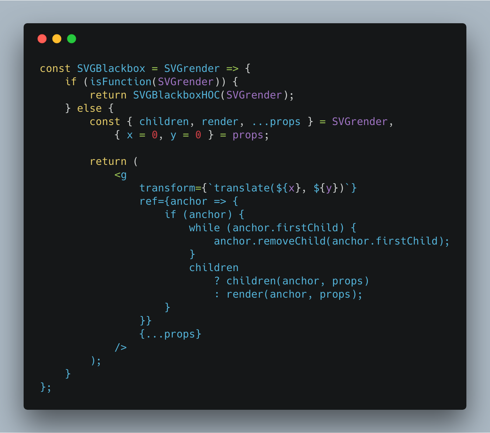

_This is a Livecoding Recap – an almost-weekly post about interesting things discovered while livecoding. Usually shorter than 500 words. Often with pictures. Livecoding happens almost **every Sunday at 2pm PDT** on multiple channels. You should subscribe to [my YouTube channel](https://www.youtube.com/user/TheSwizec) to catch me live._ https&#x3A;//www.youtube.com/watch?v=OnLho6re1aI I'm working on a React & D3 library that I've been thinking about for two years. My goal is to build [simple-react-d3](https://github.com/Swizec/simple-react-d3), a React and D3 library that never gets in your way. Most libraries give you composable and reusable charting components that are easy to use and quick to get started with. They’re great for simple charts. But more often than not, the more custom you want your dataviz to be, the more control you need. You begin to fight your library. [VX](https://vx-demo.now.sh/) comes closest to the ideal get-out-of-your-way library, and even VX when I recommended it to a friend it took all of 10 minutes for him to hit the wall. _"Wtf how do I do this? The library is fighting me"_ 😕 The best way to get started was to generalize the `D3Blackbox` pattern I developed for [React+D3](https://swizec.com/reactd3js). It's the easiest and quickest way to render a random piece of D3 code in your React project. Here's an example  Take some D3 code, wrap it in a function, pass it to a HOC (higher order component), and you're done. The HOC renders an anchor element, and your render function uses D3 to take over and manipulate the DOM. This approach doesn't give you all the benefits of React, and it doesn't scale very well. It's meant for simple components, quick hack jobs, or when you have a lot of existing D3 code you want to use. It is the easiest and quickest way to [translate any random D3 example to React](https://swizec.com/blog/translate-random-d3-example-react/swizec/7765). Turning that into a library was pretty easy 👇

    $ nwb new react-component simple-react-d3
    <copy pasta>

Boom. Library. But what if you're the kind of person who doesn't like HOCs? Maybe you prefer render props or function-as-children? 

## A React component that supports _all_ reuse patterns

_"Can we make this HOC work as not a HOC too? What if it supported it all popular React patterns for reuse"_ I came up with this https&#x3A;//twitter.com/Swizec/status/978078833076142080 It's a function, `SVGBlackbox`, that takes a function as argument and acts like a HOC. Pass in a func, get a component back. Just like the `D3Blackbox` example above. You can also use it directly as `<SVGBlackbox />`. If you do that, you can either pass a `render` prop, or a function-as-children. Both get a reference to the anchor element as their sole argument. Now you can use the blackbox approach any way you like.

    const Axis = SVGBlackbox(function() {
        const scale = d3
            .scaleLinear()
            .domain([0, 10])
            .range([0, 200]);
        const axis = d3.axisBottom(scale);

        d3.select(this.refs.anchor).call(axis);
    });

    class Demo extends Component {
        render() {
            return (
                

                    
    simple-react-d3 demo

                    
                        
                        
                            {anchor => {
                                const scale = d3
                                    .scaleLinear()
                                    .domain([0, 10])
                                    .range([0, 200]);
                                const axis = d3.axisBottom(scale);

                                d3.select(anchor).call(axis);
                            }}
                        
                    
                

            );
        }
    }

That renders two axes. One above the other.  Neat. Unfortunately, the internet told me this is a terrible pattern, and I should feel bad. The `window.requestAnimationFrame` part can lead to all sorts of problems and likely clashes with the future we're getting in React 16.3. However, Sophie Alpert had some good suggestions 👇 https&#x3A;//twitter.com/sophiebits/status/978096124824137728 https&#x3A;//twitter.com/sophiebits/status/978123160947122180 The idea of shoving render prop stuff into the `ref` callback smells like black magic. It's so crazy that it might just work.

## The ultimate reusable component

https&#x3A;//www.youtube.com/watch?v=EWVT1Cp8F4o Another livecoding session later, we did it: The ultimate reusable component. You can use it as a HOC, with render-props, or function-as-children. Less than 2 minutes to grab a random D3 example from the internet and render it in a React app. Still blackbox, but works really well. [Starts at about 9:30](https://youtu.be/EWVT1Cp8F4o?t=574) [Wrapped and embedded at 14:23](https://youtu.be/EWVT1Cp8F4o?t=863) It took 5 minutes because we had to update code from D3v4 to D3v5 and add some prop passing to `SVGBlackbox` to make it easier to use.  You can see [full SVGBlackbox code on GitHub](https://github.com/Swizec/simple-react-d3/blob/master/src/SVGBlackbox.js). Here's how the interesting part works: \[caption id="attachment_8299" align="alignnone" width="1328"] SVGBlackbox\[/caption] When used as a HOC, it takes your argument as the render function and passes it into the usual D3Blackbox HOC. Wires up invocation as required and hands control over to you. When used as a component, the argument is a `props` object. Take out `children` and `render`, store the rest as `props`. Take `x` and `y` from that. Then return a `<g>` element moved into `(x, y)` position and given all the other props. This can be handy. Now the tricky part: A `ref` callback that invokes your render function. That's right, you can hand over control of the anchor element in the `ref` callback. This works, but trips up on [React's caveat about ref callbacks](https://reactjs.org/docs/refs-and-the-dom.html) sometimes.

> If the ref callback is defined as an inline function, it will get called twice during updates, first with null and then again with the DOM element. This is because a new instance of the function is created with each render, so React needs to clear the old ref and set up the new one.

Hence the callback is wrapped in a conditional to check that `anchor` is defined. Still feels a little dirty, but much better than the `requestAnimationFrame` approach. Shouldn't mess with async stuff in React 16.3 either, I think.

## Next step?

Something similar for the full feature integration where D3 calculates your props and React renders your dataviz. You can see the first part of that towards the end of the 2nd video above. It's all coming together :)
