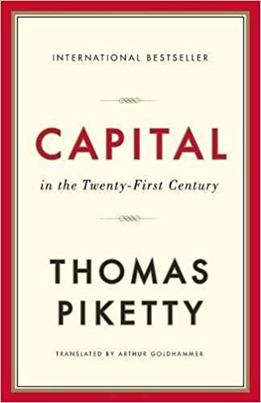

_Capital in The 21st Century_ is a great example of how you can take 6 basic points and expand them into a 26 hour book. That's right. The audiobook is 26 hours long.

At 1.5x listening speed, it washed over me during workouts for a month and a half. It will not make you run faster or lift harder, but it will keep your brain engaged and make you go, _"Huh, I never thought of that that way."_

I wouldn't say I was entertained. I was intrigued.

A lot of what Piketty writes about rings true, validates the word on the street, if you know what I mean. The things people rumble about, the murmurs going through society, stuff everyone young enough complains about, it all gets argumented and substantiated with numbers and historical facts by Piketty.

His core points are:

1. Growth of Western economy is slowing down
2. The rest of the world is catching up and will eventually slow
3. Growth creates economic mobility
4. We're sliding back towards a 19th century -like society
5. Economic equality is necessary for democratic equality
6. A _progressive_ global tax on capital would fix problems

_Capital in the 21st Century_ focuses on the economics of equality and why we do or don't have it.

Piketty argues that society was very inegalitarian in the 19th century and before. At least in Europe. You had [rich rentiers](https://en.wikipedia.org/wiki/Rentier_capitalism) who lived on rents coming from their capital (mostly land), and you had the hoi polloi that had to work for a living.

The two classes rarely mixed. Even if you were a very well off lawyer or doctor, you would not get into the rentier class. There just wasn't enough wage growth to ever get there.

Even if you increased your wages by a lot, you couldn't catch up with a rentier because their capital kept growing at capital rates, and they could afford to reinvest most of it.

So your only option was to inherit or marry well.

Then revolutions happened (mostly the French one), and certain taxes were introduced, and eventually "shocks of early 20th century" (the two wars, the Great Depression) occurred. This reset the playing field and created conditions for the high growth economy we saw in the 20th century.

We thought we’d defeated the evil rentiers. And it's not clear _why_ they're evil. For centuries, we were fine with people owning a lot of capital and making a living from allowing others to use that capital.

Then we decided as a society that this is no good. French Revolution. Later massive taxes. Then in the 80’s, somebody looked at this and said, _"Eh, maybe being rich ain't so bad.”_ Taxes were lowered, conditions were tweaked, and we spiraled into the current situation.

The issue, according to Piketty, is that the world is no longer trying to catch up to where it would've been without The Shocks. And when an economy isn't growing, there is a lack of opportunity for advancement.

It’s harder to start a business, harder to rise up the ranks of a growing company because companies aren't growing, etc.

The lower the growth, the more \\important having pre-existing capital becomes. Eventually, capital gains are so much higher than normal economy growth that the 1% is growing in wealth exponentially faster than everyone else.

What's interesting is that the average person in the world, according to Piketty, has about $60,000 of wealth. Assets less outstanding debts.

But the 1% have billions.

And we, as a society, have decided that's not cool. Right now, there are rumblings. It can eventually lead to revolutions like it did in 18th century France, or even repatriations like it did in 19th century Russia and mid-20th century Eastern Europe.

The government can taketh, and if they decide they need to, they will. The hoi polloi can rabble rouse and get you into trouble and convince the government that it should taketh.

Sort of.

According to Piketty, we can avoid this fate by introducing a global capital tax. At the very least, an inheritance and gifting tax. Some way to limit how far away from the rest of society the richest people can get.

## The one piece of Actionable Advice™

All that economic theory is great. It makes you sound smart in a pub and is curious to think about. But it won't help much in your day-to-day life.

But this piece of advice will 👇

There are only 2 ways to move into the 1% if you weren't born there. You can build a business or you can become a top executive.