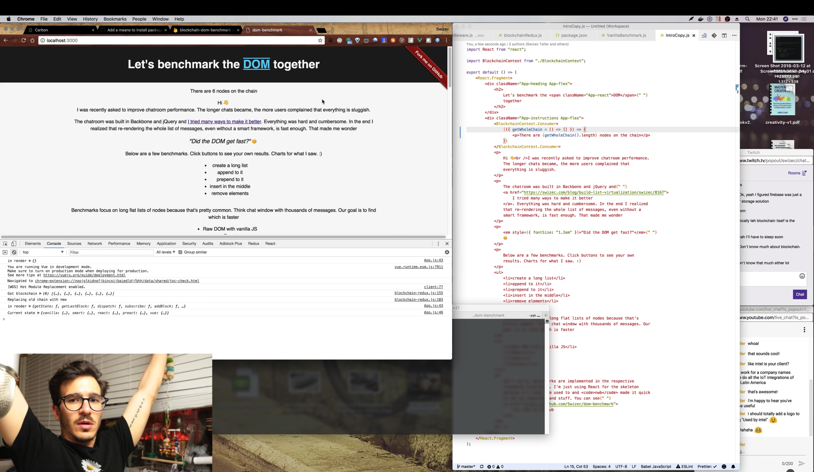

https&#x3A;//www.youtube.com/watch?v=D3WH5nI9Nj4


Remember my [blockchain-redux](https://swizec.com/blog/blockchain-redux-experiment-part-2/swizec/8055) project from December? Probably not.


I'm building a library that lets anyone who can build a webapp build a blockchain. No, not an Etherium-distributed app or a crypto currency. Altho you could…


No, I'm exploring the idea that you can use blockchains as generic validated data storage. Got some state you wanna save and share? `.dispatch` an action. Your state is hashed, shared, and saved to _a_ blockchain.


Every other app or client attached to the same blockchain can read your state, use it, and add to it.


Ideally, you shouldn't have to know _how_ it works.


My ultimate goal is to give you this 👇


1. `\import { createStore } from 'blockchain-redux'`
2. `blockchain = createStore(rootReducer)`
3. `blockchain.dispatch()` and `blockchain.getState()`
4. You have a globally distributed validated data store


This weekend, we got very close.


## First usable proof of concept


To prove that blockchains are useful for more than crypto speculation, I'm making my [interactive DOM benchmark](https://swizec.com/blog/building-interactive-dom-benchmark-preliminary-results/swizec/8219) collaborative. You can try it here: [dom-benchmark.now.sh](http://dom-benchmark.now.sh/)


There's a few kinks left to resolve before I can publish the collaborative version.


The goal is to store and share measurements from anyone who plays with the benchmark and show them as live-updating graphs and charts. We can finally find out how fast various web frameworks are in the real world on real people's computers. Won't that be fun? 🤘


Right now, on [my local machine](https://www.youtube.com/watch?v=D3WH5nI9Nj4&feature=youtu.be&t=3345), each click adds a block to the blockchain, and every other instance has to reload the page to fetch the updates. I want to make this work live.





Each block holds data that looks like this:


```
{
    "vanilla": {
        "prepend1000": [35, 92, 31, 33, 33, 7],
        "insert1000": [27],
        "append1000": [19, 7],
        "dropAll": [23, 21],
        "remove1": [0]
    },
    "smart": {
        // ...
    },
    "react": {
        // ...
    },
    "preact": {
        // ...
    },
    "vue": {
        // ...
    }
}
```


A mapping of benchmark types to results. An array of values for each button you can click.


### Adding blockchain-redux to the benchmark


Saving benchmark data to the blockchain revealed a few bugs in [blockchain-redux](https://github.com/Swizec/blockchain-redux) that I fixed. Unfortunately video of that livecoding session is blocked due to background music. Oops.


When the bugs were resolved, integration boiled down to this 👇


1. In `App.js`, we initialize the blockchain store
2. We subscribe to changes on the blockchain
3. We use the React 16.3 context API to share the store with child components
4. We render the blockchain length counter in `<IntroCopy />`
5. We dispatch block additions on every benchmark interaction


### Initialize and subscribe


First 2 steps aren't too hard:


```
// App.js
\import { createStore, firebaseMiddleware } from "blockchain-redux";
\import * as firebase from "firebase";

class App extends Component {
    blockchain = {};

    componentDidMount = async () => {
        const FirebaseApp = firebase.initializeApp({
            apiKey: "",
            databaseURL: "https://blockchain-dom-benchmark.firebaseio.com",
            projectId: "blockchain-dom-benchmark"
        });

        this.blockchain = await createStore(
            benchmarkReducer,
            firebaseMiddleware(FirebaseApp)
        );

        this.unsubscribe = this.blockchain.subscribe(() => {
            this.forceUpdate();
        });
        this.forceUpdate();
    };

    componentWillUnmount() {
        this.unsubscribe();
    }
```


We initialize `blockchain` as an empty object, then use `createStore` to overwrite it with our blockchain store in `componentDidMount`. This is because it needs to talk to Firebase during initialization.


Firebase is used as a central hub right now. Eventually, I want to replace it with direct communication between nodes via WebRTC or similar.


Once the blockchain is initialized, we subscribe to changes and trigger a `forceUpdate`. The initial call to subscribers after our chain initializes happens before we have a chance to subscribe.


Right before `<App />` unmounts, we unsubscribe from the store to avoid dangling callbacks.


### Use context to pass the chain around


We use the new React 16.3 context API to pass the chain to child components.


```
// BlockchainContext.js
\import React from "react";

const BlockchainContext = React.createContext({});

export default BlockchainContext;
```


We create a new context in a separate file. This allows us to \\import it in other components so we can define consumers.


In App.js, we set its value like this:


```
// App.js
render() {
    return 
            

            
        
}
```


We now have `this.blockchain` shared via context. Any component that needs to read from our blockchain has to use `<BlockchainContext.Consumer>`.


### Read from the chain


In `<IntroCopy>`, we render the current length of our blockchain like this:


```
\import BlockchainContext from "./BlockchainContext";

export default () => (
    
        

            

                Let's benchmark the DOM{" "}
                together
            

        

        

            
                {({ getWholeChain = () => [] }) => (
                    There are {getWholeChain().length} nodes on the chain
                )}
            
```


We wrap a paragraph in a `BlockchainContext.Consumer`, which takes a function as children. That function gets the context `value` as its argument, which lets us call `getWholeChain()` on our blockchain to read its length.


Another approach would be the traditional connected component pattern. We'd make a new `BlockchainLength` component, subscribe it to blockchain changes, and render values.


Just like Redux 🤓


### Adding to the chain


Adding new benchmark values to the chain works via action dispatchers. Just like Redux.


`<VanillaBenchmark>` (and soon all the others) takes an `addToBenchmark` function as props and calls it after updating its own benchmark display.


```
// benchmarks/VanillaBenchmark.js

updateValues() {
    // render stuff
 
    this.props.addToBenchmark({
        name: this.props.name,
        value: end - start,
        type
    });
}
```


Name is the name of this benchmark (`vanilla`), value is the result, and type tells us which button you clicked.


The overall `<Benchmarks />` component takes this callback and dispatches an action on the blockchain.


```
addToBenchmark = ({ name, type, value }) => {
    this.props.blockchain.dispatch({
        actionType: "ADD_BENCHMARK",
        name,
        type,
        value
    });
};
```


Looks familiar, doesn't it? It's just like Redux. You dispatch an action and reducers handle calculating the new state.


Our reducer for this example doesn't do much more than concat values to arrays. Like this:


```
const benchmarkReducer = function(name) {
    return function(state = defaultState, action) {
        if (name !== action.name) {
            return state;
        }

        switch (action.actionType) {
            case "ADD_BENCHMARK":
                return Object.assign(state, {
                    [action.type]: [...state[action.type], action.value]
                });
            default:
                return state;
        }
    };
};

export default combineReducers({
    vanilla: benchmarkReducer("vanilla"),
    smart: benchmarkReducer("smart"),
    react: benchmarkReducer("react"),
    preact: benchmarkReducer("preact"),
    vue: benchmarkReducer("vue")
});
```


All our reducers are the same, but they use different names. `benchmarkReducer` is a function that takes a name and returns a generic benchmark reducer. It appends values to the specified type's list of measurements.


Just like Redux 🤓


### Just like Redux, but more 🤓


Unlike just Redux, magic happens, and a new block is added to the blockchain.


And you thought it wasn't useful. Ha!


## What next?


Next step for this particular example is to render some graphs and launch the collaborative benchmark. We'll see what happens.


On the [blockchain-redux](https://github.com/Swizec/blockchain-redux) front, I'm most probably giving a lightning talk about it at [Frontier Conf](https://www.frontiersf.com/) in April and a more proper talk at [WeAreDevelopers](wearedevelopers.com/congress/) in May.


Fun times. No pressure. 😅


_This is a Livecoding Recap – an almost-weekly post about interesting things discovered while livecoding. Usually shorter than 500 words. Often with pictures. Livecoding happens almost **every Sunday at 2pm PDT** on multiple channels. You should subscribe to [My Youtube](https://www.youtube.com/TheSwizec) channel to catch me live._