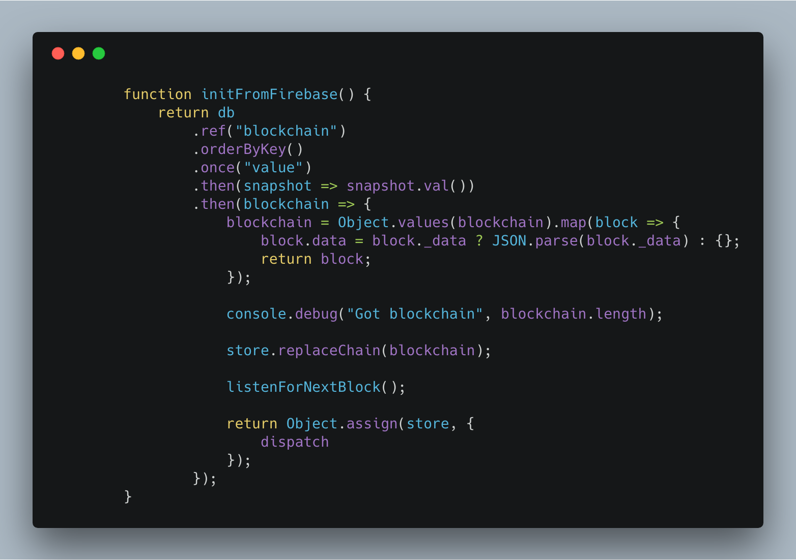
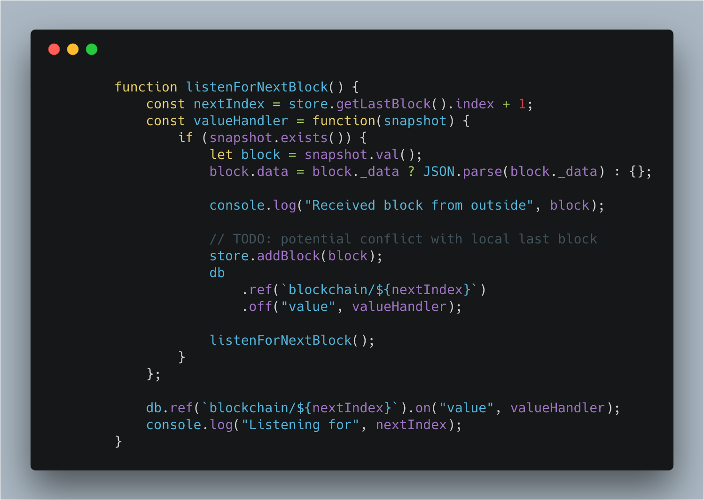

https&#x3A;//www.youtube.com/watch?v=N9YIInvZZEU


Sunday was fun. We built a thing! 🎉


Well… we added a thing to the You Can Use Blockchain To Store And Share UI State proof of concept I've been livecoding on. I'd share a live link with you, but… err… the app broke.


_This is a Livecoding Recap – an almost-weekly post about interesting things discovered while livecoding. Usually shorter than 500 words. Often with pictures. Livecoding happens almost **every Sunday at 2pm PDT** on multiple channels. You should subscribe to [My Youtube](https://www.youtube.com/TheSwizec) channel to catch me live._


It was working, you see. Then it wasn't. Infinite loop on page load.


Next time! I promise.


We did get _something_ working, however. When you `dispatch` an action on `blockchain-redux`, the generated block is shared live with all other clients. That sharing still happens via Firebase, so it's not thaaaat impressive, but it's a step in the right direction.


https&#x3A;//twitter.com/Swizec/status/983112275526496256


See, you create new benchmark measurements in one browser window, and the other window reacts. Magic 🧙‍♂️


Here's how it works 👇


## How blockchain-redux shares blocks between clients in real timeat


Long validation times got you down? Blockchain-redux is all real-time with the `firebaseMiddleware`. Soon with the WebRTC middleware too, I hope.


In part that's because there's no _real_ consensus algorithm. Any valid block is accepted to the chain. Longest chain wins by default.


You may have seen [how blockchain initialization works](https://swizec.com/blog/blockchain-redux-experiment-part-2/swizec/8055) before. We read the whole chain from Firebase and replace the local chain stub.


\[caption id="attachment_8319" align="alignnone" width="1564"] Initializing the blockchain from Firebase\[/caption]


You can read more [details about this code in a previous blogpost](https://swizec.com/blog/blockchain-redux-experiment-part-2/swizec/8055).


The part that's new is calling `listenForNextBlock` after replacing the local chain.


\[caption id="attachment_8318" align="alignnone" width="1498"] Listen for the next block\[/caption]


We have a local chain and want to make sure we catch the next block that shows up. So we fetch the latest index with `store.getLastBlock().index`, increment by 1, and listen for changes on `blockchain/${nextIndex}`.


When that block shows up, we call `valueHandler`.


`valueHandler` then parses the value and calls `store.addBlock()`, which validates the block fits our chain, and if it does fit, it gets added. If the block makes it to our local chain, then the redux-y stuff kicks in, wakes up all subscribed components, and re-renders happen.


## Completely transparent to your app


All this real-time sharing is completely invisible to your app. You build your code just like it was any other Redux-based app.


To initialize the blockchain and render a live count of nodes, you'd do something like this 👇


```
// App.js

class App extends Component {
    blockchain = {};

    componentDidMount = async () => {
        const FirebaseApp = firebase.initializeApp({
            apiKey: "",
            databaseURL: "https://thing.firebaseio.com",
            projectId: "thing"
        });

        this.blockchain = await createStore(
            benchmarkReducer,
            firebaseMiddleware(FirebaseApp)
        );

        this.unsubscribe = this.blockchain.subscribe(() => {
            console.log("Hello");
            this.forceUpdate();
        });
        this.forceUpdate();
    };

    componentWillUnmount() {
        this.unsubscribe();
    }

   render() {
        console.log("in render", this.blockchain);

        if (this.blockchain.getState) {
            console.log("Current state", this.blockchain.getState());
        }

        return (
        

            
                

                
                    {blockchain => (
                        
                    )}
                

                

            
        
       
         );
    }
}
```


Initialize the store in `componentDidMount`, subscribe to changes, run `forceUpdate` to get around async issues, unsubscribe on unmount.


The best way to make this store available to the rest of your app is via the new context API using `<Context.Provider value={this.blockchain}>`.


Then inside `<IntroCopy />`, where you display the node count, you do something like this.


```
// IntroCopy.js

// functional component boilerplate ...
// ... render stuff


    {({ getWholeChain = () => [] }) => (
        There are {getWholeChain().length} nodes on the chain
    )}


// ... more other render stuff
```


Value passed into render prop is the whole `blockchain` store. Take out `getWholeChain` and show the length. You could use `getState()` to get the latest block value, for example.


Lots of stuff you can do.


And to add a new block? Just call `dispatch` and have a reducer. Blockchain-redux handles the rest :)


## Next steps


Still have to resolve a few TODO comments around block conflicts. What happens if your network is slow and you add blocks locally that other clients haven't seen and you get blocks from the outside world that conflict? Which do you pick?


I'm not sure yet.


Plus I really want to move away from Firebase. That's gonna be fun.


Join me next Sunday as we continue exploring this experiment.